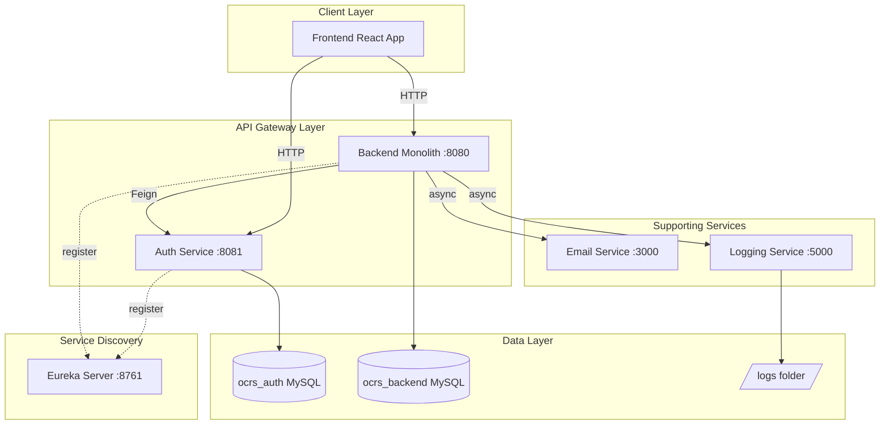
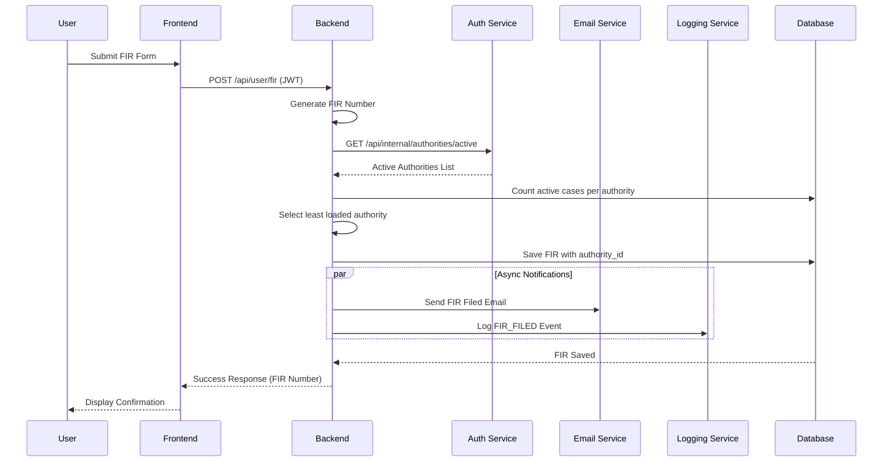
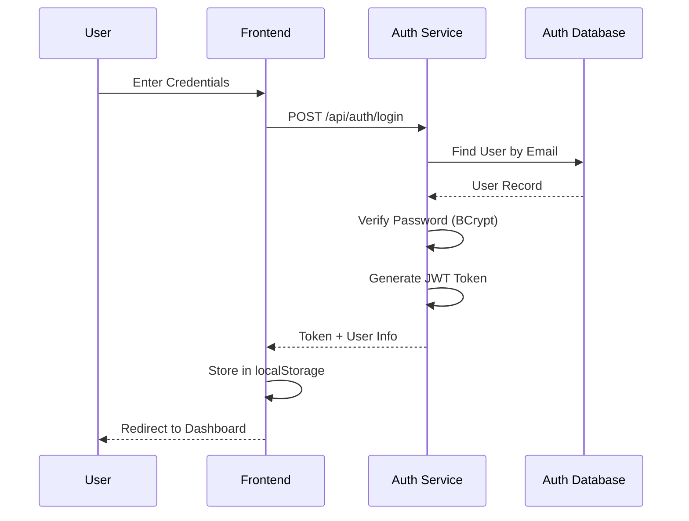
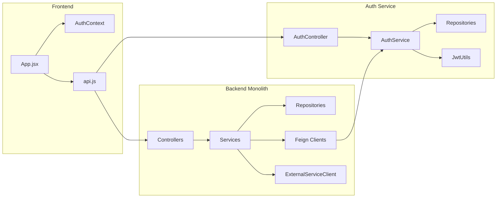

# OCRS - Online Crime Reporting System
## Application Documentation

---

## Table of Contents

1. [Overview](#1-overview)
2. [Project Structure](#2-project-structure)
3. [Technology Stack](#3-technology-stack)
4. [Architecture](#4-architecture)
5. [Design Patterns](#5-design-patterns)
6. [Microservices Breakdown](#6-microservices-breakdown)
7. [Data Models](#7-data-models)
8. [API Reference](#8-api-reference)
9. [Authentication & Security](#9-authentication--security)
10. [Fault Tolerance & Resilience](#10-fault-tolerance--resilience)
11. [Setup & Installation](#11-setup--installation)
12. [Diagrams](#12-diagrams)
13. [Testing](#13-testing)
14. [Deployment](#14-deployment)
15. [Best Practices & Rationale](#15-best-practices--rationale)
16. [Known Limitations & Improvements](#16-known-limitations--improvements)

---

## 1. Overview

### 1.1 Purpose

OCRS (Online Crime Reporting System) is a multi-service platform enabling citizens to file First Information Reports (FIRs) and missing person reports online. The system provides role-based access for:

- **Citizens (Users)**: File reports, track case status, view updates
- **Authorities (Police Officers)**: Manage assigned cases, update statuses, add comments
- **Administrators**: View analytics, manage authorities, reassign cases

### 1.2 Key Features

| Feature | Description |
|---------|-------------|
| **FIR Filing** | Online submission of crime reports with evidence upload |
| **Missing Person Reports** | Report and track missing persons |
| **Auto-Assignment** | Load-balancing algorithm assigns cases to least-loaded officers |
| **Real-time Notifications** | Email notifications for case updates |
| **Centralized Logging** | Structured logging across all services |
| **Analytics Dashboard** | Comprehensive statistics for admins and authorities |
| **Role-based Access Control** | JWT-based authentication with distinct user roles |

### 1.3 Target Users

1. **Citizens** - General public filing crime/missing person reports
2. **Police Officers** - Investigating and updating case statuses
3. **System Administrators** - Managing the platform and monitoring analytics

---

## 2. Project Structure

```
ocrs-project/
├── auth-service/           # Spring Boot authentication microservice
│   ├── src/main/java/com/ocrs/auth/
│   │   ├── config/         # Security and data seeder configuration
│   │   ├── controller/     # REST API controllers
│   │   ├── dto/            # Data Transfer Objects
│   │   ├── entity/         # JPA entities (User, Authority, Admin)
│   │   ├── exception/      # Global exception handling
│   │   ├── repository/     # JPA repositories
│   │   ├── security/       # JWT utilities and filters
│   │   └── service/        # Business logic
│   ├── pom.xml
│   └── Dockerfile
│
├── backend-monolith/       # Spring Boot main backend service
│   ├── src/main/java/com/ocrs/backend/
│   │   ├── client/         # Feign clients for service communication
│   │   ├── config/         # Security configuration
│   │   ├── controller/     # REST API controllers (User, Authority, Admin)
│   │   ├── dto/            # Data Transfer Objects
│   │   ├── entity/         # JPA entities (FIR, MissingPerson, Update)
│   │   ├── exception/      # Exception handling
│   │   ├── repository/     # JPA repositories
│   │   └── service/        # Business logic with resilience patterns
│   ├── pom.xml
│   └── Dockerfile
│
├── email-service/          # Node.js email notification service
│   ├── src/
│   │   ├── index.js        # Express server entry point
│   │   ├── routes/         # API routes
│   │   └── services/       # Email templates and sending logic
│   ├── package.json
│   └── Dockerfile
│
├── logging-service/        # .NET centralized logging service
│   ├── Controllers/        # Log API controller
│   ├── Models/             # Log entry models
│   ├── Program.cs          # Application entry point with Serilog
│   ├── LoggingService.csproj
│   └── Dockerfile
│
├── eureka-server/          # Spring Cloud Eureka service discovery
│   ├── src/
│   ├── pom.xml
│   └── Dockerfile
│
├── frontend/               # React + Vite frontend application
│   ├── src/
│   │   ├── components/     # Reusable UI components
│   │   ├── context/        # React Context (AuthContext)
│   │   ├── pages/          # Route-specific pages
│   │   │   ├── admin/      # Admin dashboard and analytics
│   │   │   ├── authority/  # Authority dashboard
│   │   │   ├── auth/       # Role-specific login/signup pages
│   │   │   └── user/       # User dashboard and forms
│   │   ├── services/       # API service layer (Axios)
│   │   ├── App.jsx         # Main application with routing
│   │   └── main.jsx        # Entry point
│   ├── package.json
│   └── Dockerfile
│
├── docs/                   # Database schemas and documentation
│   ├── auth-schema.sql
│   ├── backend-schema.sql
│   └── schema.sql
│
├── logs/                   # Centralized log storage
│   ├── user/
│   ├── authority/
│   ├── admin/
│   └── fir/
│
├── docker-compose.yml      # Container orchestration
├── start-services.sh       # Local development startup script
└── stop-services.sh        # Service shutdown script
```

---

## 3. Technology Stack

### 3.1 Languages & Frameworks

| Component | Technology | Version |
|-----------|------------|---------|
| **Auth Service** | Spring Boot | 3.2.0 |
| **Backend Monolith** | Spring Boot | 3.2.0 |
| **Eureka Server** | Spring Cloud Netflix | 2023.0.0 |
| **Email Service** | Node.js + Express | 18.x / 4.18.2 |
| **Logging Service** | .NET (ASP.NET Core) | 10.0 |
| **Frontend** | React + Vite | 18.2.0 / 5.0.8 |
| **Styling** | TailwindCSS | 3.4.0 |

### 3.2 Core Dependencies

| Service | Key Libraries |
|---------|---------------|
| **Java Services** | Spring Security, Spring Data JPA, jjwt (0.12.3), Lombok, Spring Cloud OpenFeign, Resilience4j (2.2.0), Spring WebFlux |
| **Email Service** | Nodemailer (6.9.7), CORS, dotenv |
| **Logging Service** | Serilog.AspNetCore (8.0.0), Serilog.Sinks.File, Serilog.Sinks.Console |
| **Frontend** | Axios (1.6.2), React Router DOM (6.21.1), Chart.js (4.4.1) |

### 3.3 Databases

| Database | Version | Purpose |
|----------|---------|---------|
| **MySQL** | 8.0 | Primary data storage |
| `ocrs_auth` | - | User/Authority/Admin credentials |
| `ocrs_backend` | - | FIRs, Missing Persons, Updates |

### 3.4 Infrastructure

| Tool | Purpose |
|------|---------|
| **Docker** | Containerization |
| **Docker Compose** | Multi-container orchestration |
| **Eureka** | Service discovery |
| **Nginx** | Frontend reverse proxy (production) |
| **Mailtrap** | Email testing (sandbox SMTP) |

---

## 4. Architecture

### 4.1 Architectural Style

The system follows a **Microservices Architecture** with the following characteristics:

- **Service Separation**: Each service has a single responsibility
- **Independent Deployment**: Services can be deployed independently
- **Technology Polyglot**: Different languages/frameworks per service need
- **Service Discovery**: Eureka-based dynamic service registration
- **Inter-service Communication**: REST APIs with Feign clients

### 4.2 Service Overview

```
┌─────────────────────────────────────────────────────────────────────┐
│                           FRONTEND (React)                          │
│                         Port: 5173 (dev) / 3001                     │
└──────────────────────────────┬──────────────────────────────────────┘
                               │ HTTP
          ┌────────────────────┴────────────────────┐
          ▼                                         ▼
┌─────────────────────┐                   ┌─────────────────────┐
│    AUTH SERVICE     │                   │   BACKEND MONOLITH  │
│   (Spring Boot)     │◄─────Feign───────►│   (Spring Boot)     │
│     Port: 8081      │                   │     Port: 8080      │
└─────────┬───────────┘                   └───────────┬─────────┘
          │                                           │
          │                                           │ Async (WebClient)
          ▼                                           ▼
┌─────────────────────┐   ┌───────────────────────────────────────────┐
│    AUTH DATABASE    │   │                                           │
│   (MySQL ocrs_auth) │   │  ┌─────────────────┐ ┌─────────────────┐  │
│     Port: 3307      │   │  │  EMAIL SERVICE  │ │ LOGGING SERVICE │  │
└─────────────────────┘   │  │   (Node.js)     │ │    (.NET)       │  │
                          │  │   Port: 3000    │ │   Port: 5000    │  │
┌─────────────────────┐   │  └─────────────────┘ └─────────────────┘  │
│  BACKEND DATABASE   │   │                                           │
│ (MySQL ocrs_backend)│   └───────────────────────────────────────────┘
│     Port: 3306      │
└─────────────────────┘

          ┌─────────────────────┐
          │    EUREKA SERVER    │
          │   (Service Registry)│
          │     Port: 8761      │
          └─────────────────────┘
```

### 4.3 Communication Patterns

| Pattern | Implementation | Use Case |
|---------|----------------|----------|
| **Synchronous REST** | OpenFeign | Backend ↔ Auth Service communication |
| **Asynchronous HTTP** | WebClient + CompletableFuture | Email/Logging notifications |
| **Service Discovery** | Eureka Client/Server | Dynamic service resolution |
| **Client-Side Load Balancing** | Spring Cloud LoadBalancer | Distributing requests |

---

## 5. Design Patterns

### 5.1 Creational Patterns

#### Builder Pattern
**Location**: Entity classes (`User.java`, `Authority.java`, `FIR.java`, etc.)

```java
// Example from FIR entity
FIR fir = FIR.builder()
    .firNumber(firNumber)
    .userId(userId)
    .authorityId(authorityId)
    .category(FIR.Category.valueOf(request.getCategory()))
    .title(request.getTitle())
    .status(FIR.Status.PENDING)
    .build();
```

**Rationale**: Provides a clean, readable way to construct complex objects with many optional parameters. Reduces constructor pollution and makes code self-documenting.

### 5.2 Structural Patterns

#### Repository Pattern
**Location**: All JPA repositories (`UserRepository.java`, `FIRRepository.java`, etc.)

```java
public interface FIRRepository extends JpaRepository<FIR, Long> {
    List<FIR> findByUserId(Long userId);
    List<FIR> findByAuthorityId(Long authorityId);
    @Query("SELECT COUNT(f) FROM FIR f WHERE f.authorityId = :authorityId AND f.status NOT IN ('CLOSED', 'RESOLVED')")
    long countActiveByAuthorityId(@Param("authorityId") Long authorityId);
}
```

**Rationale**: Abstracts data access logic, provides a clean API for CRUD operations, enables easy testing with mock repositories.

#### Facade/Service Layer Pattern
**Location**: Service classes (`AuthService.java`, `FIRService.java`)

**Rationale**: Encapsulates complex business logic, coordinates between multiple repositories/clients, provides a simplified interface for controllers.

### 5.3 Behavioral Patterns

#### Strategy Pattern (Implicit)
**Location**: `AuthService.login()` method

```java
public ApiResponse<AuthResponse> login(LoginRequest request) {
    String role = request.getRole().toUpperCase();
    switch (role) {
        case "USER": return loginUser(request.getEmail(), request.getPassword());
        case "AUTHORITY": return loginAuthority(request.getEmail(), request.getPassword());
        case "ADMIN": return loginAdmin(request.getEmail(), request.getPassword());
    }
}
```

**Rationale**: Allows different authentication strategies based on user role without modifying the core login interface.

#### Observer Pattern (via Notifications)
**Location**: `ExternalServiceClient.java` for async notifications

**Rationale**: When FIR status changes, observers (email service, logging service) are notified asynchronously without blocking the main operation.

### 5.4 Resilience Patterns

#### Circuit Breaker Pattern
**Location**: `ExternalServiceClient.java`

```java
@CircuitBreaker(name = "emailService", fallbackMethod = "emailFallback")
public CompletableFuture<Void> sendEmailNotification(Long userId, String subject, String message) {
    // ... implementation
}

public CompletableFuture<Void> emailFallback(Long userId, String subject, String message, Exception e) {
    logger.warn("email service unavailable, skipping notification");
    return CompletableFuture.completedFuture(null);
}
```

**Rationale**: Prevents cascading failures when external services are down, provides graceful degradation.

#### Fallback Factory Pattern
**Location**: `AuthServiceFallbackFactory.java`

```java
@Component
public class AuthServiceFallbackFactory implements FallbackFactory<AuthServiceClient> {
    @Override
    public AuthServiceClient create(Throwable cause) {
        return new AuthServiceClient() {
            @Override
            public ApiResponse<AuthorityDTO> getAuthorityById(Long id) {
                return ApiResponse.success("Fallback", AuthorityDTO.builder()
                    .id(id).fullName("Authority #" + id).build());
            }
        };
    }
}
```

**Rationale**: Provides fallback responses when the Auth service is unavailable, ensuring the Backend can continue operating with degraded functionality.

#### Retry Pattern
**Location**: `ExternalServiceClient.java` and `emailService.js`

```java
@Retry(name = "emailService", fallbackMethod = "emailFallback")
public CompletableFuture<Void> sendEmailNotification(...)
```

```javascript
// Email service retry queue
const sendEmail = async (to, templateName, data, retryCount = 0) => {
    if (retryCount < MAX_RETRY_ATTEMPTS) {
        failedEmailQueue.push({ to, templateName, data, retryCount: retryCount + 1 });
    }
};
```

**Rationale**: Handles transient failures by automatically retrying operations.

### 5.5 Frontend Patterns

#### Context/Provider Pattern
**Location**: `AuthContext.jsx`

```jsx
export const AuthProvider = ({ children }) => {
    const [user, setUser] = useState(null);
    const login = async (email, password, role) => { /* ... */ };
    return (
        <AuthContext.Provider value={{ user, login, logout }}>
            {children}
        </AuthContext.Provider>
    );
};
```

**Rationale**: Provides global state management for authentication without prop drilling.

#### Protected Route Pattern
**Location**: `ProtectedRoute.jsx`

**Rationale**: Implements role-based access control in the frontend, redirecting unauthorized users.

---

## 6. Microservices Breakdown

### 6.1 Auth Service

| Attribute | Value |
|-----------|-------|
| **Port** | 8081 |
| **Technology** | Spring Boot 3.2.0 |
| **Database** | MySQL (ocrs_auth) |
| **Primary Responsibility** | User authentication, JWT generation, user management |

**Key Components**:
- `AuthController`: User/Authority registration, login, logout, token validation
- `AuthorityController`: Authority CRUD operations
- `InternalAuthController`: Internal APIs for inter-service communication
- `JwtUtils`: JWT generation and validation using HMAC-SHA
- `DataSeeder`: Initial data population (admin, test users)

**Entities**:
- `User`: Citizens filing reports
- `Authority`: Police officers handling cases
- `Admin`: System administrators

### 6.2 Backend Monolith

| Attribute | Value |
|-----------|-------|
| **Port** | 8080 |
| **Technology** | Spring Boot 3.2.0 |
| **Database** | MySQL (ocrs_backend) |
| **Primary Responsibility** | FIR/Missing person management, case tracking, analytics |

**Key Components**:
- `UserController`: FIR/Missing person filing, tracking
- `AuthorityController`: Case management, status updates
- `AdminController`: Analytics, authority management, case reassignment
- `FIRService`: FIR business logic with auto-assignment
- `AnalyticsService`: Dashboard statistics
- `AuthServiceClient`: Feign client for Auth service
- `ExternalServiceClient`: WebClient for Email/Logging services

**Load Balancing Algorithm**:
```java
private Long findLeastLoadedAuthority() {
    // Get active authorities from Auth service
    List<AuthorityDTO> activeAuthorities = authServiceClient.getActiveAuthorities().getData();
    
    Long leastLoadedAuthority = null;
    long minCases = Long.MAX_VALUE;
    
    for (AuthorityDTO authority : activeAuthorities) {
        long activeCases = firRepository.countActiveByAuthorityId(authority.getId());
        if (activeCases < minCases) {
            minCases = activeCases;
            leastLoadedAuthority = authority.getId();
        }
    }
    return leastLoadedAuthority;
}
```

### 6.3 Email Service

| Attribute | Value |
|-----------|-------|
| **Port** | 3000 |
| **Technology** | Node.js + Express |
| **Primary Responsibility** | Email notifications |

**Key Features**:
- HTML email templates (FIR filed, status update, generic)
- Retry queue with exponential backoff
- Mailtrap integration for testing

**Templates**:
- `firFiled`: Sent when a new FIR is submitted
- `firUpdate`: Sent when case status changes
- `statusUpdate`: Generic status notification
- `generic`: Fallback template

### 6.4 Logging Service

| Attribute | Value |
|-----------|-------|
| **Port** | 5000 |
| **Technology** | .NET 10.0 (ASP.NET Core) |
| **Primary Responsibility** | Centralized application logging |

**Log Organization**:
```
logs/
├── user/user_auth_logs.txt       # User login/signup/logout
├── authority/authority_logs.txt   # Authority actions
├── admin/admin_logs.txt          # Admin operations
├── fir/fir_logs.txt              # FIR-related events
└── app_YYYY-MM-DD.log            # Rolling application logs
```

**Features**:
- Serilog integration
- Rolling file logs (10MB limit, 31-day retention)
- Structured logging format
- Category-based log separation

### 6.5 Eureka Server

| Attribute | Value |
|-----------|-------|
| **Port** | 8761 |
| **Technology** | Spring Cloud Netflix Eureka |
| **Primary Responsibility** | Service discovery and registration |

**Registered Services**:
- `auth-service`: Authentication microservice
- `backend-service`: Main backend monolith

### 6.6 Frontend

| Attribute | Value |
|-----------|-------|
| **Port** | 5173 (dev) / 3001 (Docker) |
| **Technology** | React 18 + Vite |
| **Styling** | TailwindCSS 3.4.0 |

**Page Structure**:
```
src/pages/
├── auth/
│   ├── admin/AdminSignIn.jsx
│   ├── authority/AuthoritySignIn.jsx
│   └── user/UserSignIn.jsx, UserSignUp.jsx
├── user/
│   ├── Dashboard.jsx
│   ├── FileFIR.jsx
│   ├── FileMissing.jsx
│   └── TrackStatus.jsx
├── authority/
│   ├── Dashboard.jsx
│   └── Analytics.jsx
└── admin/
    ├── Dashboard.jsx
    └── Analytics.jsx
```

---

## 7. Data Models

### 7.1 Auth Database (ocrs_auth)

#### Users Table
```sql
CREATE TABLE users (
    id BIGINT AUTO_INCREMENT PRIMARY KEY,
    email VARCHAR(255) NOT NULL UNIQUE,
    password VARCHAR(255) NOT NULL,
    full_name VARCHAR(255) NOT NULL,
    phone VARCHAR(20),
    address TEXT,
    aadhaar_number VARCHAR(12) UNIQUE,
    created_at TIMESTAMP DEFAULT CURRENT_TIMESTAMP,
    updated_at TIMESTAMP DEFAULT CURRENT_TIMESTAMP ON UPDATE CURRENT_TIMESTAMP,
    is_active BOOLEAN DEFAULT TRUE
);
```

#### Authorities Table
```sql
CREATE TABLE authorities (
    id BIGINT AUTO_INCREMENT PRIMARY KEY,
    email VARCHAR(255) NOT NULL UNIQUE,
    password VARCHAR(255) NOT NULL,
    full_name VARCHAR(255) NOT NULL,
    badge_number VARCHAR(50) UNIQUE,
    designation VARCHAR(100),
    station_name VARCHAR(255),
    station_address TEXT,
    phone VARCHAR(20),
    is_active BOOLEAN DEFAULT TRUE
);
```

#### Admins Table
```sql
CREATE TABLE admins (
    id BIGINT AUTO_INCREMENT PRIMARY KEY,
    email VARCHAR(255) NOT NULL UNIQUE,
    password VARCHAR(255) NOT NULL,
    full_name VARCHAR(255) NOT NULL,
    role VARCHAR(50) DEFAULT 'SUPER_ADMIN',
    is_active BOOLEAN DEFAULT TRUE
);
```

### 7.2 Backend Database (ocrs_backend)

#### FIRs Table
```sql
CREATE TABLE firs (
    id BIGINT AUTO_INCREMENT PRIMARY KEY,
    fir_number VARCHAR(50) UNIQUE NOT NULL,
    user_id BIGINT NOT NULL,
    authority_id BIGINT,
    category ENUM('THEFT','ASSAULT','FRAUD','CYBERCRIME','HARASSMENT','VANDALISM','OTHER'),
    title VARCHAR(255) NOT NULL,
    description TEXT NOT NULL,
    incident_date DATE NOT NULL,
    incident_time TIME,
    incident_location TEXT NOT NULL,
    status ENUM('PENDING','UNDER_INVESTIGATION','RESOLVED','CLOSED','REJECTED'),
    priority ENUM('LOW','MEDIUM','HIGH','URGENT'),
    evidence_urls JSON,
    created_at TIMESTAMP,
    updated_at TIMESTAMP
);
```

#### Missing Persons Table
```sql
CREATE TABLE missing_persons (
    id BIGINT AUTO_INCREMENT PRIMARY KEY,
    case_number VARCHAR(50) UNIQUE NOT NULL,
    user_id BIGINT NOT NULL,
    authority_id BIGINT,
    missing_person_name VARCHAR(255) NOT NULL,
    age INT,
    gender ENUM('MALE','FEMALE','OTHER'),
    height VARCHAR(20),
    weight VARCHAR(20),
    complexion VARCHAR(50),
    identifying_marks TEXT,
    last_seen_date DATE NOT NULL,
    last_seen_location TEXT NOT NULL,
    description TEXT,
    photo_url VARCHAR(500),
    status ENUM('MISSING','FOUND','CLOSED'),
    contact_phone VARCHAR(20)
);
```

#### Updates Table
```sql
CREATE TABLE updates (
    id BIGINT AUTO_INCREMENT PRIMARY KEY,
    fir_id BIGINT,
    missing_person_id BIGINT,
    authority_id BIGINT NOT NULL,
    update_type ENUM('STATUS_CHANGE','COMMENT','EVIDENCE_ADDED','REASSIGNMENT'),
    previous_status VARCHAR(50),
    new_status VARCHAR(50),
    comment TEXT,
    created_at TIMESTAMP
);
```

---

## 8. API Reference

### 8.1 Auth Service APIs

| Method | Endpoint | Description | Auth Required |
|--------|----------|-------------|---------------|
| POST | `/api/auth/register/user` | Register citizen | No |
| POST | `/api/auth/register/authority` | Register authority | Admin |
| POST | `/api/auth/login` | Login (all roles) | No |
| POST | `/api/auth/logout` | Logout | Yes |
| GET | `/api/auth/validate` | Validate token | Yes |
| GET | `/api/internal/authorities/active` | Get active authorities (internal) | Service |

### 8.2 User APIs (Backend)

| Method | Endpoint | Description |
|--------|----------|-------------|
| POST | `/api/user/fir` | File new FIR |
| GET | `/api/user/firs` | Get user's FIRs |
| GET | `/api/user/fir/{id}` | Get specific FIR |
| GET | `/api/user/fir/{id}/updates` | Get FIR updates |
| POST | `/api/user/missing` | File missing person report |
| GET | `/api/user/missing-reports` | Get user's reports |

### 8.3 Authority APIs (Backend)

| Method | Endpoint | Description |
|--------|----------|-------------|
| GET | `/api/authority/firs` | Get assigned FIRs |
| GET | `/api/authority/firs/paged` | Get paginated FIRs |
| PUT | `/api/authority/fir/{id}/update` | Update FIR status |
| GET | `/api/authority/firs/search` | Search FIRs with filters |
| GET | `/api/authority/analytics` | Get authority analytics |

### 8.4 Admin APIs (Backend)

| Method | Endpoint | Description |
|--------|----------|-------------|
| GET | `/api/admin/analytics` | Get system analytics |
| GET | `/api/admin/firs` | Get all FIRs |
| GET | `/api/admin/authorities` | Get all authorities |
| PUT | `/api/admin/fir/{id}/reassign/{authId}` | Reassign FIR |

---

## 9. Authentication & Security

### 9.1 JWT Implementation

**Token Structure**:
```json
{
  "sub": "user@email.com",
  "id": 1,
  "role": "USER",
  "iat": 1706180400,
  "exp": 1706266800
}
```

**Configuration**:
- Algorithm: HMAC-SHA256
- Library: jjwt 0.12.3
- Expiration: Configurable via `jwt.expiration`

### 9.2 Security Configuration

```java
@Bean
public SecurityFilterChain filterChain(HttpSecurity http) throws Exception {
    http.csrf(csrf -> csrf.disable())
        .cors(Customizer.withDefaults())
        .authorizeHttpRequests(auth -> auth
            .requestMatchers("/api/auth/**", "/health", "/actuator/**").permitAll()
            .requestMatchers("/api/internal/**").permitAll() // Service-to-service
            .anyRequest().authenticated())
        .addFilterBefore(jwtFilter, UsernamePasswordAuthenticationFilter.class);
    return http.build();
}
```

### 9.3 Password Security

- Encoding: BCrypt
- Library: Spring Security Crypto
- Hash pattern: `$2a$10$...`

---

## 10. Fault Tolerance & Resilience

### 10.1 Circuit Breaker Configuration

```yaml
resilience4j.circuitbreaker:
  instances:
    emailService:
      slidingWindowSize: 10
      failureRateThreshold: 50
      waitDurationInOpenState: 30s
    loggingService:
      slidingWindowSize: 10
      failureRateThreshold: 50
```

### 10.2 Retry Configuration

```yaml
resilience4j.retry:
  instances:
    emailService:
      maxAttempts: 3
      waitDuration: 1s
    loggingService:
      maxAttempts: 2
      waitDuration: 500ms
```

### 10.3 Fallback Strategies

| Service | Fallback Behavior |
|---------|-------------------|
| Email Service | Log warning, skip notification |
| Logging Service | Log locally, continue operation |
| Auth Service | Return minimal fallback data |

### 10.4 Health Checks

All services expose health endpoints:
- Auth/Backend: `/actuator/health`
- Email Service: `/health`
- Logging Service: `/health`
- Eureka: `/actuator/health`

---

## 11. Setup & Installation

### 11.1 Prerequisites

| Requirement | Version |
|-------------|---------|
| JDK | 17+ (Java 21 recommended) |
| Node.js | 18+ |
| .NET SDK | 8+ |
| MySQL | 8.0 |
| Docker | Latest (optional) |

### 11.2 Database Setup

```bash
# Create databases and seed data
mysql -u root -p < docs/schema.sql
```

### 11.3 Environment Variables

Each service requires `.env` configuration:

**Auth Service** (`.env`):
```env
DB_URL=jdbc:mysql://localhost:3307/ocrs_auth
DB_USERNAME=root
DB_PASSWORD=your_password
JWT_SECRET=your-secret-key
```

**Backend Monolith** (`.env`):
```env
DB_URL=jdbc:mysql://localhost:3306/ocrs_backend
JWT_SECRET=your-secret-key
SERVICES_EMAIL_URL=http://localhost:3000
SERVICES_LOGGING_URL=http://localhost:5000
```

**Email Service** (`.env`):
```env
PORT=3000
MAILTRAP_HOST=sandbox.smtp.mailtrap.io
MAILTRAP_USER=your_user
MAILTRAP_PASS=your_password
```

### 11.4 Running Locally

```bash
# 1. Start Eureka Server (Port 8761)
cd eureka-server && ./mvnw spring-boot:run

# 2. Start Auth Service (Port 8081)
cd auth-service && ./mvnw spring-boot:run

# 3. Start Backend Monolith (Port 8080)
cd backend-monolith && ./mvnw spring-boot:run

# 4. Start Email Service (Port 3000)
cd email-service && npm install && npm start

# 5. Start Logging Service (Port 5000)
cd logging-service && dotnet run

# 6. Start Frontend (Port 5173)
cd frontend && npm install && npm run dev
```

### 11.5 Running with Docker

```bash
docker-compose up -d
```

### 11.6 Test Credentials

| Role | Email | Password |
|------|-------|----------|
| Admin | admin@ocrs.gov.in | Admin@123 |
| Authority | officer1@police.gov.in | Auth@123 |
| User | testuser@gmail.com | User@123 |

---

## 12. Diagrams

### 12.1 System Architecture Diagram



### 12.2 Data Flow Diagram - FIR Filing



### 12.3 Authentication Flow



### 12.4 Module Dependency Graph



---

## 13. Testing

### 13.1 Test Structure

| Service | Framework | Location |
|---------|-----------|----------|
| Auth Service | JUnit 5 + Spring Test | `src/test/java/` |
| Backend Monolith | JUnit 5 + Spring Test | `src/test/java/` |
| Frontend | Vitest + React Testing Library | `src/**/*.test.jsx` |
| Email Service | Jest + Supertest | `src/**/*.test.js` |

### 13.2 Running Tests

```bash
# Java Services
cd auth-service && ./mvnw test
cd backend-monolith && ./mvnw test

# Frontend
cd frontend && npm test

# Email Service
cd email-service && npm test
```

### 13.3 Test Categories

- **Unit Tests**: Service layer, utilities
- **Integration Tests**: Controller endpoints, repository queries
- **Component Tests**: React components with mocked context

---

## 14. Deployment

### 14.1 Docker Deployment

Each service has a Dockerfile for containerization:

```dockerfile
# Example: Java Service
FROM openjdk:21-jdk-slim
WORKDIR /app
COPY target/*.jar app.jar
ENTRYPOINT ["java", "-jar", "app.jar"]
```

### 14.2 Port Mapping

| Service | Internal Port | External Port |
|---------|---------------|---------------|
| Eureka | 8761 | 8761 |
| Auth Service | 8081 | 8081 |
| Backend | 8080 | 8080 |
| Email Service | 3000 | 3000 |
| Logging Service | 5000 | 5000 |
| Frontend | 80 | 3001 |
| Auth DB | 3306 | 3307 |
| Backend DB | 3306 | 3306 |

### 14.3 Health Monitoring

Use Docker Compose healthchecks:
```yaml
healthcheck:
  test: ["CMD", "wget", "-q", "--spider", "http://localhost:8761/actuator/health"]
  interval: 10s
  timeout: 10s
  retries: 5
```

---

## 15. Best Practices & Rationale

### 15.1 Technology Choices

| Choice | Rationale |
|--------|-----------|
| **Spring Boot** | Mature ecosystem, excellent Spring Cloud integration, production-ready |
| **React** | Component-based architecture, large ecosystem, efficient UI updates |
| **Node.js for Email** | Non-blocking I/O perfect for email queue processing |
| **.NET for Logging** | High-performance, Serilog provides excellent structured logging |
| **MySQL** | Relational integrity for transactions, widely supported |
| **Eureka** | Native Spring Cloud integration, battle-tested service discovery |

### 15.2 Architectural Decisions

| Decision | Reasoning |
|----------|-----------|
| **Separate Auth Database** | Security isolation, independent scaling |
| **Feign for Service Calls** | Declarative HTTP clients, built-in load balancing |
| **Async Notifications** | Non-blocking, prevents slow external services from impacting response times |
| **JWT Stateless Auth** | Horizontal scalability, no session storage |
| **Load-Based Assignment** | Fair case distribution, prevents officer overload |

### 15.3 Code Quality Practices

- **Lombok**: Reduces boilerplate (getters, setters, builders)
- **DTO Pattern**: Separates API contracts from internal entities
- **Global Exception Handlers**: Consistent error responses
- **Structured Logging**: Enables log aggregation and analysis

---

## 16. Known Limitations & Improvements

### 16.1 Current Limitations

| Limitation | Impact |
|------------|--------|
| No API gateway | Direct service exposure, CORS handled per-service |
| File upload not implemented | Evidence URLs stored but files not uploaded |
| Single database per service | No read replicas or sharding |
| Manual JWT token refresh | Tokens expire without automatic renewal |
| No rate limiting | APIs vulnerable to abuse |

### 16.2 Potential Improvements

1. **Add API Gateway (Spring Cloud Gateway)**
   - Centralized routing, authentication, rate limiting

2. **Implement File Upload Service**
   - S3/MinIO integration for evidence storage

3. **Add Message Queue (RabbitMQ/Kafka)**
   - More robust async communication than HTTP

4. **Implement Caching (Redis)**
   - Cache authority lists, analytics data

5. **Add Monitoring (Prometheus + Grafana)**
   - Metrics collection and visualization

6. **Implement Refresh Tokens**
   - Better security with short-lived access tokens

7. **Add Search Engine (Elasticsearch)**
   - Full-text search for FIRs and reports

---

## Document Metadata

| Attribute | Value |
|-----------|-------|
| **Generated** | January 25, 2026 |
| **Project Version** | 1.0.0 |
| **Documentation Version** | 1.0 |
| **Generator** | Automated Code Analysis |

---

*This documentation was generated by analyzing the complete OCRS codebase. For updates or corrections, please refer to the source code and inline comments.*
