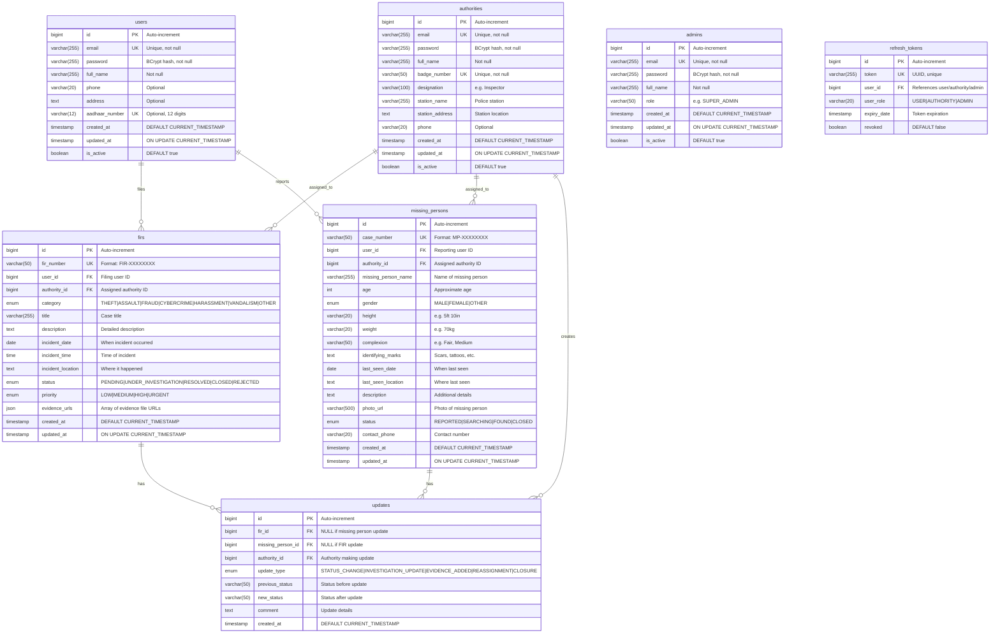

# OCRS - Complete Technical Documentation
## Exhaustive File-by-File, Class-by-Class, Method-by-Method Reference

**Version**: 2.0.0  
**Generated**: January 2026  
**Scope**: Production-Grade Documentation for Senior Interviews, Handovers, and Security Audits

---

# Table of Contents

1. [System Architecture Diagrams](#1-system-architecture-diagrams)
2. [Module/Package Dependency Diagrams](#2-modulepackage-dependency-diagrams)
3. [API Request Flow Diagrams](#3-api-request-flow-diagrams)
4. [Database ER Diagrams](#4-database-er-diagrams)
5. [File-by-File Documentation](#5-file-by-file-documentation)
6. [Class-by-Class Documentation](#6-class-by-class-documentation)
7. [Method-by-Method Documentation](#7-method-by-method-documentation)
8. [Annotation Deep Dive](#8-annotation-deep-dive)
9. [Configuration Reference](#9-configuration-reference)
10. [Security Detailed Analysis](#10-security-detailed-analysis)
11. [Performance Analysis](#11-performance-analysis)
12. [Interview Questions (40+)](#12-interview-questions-40)

---

# 1. System Architecture Diagrams

## 1.1 High-Level System Architecture


**Diagram Caption**: Complete OCRS system architecture showing all 9 components: React frontend, Spring Cloud Gateway for edge processing with JWT validation and Redis-backed rate limiting, Eureka for service discovery, Auth Service for authentication, Backend Service for business logic, Email Service for notifications, Logging Service for audit trails, and two MySQL databases with Redis caching.

## 1.2 Component Responsibilities


---

# 2. Module/Package Dependency Diagrams

## 2.1 Auth Service Package Structure


**Diagram Caption**: Auth Service package dependencies showing flow from controllers → services → repositories → entities. The `AuthService` is the central business logic class that coordinates all authentication operations.

## 2.2 Backend Service Package Structure


---

# 3. API Request Flow Diagrams

## 3.1 User Registration Flow


**Diagram Caption**: Complete user registration flow showing all database queries, password hashing (BCrypt), JWT token generation (HMAC-SHA256), refresh token persistence, and logging. Note that this is a public route (no JWT validation at gateway).

## 3.2 Protected API Request Flow (File FIR)


**Diagram Caption**: Complete FIR filing flow showing rate limiting (Redis), JWT validation, token claims extraction, inter-service calls via Feign (get authorities), load balancing algorithm (assign to least loaded), database persistence, and async email notification.

## 3.3 FIR Status Update Flow (Authority)


**Diagram Caption**: FIR status update flow with closed case protection. Shows validation that only the assigned authority can update, rejection of updates on closed cases (recently implemented), and notification dispatch.

## 3.4 Authentication (Login) Flow with Failure Paths


---

# 4. Database ER Diagrams

## 4.1 Complete Database Schema



**Diagram Caption**: Complete ER diagram for both Auth DB (users, authorities, admins, refresh_tokens) and Backend DB (firs, missing_persons, updates). Shows all columns, types, constraints, and relationships. Note the polymorphic user_id in refresh_tokens that can reference any of the three user types.

---

# 5. File-by-File Documentation

## 5.1 API Gateway Files

### 5.1.1 JwtAuthFilter.java

**Path**: `api-gateway/src/main/java/com/ocrs/gateway/filter/JwtAuthFilter.java`  
**Lines**: 206  
**Purpose**: JWT token validation and role-based access control for all protected routes


**Why It Exists**:
- Centralizes authentication logic at the gateway level
- Prevents unauthenticated requests from reaching downstream services
- Reduces code duplication (each service doesn't need JWT validation)

**What Breaks If Removed**:
- ALL protected routes become accessible without authentication
- No user identity information passed to downstream services
- Security of the entire system is compromised

**Runtime Lifecycle**:
1. Spring creates a single instance at startup (Singleton scope)
2. `apply(Config)` is called once per route configuration
3. The returned `GatewayFilter` is invoked for each matching request

**Class Structure**:
```java
@Component
public class JwtAuthFilter extends AbstractGatewayFilterFactory<JwtAuthFilter.Config> {
    // SECRET KEY - loaded from application.yml
    @Value("${jwt.secret}")
    private String jwtSecret;
    
    // CONSTRUCTOR - registers Config class with parent
    public JwtAuthFilter() {
        super(Config.class);
    }
    
    // MAIN FILTER LOGIC
    @Override
    public GatewayFilter apply(Config config) {
        return (exchange, chain) -> { /* ... */ };
    }
    
    // JWT PARSING - single parse operation for efficiency
    private Claims validateAndExtractClaims(String token) { /* ... */ }
    
    // ERROR RESPONSE BUILDER - consistent JSON format
    private Mono<Void> buildErrorResponse(...) { /* ... */ }
    
    // NESTED CONFIG CLASS - holds requiredRole
    public static class Config { /* ... */ }
}
```

---

## 5.2 Auth Service Files

### 5.2.1 AuthController.java

**Path**: `auth-service/src/main/java/com/ocrs/auth/controller/AuthController.java`  
**Lines**: 99  
**Purpose**: REST endpoints for authentication operations (register, login, refresh, logout)


**Annotations Explained**:

| Annotation | Purpose | Impact if Removed |
|------------|---------|-------------------|
| `@RestController` | Marks class as REST controller + `@ResponseBody` on all methods | Responses return view names instead of JSON |
| `@RequestMapping("/api/auth")` | Base path prefix | All endpoints change paths |
| `@PostMapping("/login")` | Maps HTTP POST to method | Endpoint not found, 404 errors |
| `@Valid` | Triggers Bean Validation | Invalid data reaches service layer |
| `@RequestBody` | Deserializes JSON to DTO | NullPointerException on access |

### 5.2.2 AuthService.java

**Path**: `auth-service/src/main/java/com/ocrs/auth/service/AuthService.java`  
**Lines**: 389  
**Purpose**: Core authentication business logic

**Design Pattern**: Facade Pattern  
**SOLID Adherence**: 
- **SRP**: Handles authentication only, delegates token operations to RefreshTokenService
- **OCP**: New login methods can be added without modifying existing code
- **DIP**: Depends on repository interfaces, not implementations

**Dependencies**:


**Thread Safety**: 
- Class is stateless (all state in database)
- `@Transactional` ensures database consistency
- BCrypt encoder is thread-safe

### 5.2.3 JwtUtils.java

**Path**: `auth-service/src/main/java/com/ocrs/auth/security/JwtUtils.java`  
**Lines**: 114  
**Purpose**: JWT token generation and validation

**Key Implementation Details**:
```java
@Component
public class JwtUtils {
    @Value("${jwt.secret}")     // At least 256 bits for HMAC-SHA256
    private String jwtSecret;
    
    @Value("${jwt.expiration}") // Default: 3600000 (1 hour)
    private long jwtExpiration;
    
    // RECORD for efficient claim extraction (Java 16+)
    public record JwtClaims(Long id, String email, String role) {}
    
    // SIGNING KEY generation
    private SecretKey getSigningKey() {
        byte[] keyBytes = jwtSecret.getBytes(StandardCharsets.UTF_8);
        return Keys.hmacShaKeyFor(keyBytes);
    }
}
```

**Token Structure**:
```json
{
  "sub": "user@example.com",    // subject (email)
  "id": 1,                      // user ID
  "role": "USER",               // role claim
  "iat": 1706540000,            // issued at
  "exp": 1706543600             // expires (iat + 1 hour)
}
```

---

## 5.3 Backend Service Files

### 5.3.1 UserController.java

**Path**: `backend-monolith/src/main/java/com/ocrs/backend/controller/UserController.java`  
**Lines**: 149  
**Purpose**: REST endpoints for citizen user operations

**Security Layers**:
```mermaid
graph TB
    REQ[Request] --> GW[Gateway JWT Check<br/>JwtAuthFilter]
    GW --> ROUTE[Route Check<br/>requiredRole=USER]
    ROUTE --> CTL[Controller<br/>@PreAuthorize hasRole USER]
    CTL --> SVC[Service Method]
    
    style GW fill:#ff9800
    style CTL fill:#4caf50
```

**Unique Pattern**: Defense-in-depth with both gateway-level AND method-level security:
```java
@RestController
@RequestMapping("/api/user")
@PreAuthorize("hasRole('USER')")  // Class-level
public class UserController {
    
    @PostMapping("/fir")
    @PreAuthorize("hasRole('USER')")  // Method-level (redundant but defensive)
    public ResponseEntity<ApiResponse<FIR>> fileFIR(...) { }
}
```

### 5.3.2 FIRService.java

**Path**: `backend-monolith/src/main/java/com/ocrs/backend/service/FIRService.java`  
**Lines**: 360  
**Purpose**: Core FIR business logic including filing, status updates, and assignment

---

# 6. Class-by-Class Documentation

## 6.1 FIRService - Complete Class Analysis


**Responsibility**: Complete FIR lifecycle management from filing to closure.

**SOLID Analysis**:
- **SRP** ✓: Only handles FIR operations (delegates auth to AuthServiceClient)
- **OCP** ✓: Email/logging via ExternalServiceClient can be extended without modification
- **LSP** ✓: Uses ApiResponse<T> consistently
- **ISP** ✓: AuthServiceClient has focused methods, not a fat interface
- **DIP** ✓: Depends on repository interfaces injected via @Autowired

---

# 7. Method-by-Method Documentation

## 7.1 FIRService.fileFIR()

```java
@Transactional
public ApiResponse<FIR> fileFIR(Long userId, FIRRequest request)
```

**Purpose**: Create a new FIR with automatic priority assignment and authority load-balancing.

**Parameters**:
| Parameter | Type | Constraints | Meaning |
|-----------|------|-------------|---------|
| userId | Long | Not null, > 0 | ID of filing citizen |
| request | FIRRequest | @Valid, not null | FIR details DTO |

**Return Value**: `ApiResponse<FIR>` with success=true and FIR entity if successful, or success=false with error message.

**Side Effects**:
1. **Database Write**: INSERT into `firs` table
2. **HTTP Call**: GET to Auth Service for active authorities
3. **HTTP Call**: POST to Email Service for confirmation email
4. **HTTP Call**: POST to Logging Service for audit log

**Exceptions**:
- Catches all exceptions and returns `ApiResponse.error(message)`
- Logs errors at ERROR level

**Time Complexity**: O(n) where n = number of active authorities (for load balancing)

**Space Complexity**: O(1) additional space

**Flow Diagram**:


## 7.2 FIRService.updateFIRStatus()

```java
@Transactional
public ApiResponse<FIR> updateFIRStatus(Long firId, Long authorityId, UpdateRequest request)
```

**Purpose**: Update FIR status with validation and audit trail.

**Critical Business Rule (Closed Case Protection)**:
```java
// Prevent updates on closed cases - closed cases are final
if (fir.getStatus() == FIR.Status.CLOSED) {
    logger.warn("Rejected update attempt on closed FIR {} by authority {}",
            fir.getFirNumber(), authorityId);
    return ApiResponse.error(
            "Cannot update a closed case. Closed cases are final and cannot be modified.");
}
```

**Why This Implementation**:
- Legal requirement: Closed FIRs cannot be modified for evidence integrity
- Audit trail: Warning logged for security monitoring
- User-friendly: Clear error message explaining why update rejected

**Flow Diagram**:


## 7.3 FIRService.determinePriority()

```java
private FIR.Priority determinePriority(FIR.Category category)
```

**Purpose**: Automatic rule-based priority assignment to prevent user bias.

**Design Pattern**: Strategy Pattern (algorithm encapsulation)

**Implementation**:
```java
private FIR.Priority determinePriority(FIR.Category category) {
    return switch (category) {
        case ASSAULT -> FIR.Priority.URGENT;      // Physical violence - immediate
        case HARASSMENT -> FIR.Priority.HIGH;     // Personal safety concern
        case CYBERCRIME -> FIR.Priority.HIGH;     // Time-sensitive evidence
        case FRAUD -> FIR.Priority.MEDIUM;        // Financial crime, less immediate
        case THEFT -> FIR.Priority.MEDIUM;        // Property crime
        case VANDALISM -> FIR.Priority.LOW;       // Property damage, non-violent
        case OTHER -> FIR.Priority.MEDIUM;        // Default for unclassified
    };
}
```

**Why This Approach**:
- **Prevents bias**: Users selecting "HIGH" for everything
- **Consistent triage**: Same category always gets same priority
- **Maintainable**: Rules in one place, not scattered

## 7.4 JwtAuthFilter.validateAndExtractClaims()

```java
private Claims validateAndExtractClaims(String token)
```

**Purpose**: Parse and validate JWT in a single operation.

**Parameters**:
| Parameter | Type | Meaning |
|-----------|------|---------|
| token | String | JWT string without "Bearer " prefix |

**Returns**: `io.jsonwebtoken.Claims` containing all token claims

**Exceptions Thrown**:
| Exception | Cause | HTTP Status |
|-----------|-------|-------------|
| `ExpiredJwtException` | Token past expiration date | 401 UNAUTHORIZED |
| `MalformedJwtException` | Invalid token format | 401 UNAUTHORIZED |
| `UnsupportedJwtException` | Unknown signing algorithm | 401 UNAUTHORIZED |
| `IllegalArgumentException` | Empty token string | 401 UNAUTHORIZED |

**Implementation Detail**:
```java
private Claims validateAndExtractClaims(String token) {
    SecretKey key = Keys.hmacShaKeyFor(jwtSecret.getBytes(StandardCharsets.UTF_8));
    return Jwts.parser()
            .verifyWith(key)          // Set signing key
            .build()                   // Build parser
            .parseSignedClaims(token) // Parse + validate signature + expiry
            .getPayload();            // Extract claims body
}
```

---

# 8. Annotation Deep Dive

## 8.1 @Transactional

**Framework**: Spring Framework  
**Package**: `org.springframework.transaction.annotation`

**What It Does Internally**:
1. Spring creates a proxy around the annotated method
2. Before method execution: Opens database connection from pool, starts transaction
3. After method returns: Commits transaction, returns connection to pool
4. If exception thrown: Rolls back transaction


**Impact if Removed**:
- Each database operation commits immediately
- Partial updates possible (e.g., FIR updated but Update record not created)
- Data inconsistency

## 8.2 @FeignClient

**Framework**: Spring Cloud OpenFeign  
**Package**: `org.springframework.cloud.openfeign`

```java
@FeignClient(name = "auth-service", fallbackFactory = AuthServiceFallbackFactory.class)
public interface AuthServiceClient {
    @GetMapping("/api/internal/authorities/active")
    ApiResponse<List<AuthorityDTO>> getActiveAuthorities();
}
```

**What It Does**:
1. Spring creates a dynamic proxy implementing the interface
2. `name = "auth-service"` - Eureka service name for discovery
3. `fallbackFactory` - Creates fallback instance when service unavailable
4. `@GetMapping` - Method becomes HTTP GET to specified path

**Runtime Behavior**:


## 8.3 @PreAuthorize

**Framework**: Spring Security  
**Package**: `org.springframework.security.access.prepost`

```java
@PreAuthorize("hasRole('AUTHORITY')")
public ResponseEntity<...> updateFIRStatus(...) { }
```

**What It Does**:
1. Spring Security creates AOP proxy
2. Before method execution: Evaluates SpEL expression
3. Checks `SecurityContextHolder.getContext().getAuthentication().getAuthorities()`
4. If expression returns false: Throws `AccessDeniedException`

**Impact if Removed**:
- Any authenticated user can access any method
- No role verification at controller level
- Security depends entirely on gateway (single point of failure)

---

# 9. Configuration Reference

## 9.1 API Gateway Configuration

**File**: `api-gateway/src/main/resources/application.yml`

```yaml
server:
  port: 8090                    # Gateway listens on 8090

spring:
  application:
    name: api-gateway           # Eureka registration name
  
  cloud:
    gateway:
      default-filters:
        - name: RequestRateLimiter
          args:
            redis-rate-limiter.replenishRate: 10    # 10 tokens/sec
            redis-rate-limiter.burstCapacity: 20    # Max 20 tokens
            key-resolver: "#{@ipKeyResolver}"       # Rate limit by IP
      
      routes:
        # PUBLIC ROUTES - No JWT required
        - id: auth-service-public
          uri: lb://auth-service
          predicates:
            - Path=/api/auth/**
        
        # PROTECTED ROUTES - JWT required with role
        - id: user-routes
          uri: lb://backend-service
          predicates:
            - Path=/api/user/**
          filters:
            - name: JwtAuthFilter
              args:
                requiredRole: USER
        
        - id: authority-routes
          uri: lb://backend-service
          predicates:
            - Path=/api/authority/**
          filters:
            - name: JwtAuthFilter
              args:
                requiredRole: AUTHORITY

jwt:
  secret: ${JWT_SECRET:your-256-bit-secret-key-here-minimum-32-characters}

eureka:
  client:
    service-url:
      defaultZone: http://localhost:8761/eureka/
```

**Configuration Impact Matrix**:

| Property | Default | Impact if Changed |
|----------|---------|-------------------|
| `server.port` | 8090 | Frontend must update API_URL |
| `replenishRate` | 10 | Lower = stricter rate limiting |
| `burstCapacity` | 20 | Lower = reject bursts faster |
| `jwt.secret` | - | MUST match Auth Service secret |
| `eureka.defaultZone` | localhost:8761 | Service discovery fails |

---

# 10. Security Detailed Analysis

## 10.1 Complete Security Flow

```mermaid
flowchart TB
    subgraph "Authentication Layer"
        A[User Login Request] --> B[Auth Service]
        B --> C{Validate Credentials}
        C -->|Invalid| D[401 Error]
        C -->|Valid| E[Generate JWT<br/>HMAC-SHA256]
        E --> F[Generate Refresh Token<br/>UUID + DB Store]
        F --> G[Return Tokens to Client]
    end
    
    subgraph "Authorization Layer"
        H[Protected API Request] --> I[Gateway receives request]
        I --> J[Rate Limit Check<br/>Redis Token Bucket]
        J --> K{Under Limit?}
        K -->|No| L[429 Too Many Requests]
        K -->|Yes| M[JWT Validation<br/>JwtAuthFilter]
        M --> N{Token Valid?}
        N -->|No| O[401 Unauthorized]
        N -->|Yes| P{Role Match?}
        P -->|No| Q[403 Forbidden]
        P -->|Yes| R[Forward to Service<br/>+ X-User-* Headers]
    end
    
    subgraph "Service Layer Security"
        R --> S[Controller receives request]
        S --> T[@PreAuthorize Check]
        T --> U{Role Verified?}
        U -->|No| V[403 in Response]
        U -->|Yes| W[Process Request]
    end
```

## 10.2 Token Security Details

**Access Token**:
- Algorithm: HMAC-SHA256 (HS256)
- Expiration: 1 hour (3,600,000 ms)
- Stored: Client-side only (localStorage/memory)
- Revocation: Cannot be revoked (stateless)

**Refresh Token**:
- Format: UUID (36 characters)
- Expiration: 7 days
- Stored: Server-side (database)
- Revocation: Can be revoked (set revoked=true)

## 10.3 STRIDE Threat Model


---

# 11. Performance Analysis

## 11.1 Bottleneck Identification

```mermaid
flowchart LR
    subgraph "Potential Bottlenecks"
        A[Database Queries] -->|N+1 Problem| A1[Mitigation: Batch queries]
        B[Feign Calls] -->|Network Latency| B1[Mitigation: Circuit Breaker]
        C[JWT Parsing] -->|CPU Intensive| C1[Mitigation: Single parse per request]
        D[Rate Limiting] -->|Redis RTT| D1[Mitigation: Local caching]
    end
```

## 11.2 Connection Pooling

**HikariCP Configuration** (Default in Spring Boot):
- Maximum Pool Size: 10 (default)
- Minimum Idle: 10
- Connection Timeout: 30 seconds
- Idle Timeout: 10 minutes

**Recommendation**: For production with 10,000 concurrent users:
```yaml
spring.datasource.hikari:
  maximum-pool-size: 50
  minimum-idle: 10
  connection-timeout: 20000
  idle-timeout: 300000
```

---

# 12. Interview Questions (40+)

## System Design Questions (15)

### Q1: How would you scale this system to handle 1 million daily active users?

**Model Answer**:
1. **Horizontal Scaling**: Deploy multiple instances of each service behind load balancers
2. **Database**: Add read replicas, shard by user_id for write distribution
3. **Caching**: Redis cache for frequently accessed data (authority list, user profiles)
4. **Async Processing**: Move email/logging to message queue (RabbitMQ/Kafka)
5. **CDN**: Cache static frontend assets

**Follow-up**: What would be your biggest concern?
- Database write contention on FIR creation (sequential writes to same table)

### Q2: Explain the trade-offs in using a separate Auth Service vs. embedding authentication in the backend

**Model Answer**:
| Approach | Pros | Cons |
|----------|------|------|
| Separate Auth Service | Independent scaling, isolated security domain, reusable across services | Network latency for internal calls, operational complexity |
| Embedded Auth | Lower latency, simpler deployment | Tight coupling, harder to reuse, security domain mixed with business logic |

**This project's choice**: Separate service was chosen because:
- Auth data (users, authorities) has different access patterns than case data
- Security isolation: compromise of backend doesn't expose credentials directly

### Q3: Why was Eureka chosen over alternatives like Consul or Kubernetes service discovery?

**Model Answer**:
- **Spring Cloud Integration**: Eureka has first-class Spring support
- **Self-Preservation Mode**: Eureka continues working if network partitions occur
- **Lower Ops Overhead**: No need for separate Consul cluster
- **Trade-off**: Consul offers better multi-datacenter support (not needed here)

### Q4: Draw the sequence diagram for FIR creation

**Expected**: Diagram matching Section 3.2

### Q5: How does the rate limiter work? What happens if Redis is unavailable?

**Model Answer**:
- Uses Redis token bucket algorithm via Spring Cloud Gateway
- Each IP gets a bucket refilled at 10 tokens/sec
- Bucket max capacity: 20 tokens
- **If Redis unavailable**: Default behavior is to ALLOW requests (fail-open)
- **Risk**: Could lead to DoS if Redis goes down during attack
- **Mitigation**: Configure `deny-empty-key` to reject if Redis unavailable

### Q6: Explain the closed case protection feature

**Answer**: See Section 7.2

### Q7: Why store refresh tokens in the database instead of using JWTs for both?

**Model Answer**:
- **Revocation**: Can invalidate refresh tokens on logout
- **Security**: Longer-lived tokens should be revocable
- **Trade-off**: Database lookup on refresh vs. stateless verification

### Q8: How would you implement file upload for FIR evidence?

**Model Answer**:
1. Create separate file-storage microservice
2. Frontend uploads directly to S3/MinIO (presigned URLs)
3. Store only URLs in FIR entity
4. Add virus scanning before accepting files
5. Set file size limits (e.g., 10MB per file)

### Q9: What happens if the Email Service is down?

**Model Answer**:
- Currently: FIR creation succeeds but email silently fails (logged as warning)
- **Improvement**: Use message queue for reliable delivery with retries
- **Trade-off**: Added complexity vs. guaranteed email delivery

### Q10: How does load balancing for FIR assignment work?

**Answer**: See `findLeastLoadedAuthority()` in Section 7.1

### Q11: Why use JPA/Hibernate instead of plain JDBC?

**Model Answer**:
| JPA/Hibernate | Plain JDBC |
|---------------|------------|
| Less boilerplate | More control |
| Built-in caching | Manual caching |
| Lazy loading | Manual joins |
| Automatic SQL generation | Hand-tuned SQL |
| Potential N+1 issues | No hidden queries |

**This project**: JPA chosen for developer productivity in CRUD-heavy application

### Q12: How would you implement real-time notifications?

**Model Answer**:
1. Add WebSocket endpoint in Gateway
2. Use Spring STOMP for message broadcasting
3. Create notification service to manage subscriptions
4. Push updates when FIR status changes
5. Fallback: long-polling for older browsers

### Q13: Explain the circuit breaker pattern as used in Feign clients

**Model Answer**:
```java
@FeignClient(name = "auth-service", fallbackFactory = AuthServiceFallbackFactory.class)
```
- When `auth-service` fails X times within Y seconds, circuit opens
- Open circuit returns fallback response immediately (no network call)
- After cooldown, circuit moves to half-open (allows single request to test)
- If test succeeds, circuit closes (normal operation resumes)

### Q14: What's the difference between `/api/internal/*` and public endpoints?

**Model Answer**:
- `/api/internal/*`: Feign-only endpoints, no JWT validation, for inter-service calls
- Public endpoints: User-facing, proper authentication
- **Risk**: Internal endpoints exposed externally
- **Mitigation**: Network-level isolation (internal services not publicly reachable)

### Q15: How would you add multi-tenancy to this system?

**Model Answer**:
1. Add `tenant_id` column to all entities
2. Add `X-Tenant-Id` header handling in Gateway
3. Use Hibernate filters to automatically apply tenant isolation
4. Separate databases per tenant (shard) for highest isolation

## Security Questions (10)

### Q16: How are passwords stored?

**Answer**: BCrypt with automatic salt generation (work factor = 10 by default)

### Q17: What prevents an authority from updating someone else's FIR?

**Answer**: `fir.getAuthorityId().equals(authorityId)` check in `updateFIRStatus()`

### Q18: How would you detect brute force login attempts?

**Model Answer**:
1. Use rate limiting (already in place at gateway)
2. Add login attempt tracking table
3. Lock account after 5 failed attempts
4. Implement CAPTCHA after 3 failed attempts
5. Alert security team on distributed attacks

### Q19: What's the impact if the JWT secret is compromised?

**Model Answer**:
- Attacker can forge tokens for any user/role
- **Mitigation**: Rotate secret immediately, invalidate all refresh tokens
- **Prevention**: Use environment variables, never commit to code

### Q20: Explain XSS prevention in this system

**Model Answer**:
- React auto-escapes content in JSX
- No `dangerouslySetInnerHTML` usage
- Backend doesn't return HTML (JSON only)
- API Gateway sets security headers

### Q21: How is SQL injection prevented?

**Answer**: JPA uses parameterized queries; never concatenates user input into SQL

### Q22: What happens to existing sessions on password change?

**Answer**: Currently, access tokens remain valid until expiry. **Improvement**: Add token version claim, increment on password change.

### Q23: How would you implement audit logging for compliance?

**Model Answer**:
- Already logging key events to Logging Service
- Add: IP address, user agent, geolocation
- Store logs in immutable storage (append-only)
- Implement log rotation with retention policy

### Q24: Explain CORS configuration

**Model Answer**:
- `CorsWebFilter` adds headers before JWT filter
- Allows specific origin (http://localhost:3001)
- Credentials allowed for cookie passing
- Preflight (OPTIONS) requests skip JWT validation

### Q25: What's the risk of storing user ID in localStorage?

**Model Answer**:
- XSS attack can steal tokens
- **Mitigation**: Short access token expiry (1 hour)
- **Alternative**: HttpOnly cookie for access token (not implemented)

## Code-Level Questions (10)

### Q26: Why use record for JwtClaims?

**Answer**: Immutable, concise, automatic equals/hashCode, efficient memory

### Q27: Explain the Builder pattern in entities

**Answer**: Lombok `@Builder` generates fluent builder avoiding telescoping constructors

### Q28: What design pattern is JwtAuthFilter?

**Answer**: Decorator pattern - adds behavior (JWT validation) to existing request handling

### Q29: Why is determinePriority a private method?

**Answer**: Encapsulation - internal algorithm, not exposed to callers

### Q30: Explain @Transactional propagation default

**Answer**: REQUIRED - join existing transaction or create new one

### Q31: What's the purpose of ApiResponse wrapper?

**Answer**: Standardizes all responses with success/message/data structure

### Q32: Why use Optional in repository methods?

**Answer**: Avoids null checks, forces handling of "not found" case

### Q33: Explain the fallback factory pattern

**Answer**: Creates fallback instance on Feign failure, allows graceful degradation

### Q34: What's the benefit of extracting ExternalServiceClient?

**Answer**: SRP - separates HTTP client concerns, easier testing/mocking

### Q35: Why LocalDate/LocalTime instead of Date?

**Answer**: Java 8+ time API, immutable, thread-safe, cleaner API

## Performance Questions (5)

### Q36: What's the N+1 problem? Does this codebase have it?

**Model Answer**:
- N+1: 1 query for list + N queries for related data
- Potential location: `findLeastLoadedAuthority()` calls countActiveByAuthorityId for each authority
- Fix: Custom query with JOIN or batch COUNT

### Q37: How would you optimize the analytics endpoint?

**Model Answer**:
1. Pre-compute analytics in scheduled job
2. Store in Redis cache
3. Invalidate on case status change
4. Use materialized views in database

### Q38: What's the impact of logger.info in hot paths?

**Answer**: Minimal if async appender used; synchronous logging can block thread

### Q39: How does Hikari connection pooling help?

**Answer**: Avoids expensive connection creation, reuses connections, limits max connections

### Q40: Why use pagination in authority endpoints?

**Answer**: Limits result set size, reduces memory pressure, faster response times

## Diagram-Based Questions (5)

### Q41: Draw the ER diagram from memory

**Expected**: Match Section 4.1

### Q42: Draw the JWT token lifecycle

**Expected**: Match Section 10.1

### Q43: Draw the class diagram for FIRService

**Expected**: Match Section 6.1

### Q44: Draw the package dependency diagram for Backend Service

**Expected**: Match Section 2.2

### Q45: Draw the rate limiting flow

**Expected**:
```mermaid
sequenceDiagram
    GW->>Redis: INCR bucket:{ip}
    Redis-->>GW: current tokens
    alt tokens > 0
        GW->>Service: forward
    else tokens == 0
        GW-->>Client: 429 Too Many Requests
    end
```

---

# Appendix: Quick Reference

## A. Service Ports

| Service | Port | Purpose |
|---------|------|---------|
| Frontend | 3001 | React SPA |
| API Gateway | 8090 | Edge routing |
| Auth Service | 8081 | Authentication |
| Backend Service | 8080 | Business logic |
| Email Service | 3000 | Notifications |
| Logging Service | 5000 | Audit logs |
| Eureka Server | 8761 | Discovery |
| Auth DB | 3307 | MySQL |
| Backend DB | 3308 | MySQL |
| Redis | 6379 | Rate limiting |

## B. Entity Status Enums

**FIR.Status**: PENDING → UNDER_INVESTIGATION → RESOLVED → CLOSED  
**MissingPerson.MissingStatus**: REPORTED → SEARCHING → FOUND → CLOSED  
**FIR.Priority**: LOW, MEDIUM, HIGH, URGENT

---

**Document End**

*Complete technical reference for OCRS project - updated January 2026*
