# OCRS - Online Crime Reporting System
## Complete Technical Documentation

---

# 0. Executive Summary & Metadata

| Property | Value |
|----------|-------|
| **Business Domain** | Law enforcement crime reporting and case management platform |
| **Architecture Style** | Microservices with API Gateway pattern |
| **Primary Tech Stack** | Java 21/Spring Boot 3.x, Node.js/Express, .NET 10, React 18, MySQL 8, Redis 7 |
| **Team Bus Factor** | 2-3 (moderate risk - single developer codebase with good separation) |

### Top 5 Critical Risks

| # | Risk | Severity | Impact |
|---|------|----------|--------|
| 1 | Hardcoded secrets in docker-compose.yml | CRITICAL | Complete system compromise if leaked |
| 2 | No input sanitization on Aadhaar numbers | HIGH | PII exposure, regulatory violation |
| 3 | Missing rate limiting on internal services | HIGH | DoS vulnerability on backend-monolith |
| 4 | No database encryption at rest | MEDIUM | Data breach exposure |
| 5 | Single-point-of-failure on Eureka | MEDIUM | Service discovery outage |

---

# 1. System-wide Overview & Context Diagrams

## 1.1 Business Capability Map

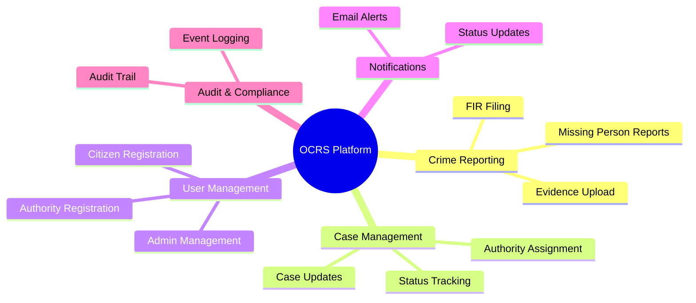

## 1.2 System Context Diagram (C4 Level 1)

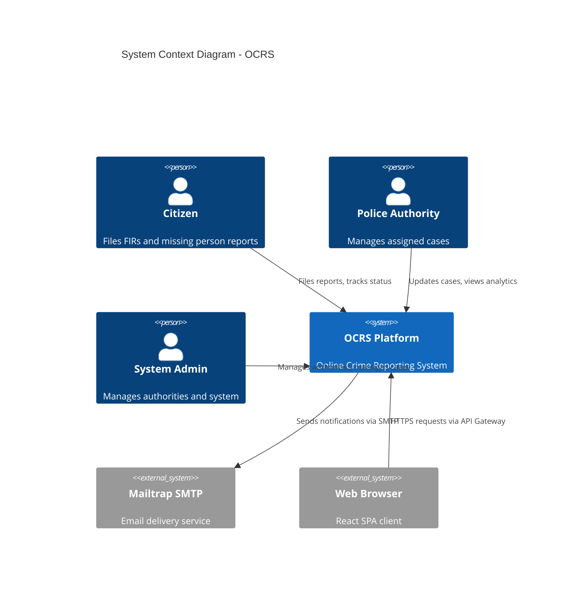

## 1.3 Architectural Decision Records (ADR Summary)

| ADR | Decision | Rationale | Trade-offs |
|-----|----------|-----------|------------|
| ADR-001 | Separate Auth and Backend databases | Data isolation, independent scaling | Cross-service joins require Feign calls |
| ADR-002 | API Gateway with JWT validation | Centralized security, reduced backend load | Single point of failure |
| ADR-003 | Redis for rate limiting | Fast, distributed counters | Additional infrastructure dependency |
| ADR-004 | Eureka for service discovery | Spring ecosystem integration | No built-in HA without clustering |
| ADR-005 | Polyglot microservices | Best tool per job | Increased operational complexity |
| ADR-006 | Gateway-trusts-headers pattern | Eliminates redundant JWT parsing | Requires gateway secret validation |

---

# 2. C4 Model - Level 2 (Container Diagram)

## 2.1 Container Diagram

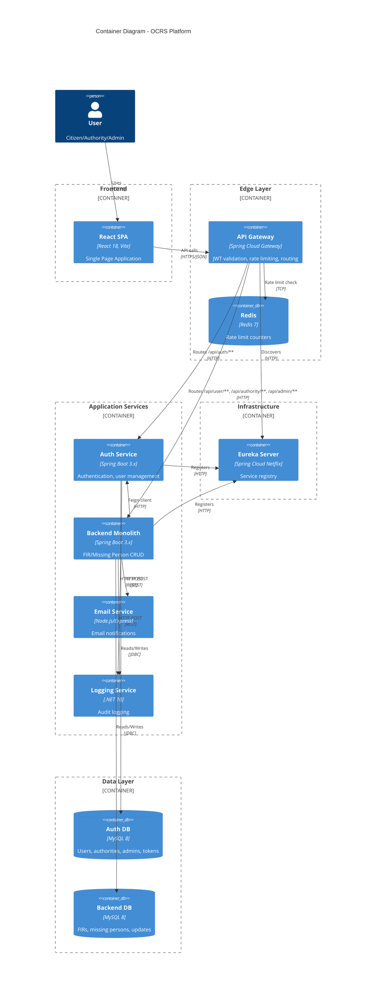

## 2.2 Deployment View

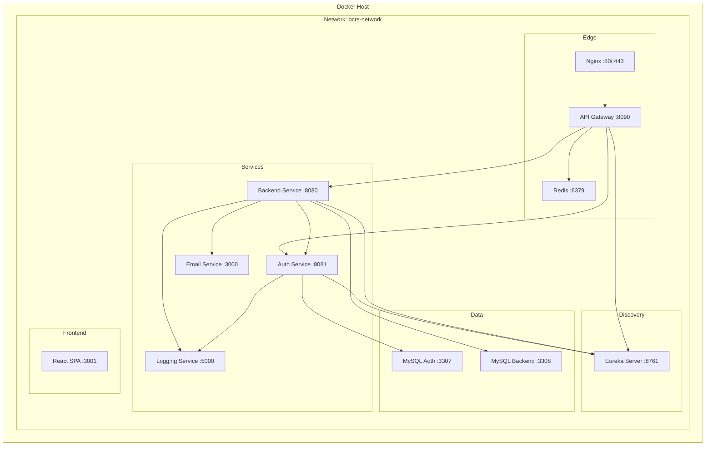

## 2.3 Port Mapping

| Service | Internal Port | External Port | Protocol |
|---------|--------------|---------------|----------|
| Eureka Server | 8761 | 8761 | HTTP |
| API Gateway | 8090 | 8090 | HTTP |
| Auth Service | 8081 | - (internal) | HTTP |
| Backend Service | 8080 | - (internal) | HTTP |
| Email Service | 3000 | 3000 | HTTP |
| Logging Service | 5000 | 5000 | HTTP |
| Redis | 6379 | 6379 | TCP |
| Auth MySQL | 3306 | 3307 | TCP |
| Backend MySQL | 3306 | 3308 | TCP |
| Frontend | 80 | 3001 | HTTP |

---

# 3. C4 Model - Level 3 (Component Diagrams)

## 3.1 Auth Service Components

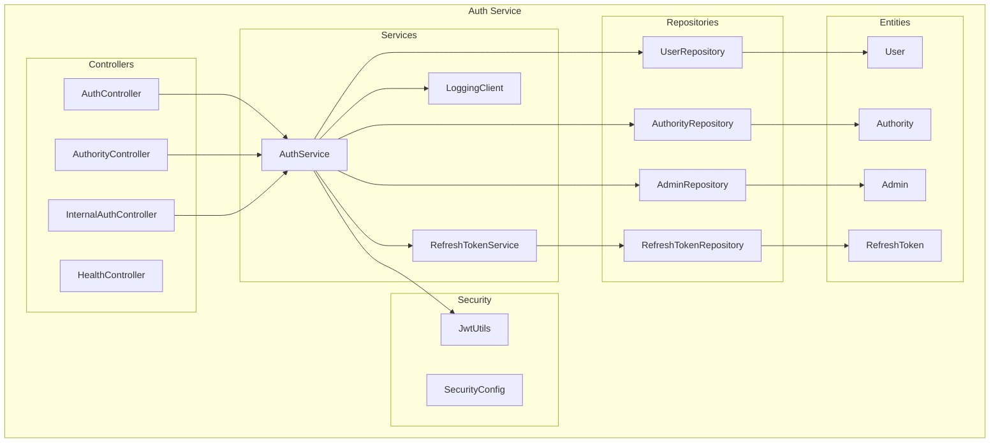

## 3.2 Backend Monolith Components

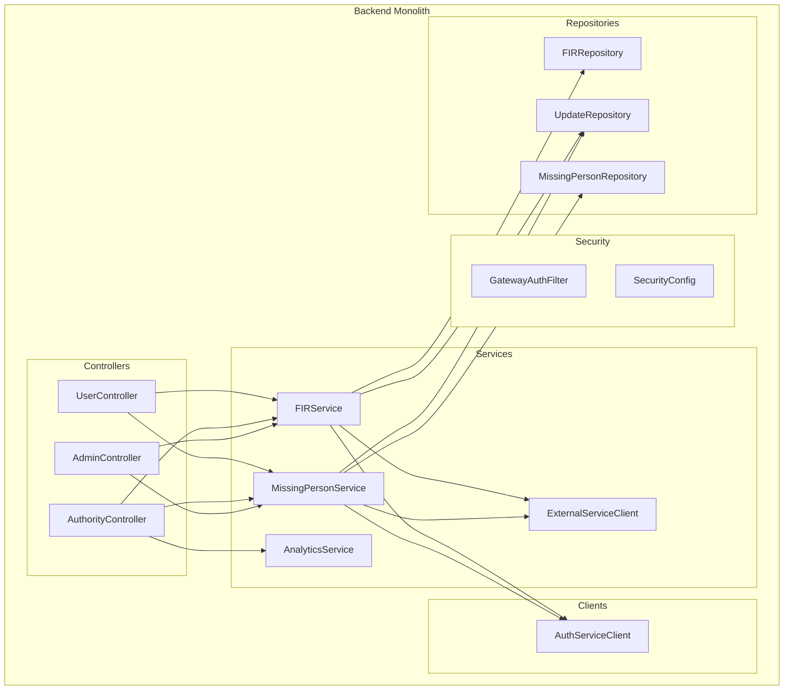

---

# 4. Module/Package Structure & Dependencies

## 4.1 Project Tree

```
ocrs-project/
├── api-gateway/                    # Spring Cloud Gateway
│   └── src/main/java/com/ocrs/gateway/
│       ├── ApiGatewayApplication.java
│       ├── config/
│       │   ├── CorsConfig.java
│       │   └── RateLimitConfig.java
│       ├── filter/
│       │   └── JwtAuthFilter.java
│       └── exception/
│           └── GlobalExceptionHandler.java
│
├── auth-service/                   # Authentication microservice
│   └── src/main/java/com/ocrs/auth/
│       ├── AuthServiceApplication.java
│       ├── config/
│       │   ├── DataSeeder.java
│       │   └── SecurityConfig.java
│       ├── controller/
│       │   ├── AuthController.java
│       │   ├── AuthorityController.java
│       │   ├── HealthController.java
│       │   └── InternalAuthController.java
│       ├── dto/
│       │   ├── ApiResponse.java
│       │   ├── AuthResponse.java
│       │   ├── LoginRequest.java
│       │   └── ...
│       ├── entity/
│       │   ├── User.java
│       │   ├── Authority.java
│       │   ├── Admin.java
│       │   └── RefreshToken.java
│       ├── exception/
│       │   ├── GlobalExceptionHandler.java
│       │   └── TokenRefreshException.java
│       ├── repository/
│       │   └── ...
│       ├── security/
│       │   └── JwtUtils.java
│       └── service/
│           ├── AuthService.java
│           ├── RefreshTokenService.java
│           └── LoggingClient.java
│
├── backend-monolith/               # Core business logic
│   └── src/main/java/com/ocrs/backend/
│       ├── BackendMonolithApplication.java
│       ├── client/
│       │   ├── AuthServiceClient.java
│       │   └── AuthServiceFallbackFactory.java
│       ├── config/
│       │   └── SecurityConfig.java
│       ├── controller/
│       │   ├── UserController.java
│       │   ├── AuthorityController.java
│       │   └── AdminController.java
│       ├── dto/
│       │   └── ...
│       ├── entity/
│       │   ├── FIR.java
│       │   ├── MissingPerson.java
│       │   └── Update.java
│       ├── repository/
│       │   └── ...
│       ├── security/
│       │   ├── GatewayAuthFilter.java
│       │   ├── CustomAccessDeniedHandler.java
│       │   └── JwtAuthenticationEntryPoint.java
│       └── service/
│           ├── FIRService.java
│           ├── MissingPersonService.java
│           ├── AnalyticsService.java
│           └── ExternalServiceClient.java
│
├── email-service/                  # Node.js email sender
│   └── src/
│       ├── index.js
│       ├── routes/emailRoutes.js
│       └── services/emailService.js
│
├── logging-service/                # .NET audit logging
│   ├── Program.cs
│   ├── Controllers/LogController.cs
│   └── Models/LogModels.cs
│
├── eureka-server/                  # Service discovery
│   └── src/main/java/.../EurekaServerApplication.java
│
├── frontend/                       # React SPA
│   └── src/
│       ├── components/
│       ├── pages/
│       ├── services/
│       └── context/
│
├── docker-compose.yml
└── docs/
```

## 4.2 Dependency Graph

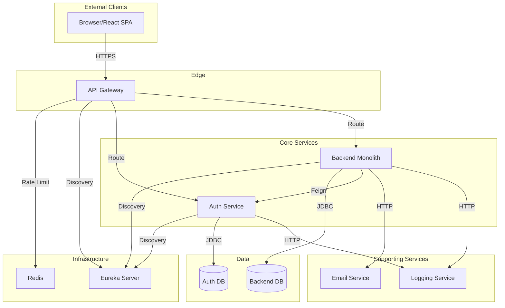

## 4.3 Circular Dependency Analysis

**No circular dependencies detected** between services. The dependency flow is strictly unidirectional:

- `backend-monolith` → `auth-service` (via Feign client)
- `backend-monolith` → `email-service` (via HTTP)
- `backend-monolith` → `logging-service` (via HTTP)
- `auth-service` → `logging-service` (via HTTP)

---

# 5. Security Architecture & Controls

## 5.1 Authentication Flow Sequence

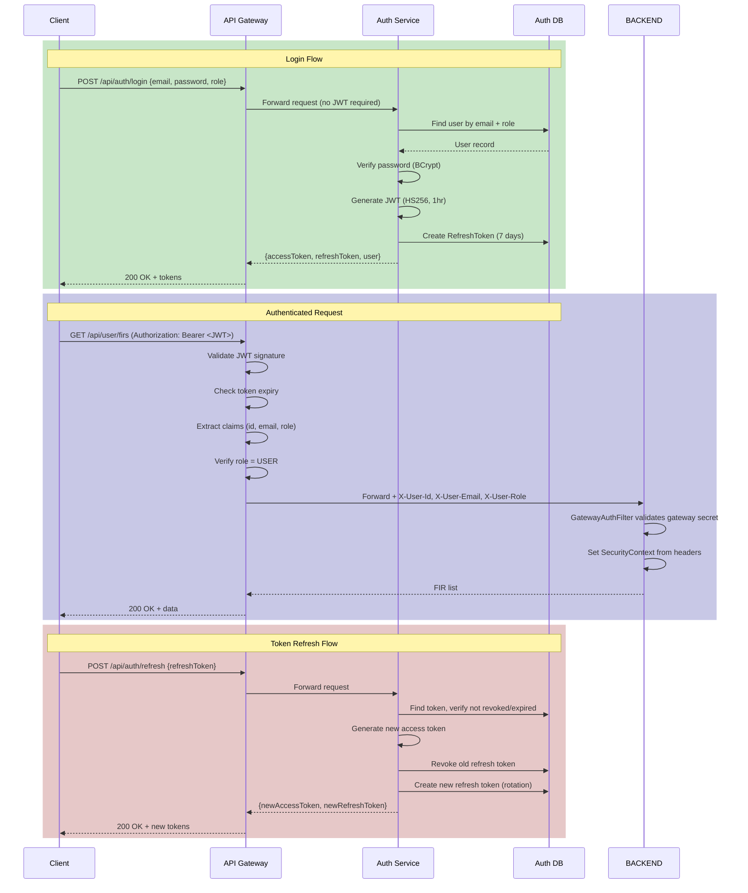

## 5.2 JWT Token Structure

```json
{
  "header": {
    "alg": "HS256",
    "typ": "JWT"
  },
  "payload": {
    "sub": "user@example.com",
    "id": 123,
    "role": "USER",
    "iat": 1706745600,
    "exp": 1706749200
  }
}
```

| Claim | Type | Description |
|-------|------|-------------|
| `sub` | String | User email address (subject) |
| `id` | Long | User ID from database |
| `role` | String | USER, AUTHORITY, or ADMIN |
| `iat` | Long | Issued at timestamp |
| `exp` | Long | Expiration timestamp (1 hour from iat) |

## 5.3 Authorization Model (RBAC)

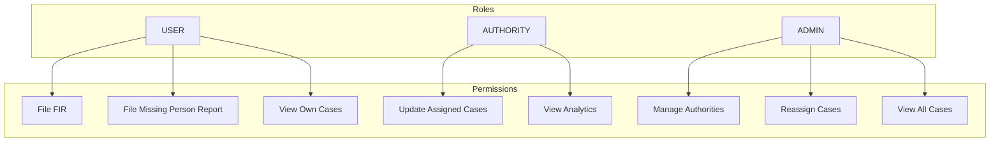

### Role-Based Route Protection

| Route Pattern | Required Role | Gateway Filter | Controller Annotation |
|--------------|---------------|----------------|----------------------|
| `/api/auth/**` | None | - | - |
| `/api/user/**` | USER | `JwtAuthFilter(requiredRole: USER)` | `@PreAuthorize("hasRole('USER')")` |
| `/api/authority/**` | AUTHORITY | `JwtAuthFilter(requiredRole: AUTHORITY)` | `@PreAuthorize("hasRole('AUTHORITY')")` |
| `/api/admin/**` | ADMIN | `JwtAuthFilter(requiredRole: ADMIN)` | `@PreAuthorize("hasRole('ADMIN')")` |

## 5.4 Security Headers

| Header | Value | Purpose |
|--------|-------|---------|
| `X-Content-Type-Options` | `nosniff` | Prevent MIME sniffing |
| `X-Frame-Options` | `DENY` | Prevent clickjacking |
| `Referrer-Policy` | `strict-origin-when-cross-origin` | Control referrer leakage |
| `X-Gateway-Secret` | (configured) | Backend validates gateway origin |
| `X-Request-Id` | UUID | Request tracing |

## 5.5 CORS Configuration

```yaml
allowedOriginPatterns:
  - http://localhost:*
allowedMethods:
  - GET, POST, PUT, DELETE, OPTIONS, PATCH
allowedHeaders: "*"
allowCredentials: true
maxAge: 3600
```

## 5.6 Secret Management Analysis

### Current Implementation (CRITICAL RISK)

| Secret | Location | Status |
|--------|----------|--------|
| JWT Secret | docker-compose.yml, application.yml | ⚠️ HARDCODED |
| DB Passwords | docker-compose.yml | ⚠️ HARDCODED |
| Gateway Secret | docker-compose.yml | ⚠️ HARDCODED |
| SMTP Credentials | Environment variables | ✅ Externalized |

### Recommended Production Solution

```yaml
# Use Docker secrets or Vault
secrets:
  jwt_secret:
    external: true
  db_password:
    external: true

services:
  auth-service:
    secrets:
      - jwt_secret
      - db_password
```

## 5.7 Input Validation

| Layer | Validation Type | Implementation |
|-------|-----------------|----------------|
| DTO | Bean Validation | `@Valid`, `@NotNull`, `@Email`, `@Size` |
| Controller | Request validation | Spring `@Valid` annotation |
| Entity | Database constraints | `@Column(nullable=false, unique=true)` |
| Service | Business rules | Programmatic checks |

### Missing Validations (Production Risk)

1. **Aadhaar Number**: No format validation (should be 12 digits with Verhoeff checksum)
2. **Phone Number**: No format validation
3. **FIR Description**: No XSS sanitization
4. **Evidence URLs**: No URL validation or domain whitelist

## 5.8 OWASP Top-10 Compliance

| Vulnerability | Status | Notes |
|---------------|--------|-------|
| A01: Broken Access Control | ✅ Partial | RBAC implemented, missing ownership validation on some endpoints |
| A02: Cryptographic Failures | ⚠️ Risk | Passwords hashed with BCrypt, but no encryption at rest |
| A03: Injection | ✅ Good | Spring Data JPA prevents SQL injection |
| A04: Insecure Design | ✅ Good | Defense-in-depth with gateway + controller auth |
| A05: Security Misconfiguration | ⚠️ Risk | Hardcoded secrets in config files |
| A06: Vulnerable Components | ⚠️ Unknown | No automated dependency scanning visible |
| A07: Auth Failures | ✅ Good | Refresh token rotation, proper logout |
| A08: Data Integrity Failures | ⚠️ Risk | No cryptographic verification of JWT key rotation |
| A09: Logging Failures | ✅ Good | Comprehensive audit logging implemented |
| A10: SSRF | ✅ Good | No user-controlled URL fetching |

---

# 6. Complete Data Model Documentation

## 6.1 Entity Relationship Diagram

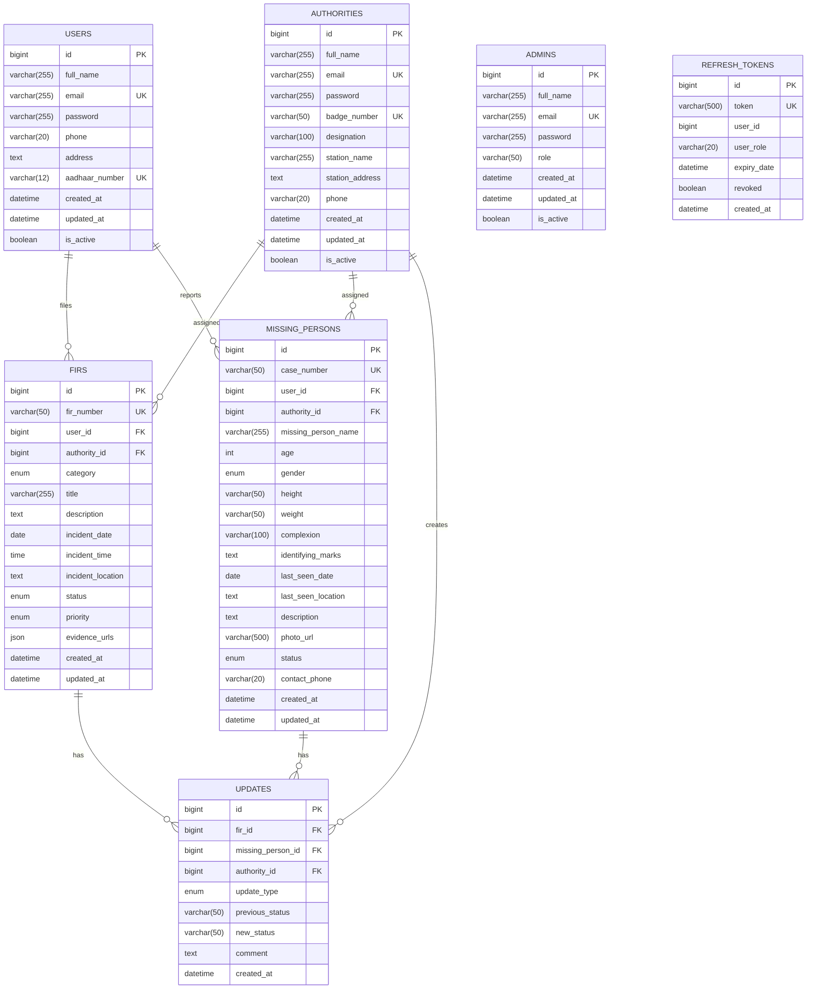

## 6.2 Table-by-Table Documentation

### 6.2.1 `users` Table (Auth DB)

| Column | Type | Constraints | Business Meaning | Access Pattern |
|--------|------|-------------|------------------|----------------|
| `id` | BIGINT | PK, AUTO_INCREMENT | Unique citizen identifier | Lookup by ID |
| `full_name` | VARCHAR(255) | NOT NULL | Legal name of citizen | Display |
| `email` | VARCHAR(255) | NOT NULL, UNIQUE | Login credential, communication | Login lookup |
| `password` | VARCHAR(255) | NOT NULL | BCrypt hashed password | Authentication |
| `phone` | VARCHAR(20) | NULL | Contact number | Contact |
| `address` | TEXT | NULL | Residential address | FIR context |
| `aadhaar_number` | VARCHAR(12) | UNIQUE | Indian national ID | Identity verification |
| `created_at` | DATETIME | NOT NULL | Registration timestamp | Audit |
| `updated_at` | DATETIME | NOT NULL | Last modification | Audit |
| `is_active` | BOOLEAN | DEFAULT TRUE | Soft delete flag | Access control |

**Indexes**: `email` (unique), `aadhaar_number` (unique)
**Expected Cardinality**: 10K-100K records
**Soft Delete Strategy**: `is_active = false` for deactivation

### 6.2.2 `authorities` Table (Auth DB)

| Column | Type | Constraints | Business Meaning |
|--------|------|-------------|------------------|
| `id` | BIGINT | PK, AUTO_INCREMENT | Police officer identifier |
| `full_name` | VARCHAR(255) | NOT NULL | Officer's legal name |
| `email` | VARCHAR(255) | NOT NULL, UNIQUE | Official email for login |
| `password` | VARCHAR(255) | NOT NULL | BCrypt hashed password |
| `badge_number` | VARCHAR(50) | UNIQUE | Official police badge ID |
| `designation` | VARCHAR(100) | NULL | Rank (Inspector, SI, etc.) |
| `station_name` | VARCHAR(255) | NULL | Police station name |
| `station_address` | TEXT | NULL | Station location |
| `phone` | VARCHAR(20) | NULL | Contact number |
| `is_active` | BOOLEAN | DEFAULT TRUE | Officer status |

**Indexes**: `email` (unique), `badge_number` (unique)
**Expected Cardinality**: 100-1000 records

### 6.2.3 `refresh_tokens` Table (Auth DB)

| Column | Type | Constraints | Business Meaning |
|--------|------|-------------|------------------|
| `id` | BIGINT | PK | Token record ID |
| `token` | VARCHAR(500) | NOT NULL, UNIQUE | UUID-based refresh token |
| `user_id` | BIGINT | NOT NULL | Associated user/authority/admin ID |
| `user_role` | VARCHAR(20) | NOT NULL | USER, AUTHORITY, or ADMIN |
| `expiry_date` | DATETIME | NOT NULL | Token expiration (7 days default) |
| `revoked` | BOOLEAN | DEFAULT FALSE | Manual revocation flag |
| `created_at` | DATETIME | NOT NULL | Token creation time |

**Indexes**: `token` (unique), composite `(user_id, user_role)`
**Cleanup**: Scheduled job at midnight deletes expired tokens

### 6.2.4 `firs` Table (Backend DB)

| Column | Type | Constraints | Business Meaning |
|--------|------|-------------|------------------|
| `id` | BIGINT | PK | Internal FIR ID |
| `fir_number` | VARCHAR(50) | NOT NULL, UNIQUE | Public FIR reference (FIR-XXXXXXXX) |
| `user_id` | BIGINT | NOT NULL | Citizen who filed |
| `authority_id` | BIGINT | NULL | Assigned officer (auto-assigned) |
| `category` | ENUM | NOT NULL | Crime type classification |
| `title` | VARCHAR(255) | NOT NULL | Short description |
| `description` | TEXT | NOT NULL | Full incident details |
| `incident_date` | DATE | NOT NULL | When crime occurred |
| `incident_time` | TIME | NULL | Time of incident |
| `incident_location` | TEXT | NOT NULL | Where crime occurred |
| `status` | ENUM | DEFAULT 'PENDING' | Case lifecycle state |
| `priority` | ENUM | AUTO-ASSIGNED | Urgency level based on category |
| `evidence_urls` | JSON | NULL | Array of evidence file URLs |

**Category Enum Values**: THEFT, ASSAULT, FRAUD, CYBERCRIME, HARASSMENT, VANDALISM, OTHER

**Status Enum Values**: PENDING, UNDER_INVESTIGATION, RESOLVED, CLOSED, REJECTED

**Priority Enum Values**: LOW, MEDIUM, HIGH, URGENT

**Auto-Priority Assignment Logic**:
- ASSAULT → URGENT
- HARASSMENT, CYBERCRIME → HIGH
- FRAUD, THEFT, OTHER → MEDIUM
- VANDALISM → LOW

### 6.2.5 `updates` Table (Backend DB)

| Column | Type | Constraints | Business Meaning |
|--------|------|-------------|------------------|
| `id` | BIGINT | PK | Update record ID |
| `fir_id` | BIGINT | FK, NULL | Associated FIR |
| `missing_person_id` | BIGINT | FK, NULL | Associated missing person case |
| `authority_id` | BIGINT | NOT NULL | Officer who made update |
| `update_type` | ENUM | NOT NULL | Type of update |
| `previous_status` | VARCHAR(50) | NULL | Status before change |
| `new_status` | VARCHAR(50) | NULL | Status after change |
| `comment` | TEXT | NULL | Officer's notes |
| `created_at` | DATETIME | NOT NULL | Update timestamp |

**Update Type Enum**: STATUS_CHANGE, COMMENT, EVIDENCE_ADDED, REASSIGNMENT

---

# 7. API Contract & Request Lifecycle

## 7.1 API Endpoints Summary

### Auth Service Endpoints

| Method | Path | Auth | Description |
|--------|------|------|-------------|
| POST | `/api/auth/register/user` | None | Register new citizen |
| POST | `/api/auth/register/authority` | None | Register new authority |
| POST | `/api/auth/login` | None | Authenticate user |
| POST | `/api/auth/refresh` | None | Refresh access token |
| POST | `/api/auth/revoke` | None | Revoke refresh token |
| POST | `/api/auth/logout` | None | Logout and revoke tokens |

### User Endpoints (Backend)

| Method | Path | Auth | Description |
|--------|------|------|-------------|
| POST | `/api/user/fir` | USER | File new FIR |
| GET | `/api/user/firs` | USER | Get user's FIRs |
| GET | `/api/user/fir/{id}` | USER | Get FIR by ID |
| GET | `/api/user/fir/{firId}/updates` | USER | Get FIR updates |
| POST | `/api/user/missing` | USER | File missing person report |
| GET | `/api/user/missing-reports` | USER | Get user's reports |

### Authority Endpoints (Backend)

| Method | Path | Auth | Description |
|--------|------|------|-------------|
| GET | `/api/authority/analytics` | AUTHORITY | Get analytics |
| GET | `/api/authority/firs` | AUTHORITY | Get assigned FIRs |
| GET | `/api/authority/firs/paged` | AUTHORITY | Paginated FIRs |
| GET | `/api/authority/firs/search` | AUTHORITY | Search/filter FIRs |
| PUT | `/api/authority/fir/{firId}/update` | AUTHORITY | Update FIR status |

### Admin Endpoints (Backend)

| Method | Path | Auth | Description |
|--------|------|------|-------------|
| GET | `/api/admin/firs` | ADMIN | Get all FIRs |
| PUT | `/api/admin/fir/{firId}/reassign` | ADMIN | Reassign FIR |
| GET | `/api/admin/analytics` | ADMIN | System-wide analytics |

## 7.2 Request Lifecycle - File FIR

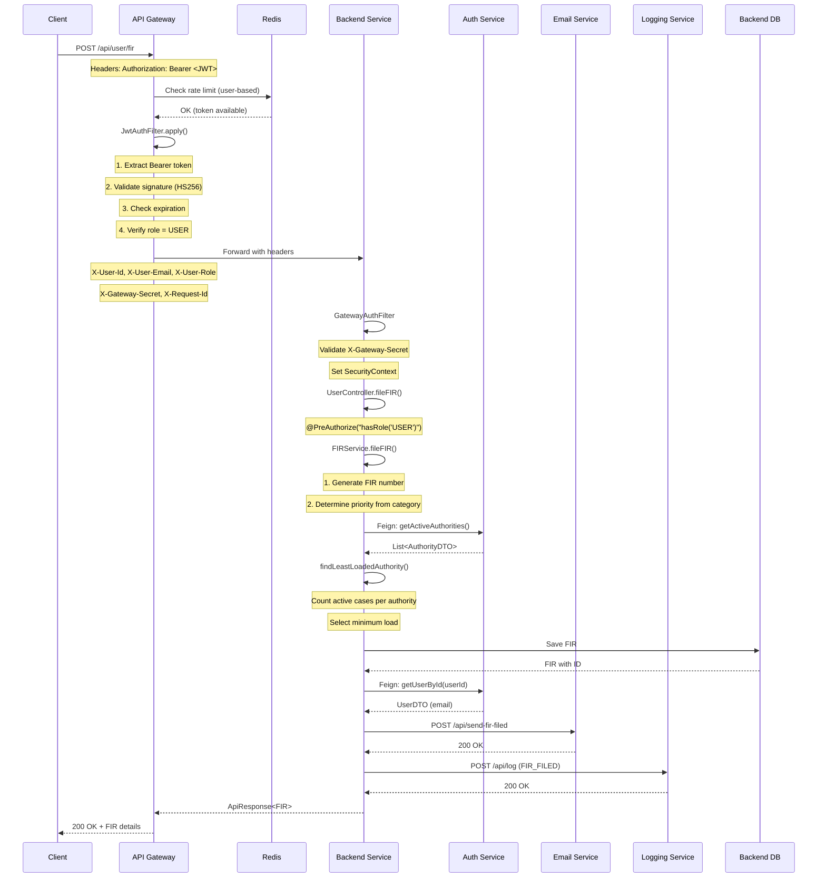

## 7.3 Rate Limiting Configuration

| Route | Rate | Burst | Key Resolver |
|-------|------|-------|--------------|
| `/api/auth/**` | 10/sec | 20 | IP Address |
| `/api/user/**` | 20/sec | 40 | User ID |
| `/api/authority/**` | 30/sec | 60 | User ID |
| `/api/admin/**` | 50/sec | 100 | User ID |

---

# 8. File-by-File Deep Documentation

## 8.1 Auth Service

### `AuthService.java` (382 lines)

**Responsibility**: Core authentication logic - registration, login, token management for all 3 user types.

**Layer Position**: Service layer (business logic)

**Design Patterns**:
- Strategy pattern (implicit): Login method dispatches to role-specific handlers
- Builder pattern: Entity construction

**Key Methods**:

| Method | Responsibility | Transaction |
|--------|----------------|-------------|
| `registerUser()` | Citizen registration, token generation | `@Transactional` |
| `registerAuthority()` | Officer registration | `@Transactional` |
| `login()` | Dispatch to role-specific login | - |
| `loginUser/Authority/Admin()` | Role-specific authentication | `@Transactional` |
| `refreshToken()` | Token rotation | `@Transactional` |
| `logout()` | Revoke all user tokens | `@Transactional` |

**Thread Safety**: Stateless service, thread-safe via Spring singleton scope.

**Dependencies Injected**:
- `UserRepository`, `AuthorityRepository`, `AdminRepository`
- `PasswordEncoder` (BCrypt)
- `JwtUtils`, `RefreshTokenService`, `LoggingClient`

### `JwtUtils.java` (114 lines)

**Responsibility**: JWT token generation and validation using HMAC-SHA256.

**Key Methods**:

| Method | Purpose |
|--------|---------|
| `generateToken()` | Create signed JWT with id, email, role claims |
| `extractAllClaims()` | Parse token once, return all claims as record |
| `validateToken()` | Verify signature, check expiration |

**Concurrency**: Stateless, key derivation is thread-safe.

**Security Note**: Uses `Keys.hmacShaKeyFor()` which requires minimum 256-bit key.

### `RefreshTokenService.java` (118 lines)

**Responsibility**: Refresh token lifecycle management with rotation.

**Key Features**:
- Token rotation on refresh (revokes old, issues new)
- Scheduled cleanup at midnight (`@Scheduled(cron = "0 0 0 * * ?")`)
- Dual UUID generation for token value

**Critical Consideration**: If this service fails, users cannot refresh tokens and must re-login.

## 8.2 API Gateway

### `JwtAuthFilter.java` (204 lines)

**Responsibility**: Gateway filter for JWT validation and role-based access control.

**Pattern**: GatewayFilterFactory (Spring Cloud Gateway pattern)

**Flow**:
1. Skip OPTIONS requests (CORS preflight)
2. Extract Authorization header
3. Parse and validate JWT
4. Check required role (from filter config)
5. Add X-User-* headers for downstream
6. Return structured JSON errors for failures

**Error Codes Returned**:
- `MISSING_TOKEN` (401)
- `INVALID_TOKEN_FORMAT` (401)
- `TOKEN_EXPIRED` (401)
- `MALFORMED_TOKEN` (401)
- `INSUFFICIENT_PERMISSIONS` (403)

### `RateLimitConfig.java` (45 lines)

**Responsibility**: Define key resolvers for rate limiting.

**Key Resolvers**:
- `ipKeyResolver`: Uses client IP (for public endpoints)
- `userKeyResolver`: Uses X-User-Id header (for authenticated endpoints)

## 8.3 Backend Monolith

### `FIRService.java` (360 lines)

**Responsibility**: FIR business logic - filing, updating, reassignment.

**Key Features**:

| Feature | Implementation |
|---------|----------------|
| Auto-priority | Rule-based assignment from category |
| Load balancing | Least-loaded authority assignment |
| Closed case protection | Cannot update CLOSED status |
| Email notifications | On file, update, reassign |
| Audit logging | All actions logged |

**Critical Method - `findLeastLoadedAuthority()`**:
```java
// Fetches all active authorities from Auth Service
// Counts active (non-closed) FIRs per authority
// Returns authority ID with minimum count
```

**Idempotency**: FIR filing is NOT idempotent (generates new FIR number each time). Consider adding request deduplication.

### `GatewayAuthFilter.java` (115 lines)

**Responsibility**: Trust gateway headers and set Spring Security context.

**Security Model**:
1. Validates `X-Gateway-Secret` header
2. Extracts `X-User-Id`, `X-User-Email`, `X-User-Role`
3. Creates `UsernamePasswordAuthenticationToken`
4. Sets `SecurityContextHolder` for `@PreAuthorize`

**Defense in Depth**: Rejects requests without valid gateway secret, preventing direct backend access.

### `UserController.java` (149 lines)

**Responsibility**: REST endpoints for citizen operations.

**Security Layers**:
- Class-level: `@PreAuthorize("hasRole('USER')")`
- Method-level: Redundant `@PreAuthorize` for defense-in-depth

**Missing**: Ownership validation on `getFIR()` - any USER can view any FIR by ID.

### `AuthorityController.java` (233 lines)

**Responsibility**: REST endpoints for police officer operations.

**Features**:
- Pagination support (`PageRequest`)
- Multi-field sorting
- Search with filters (category, priority, status)
- Analytics endpoint

## 8.4 Email Service (Node.js)

### `index.js` (40 lines)

**Responsibility**: Express app initialization, CORS config, health endpoint.

**Stack**: Express.js on Node.js 18

**CORS Origins**: Configurable via `CORS_ORIGINS` environment variable.

## 8.5 Logging Service (.NET)

### `LogController.cs` (369 lines)

**Responsibility**: Centralized audit logging with categorized file output.

**Log Categories**:
| Category | File Path | Events |
|----------|-----------|--------|
| user | `/logs/user/user_auth_logs.txt` | LOGIN, LOGOUT, USER_REGISTERED |
| authority | `/logs/authority/authority_logs.txt` | AUTHORITY_REGISTERED, case updates |
| admin | `/logs/admin/admin_logs.txt` | ADMIN_LOGIN, authority management |
| fir | `/logs/fir/fir_logs.txt` | FIR_FILED, FIR_UPDATED, MISSING_PERSON_* |

**Thread Safety**: Uses per-category lock objects for file writes.

**Dual Logging**: FIR updates are logged to both `fir` and `authority` categories.

---

# 9. Critical Business Flows

## 9.1 FIR Filing Flow (Happy Path + Errors)

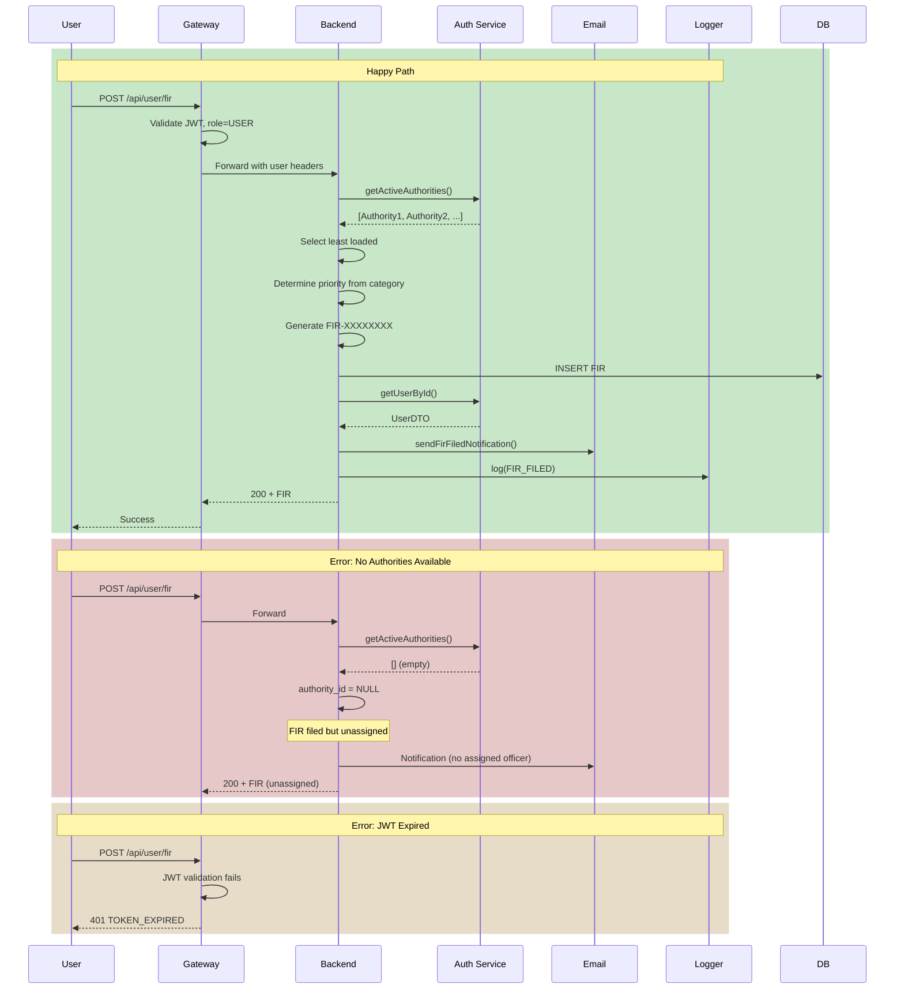

## 9.2 Case Status Update Flow

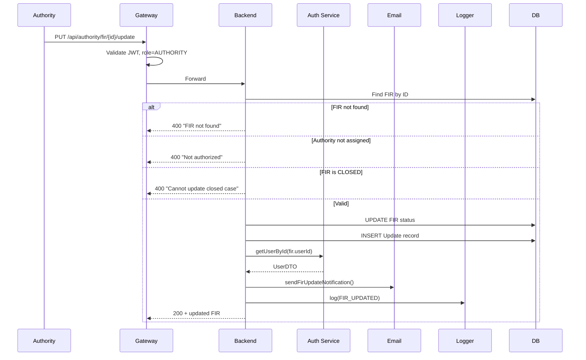

## 9.3 Token Refresh Flow

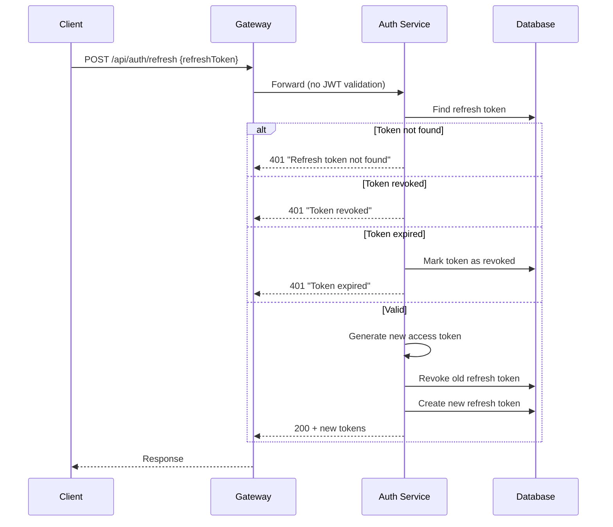

---

# 10. Operations & Production Readiness

## 10.1 Logging Strategy

### Structured Logging Format

**Java Services (Logback)**:
```
2025-01-15 14:23:45.123 INFO [auth-service,trace-id,span-id] c.o.a.s.AuthService - user registered: user@example.com
```

**Node.js (Console)**:
```
[2025-01-15T14:23:45.123Z] INFO: Email sent to user@example.com
```

**.NET (Serilog)**:
```
2025-01-15 14:23:45 [INF] ABC12345 - 2025-01-15 14:23:45 - User Login - User ID: 123, Email: user@example.com
```

### Log Levels

| Level | Usage |
|-------|-------|
| ERROR | Exceptions, failed operations |
| WARN | Suspicious activity, degraded operations |
| INFO | Business events (login, FIR filed) |
| DEBUG | Request/response details, internal flow |

### Correlation ID

**Current Status**: `X-Request-Id` header added by gateway but NOT propagated through Feign calls.

**Recommended Fix**: Add MDC-based correlation ID propagation.

## 10.2 Health Checks

| Service | Endpoint | Checks |
|---------|----------|--------|
| Eureka | `/actuator/health` | Self |
| Gateway | `/actuator/health` | Self, Redis, Eureka |
| Auth Service | `/actuator/health` | Self, MySQL, Eureka |
| Backend | `/actuator/health` | Self, MySQL, Eureka |
| Email | `/health` | Self |
| Logging | `/health` | Self, log directory |

## 10.3 Metrics Exposed

**Spring Boot Actuator** (via Prometheus endpoint):

- `jvm_*`: Memory, GC, threads
- `http_server_requests_*`: Request count, latency
- `spring_data_repository_*`: Database operations
- `resilience4j_*`: Circuit breaker state

## 10.4 Alerting Recommendations

| Alert | Condition | Severity |
|-------|-----------|----------|
| High Error Rate | 5xx > 1% of requests | P1 |
| Auth Service Down | Health check fails 3x | P1 |
| Database Connection Exhausted | Pool utilization > 90% | P2 |
| JWT Token Errors Spike | TOKEN_EXPIRED > 100/min | P3 |
| Rate Limit Triggered | 429 responses > 50/min | P3 |

## 10.5 Backup Strategy

**Current Implementation**: Missing

**Recommended Production Setup**:

```yaml
# MySQL automatic backup
mysqldump:
  schedule: "0 2 * * *"  # 2 AM daily
  retention: 30 days
  destination: s3://ocrs-backups/

# Volume snapshot (Docker)
docker run --rm -v auth_db_data:/data \
  -v /backups:/backup \
  busybox tar czf /backup/auth-$(date +%Y%m%d).tar.gz /data
```

## 10.6 Disaster Recovery

| Scenario | RTO | RPO | Procedure |
|----------|-----|-----|-----------|
| Single service failure | 5 min | 0 | Kubernetes/Docker restart |
| Database corruption | 1 hour | 24 hours | Restore from backup |
| Complete data center loss | 4 hours | 24 hours | Failover to DR region |

**Current Status**: No DR setup. Single point of failure.

---

# 11. Known Issues & Technical Debt

## 11.1 Critical Issues

| ID | Issue | Risk | Recommendation |
|----|-------|------|----------------|
| TD-001 | Hardcoded secrets | Critical | Migrate to Docker secrets or Vault |
| TD-002 | No input validation on Aadhaar | High | Add Verhoeff checksum validation |
| TD-003 | Missing ownership check on FIR view | High | Add userId check in controller |
| TD-004 | No database encryption at rest | Medium | Enable TDE on MySQL |

## 11.2 Performance Concerns

| Issue | Impact | Solution |
|-------|--------|----------|
| N+1 query on authority load balancing | Slow FIR filing | Add `@Query` with JOIN |
| No connection pooling config | DB bottleneck under load | Configure HikariCP |
| Synchronous email sending | Slow response | Use async with queue |

## 11.3 Missing Production Features

- [ ] Circuit breaker on Feign clients (configured but not tested)
- [ ] Distributed tracing (Zipkin/Jaeger)
- [ ] Centralized log aggregation (ELK/Loki)
- [ ] Database read replicas
- [ ] Blue-green deployment support
- [ ] API versioning

---

# 12. Appendices

## A. Environment Variables

| Variable | Service | Default | Description |
|----------|---------|---------|-------------|
| `JWT_SECRET` | Auth, Gateway | (hardcoded) | Token signing key |
| `JWT_EXPIRATION` | Auth | 3600000 | Access token TTL (ms) |
| `JWT_REFRESH_EXPIRATION` | Auth | 604800000 | Refresh token TTL (ms) |
| `GATEWAY_SECRET` | Gateway, Backend | (hardcoded) | Inter-service auth |
| `EUREKA_CLIENT_SERVICEURL_DEFAULTZONE` | All Java | localhost:8761 | Service registry URL |
| `REDIS_HOST` | Gateway | localhost | Rate limit store |
| `SMTP_HOST` | Email | live.smtp.mailtrap.io | Email server |
| `SMTP_USER` | Email | (required) | SMTP username |
| `SMTP_PASS` | Email | (required) | SMTP password |

## B. Docker Compose Quick Reference

```bash
# Start all services
docker-compose up -d

# View logs
docker-compose logs -f api-gateway

# Restart single service
docker-compose restart backend-monolith

# Scale (if configured)
docker-compose up -d --scale backend-monolith=2

# Cleanup
docker-compose down -v
```

## C. Common Troubleshooting

| Symptom | Likely Cause | Solution |
|---------|--------------|----------|
| 401 on all requests | JWT secret mismatch | Ensure same secret in auth-service and gateway |
| 403 on backend | Missing gateway secret | Check X-Gateway-Secret header |
| 500 on FIR file | Auth service unreachable | Check Eureka registration |
| Empty authority list | No active authorities | Create/activate authorities |
| Rate limit 429 | Too many requests | Wait or increase limits |

---

**Document Version**: 1.0.0
**Last Updated**: 2025-01-15
**Author**: Technical Documentation System
**Review Status**: Pending Security Review
