# OCRS - Online Crime Reporting System
## Complete Technical Documentation (Production-Grade)

**Version**: 2.0  
**Generated**: January 28, 2026  
**Purpose**: Senior backend interviews, production handover, security audits, architecture reviews, new developer onboarding

---

# Table of Contents

1. [System Architecture](#1-system-architecture)
2. [API Gateway Deep-Dive](#2-api-gateway-deep-dive)
3. [Auth Service Deep-Dive](#3-auth-service-deep-dive)
4. [Backend Monolith Deep-Dive](#4-backend-monolith-deep-dive)
5. [Email Service Deep-Dive](#5-email-service-deep-dive)
6. [Logging Service Deep-Dive](#6-logging-service-deep-dive)
7. [Frontend Deep-Dive](#7-frontend-deep-dive)
8. [Database Documentation](#8-database-documentation)
9. [Security Deep-Dive](#9-security-deep-dive)
10. [Configuration Files](#10-configuration-files)
11. [Deployment & Scaling](#11-deployment--scaling)
12. [Performance Analysis](#12-performance-analysis)
13. [Interview Preparation](#13-interview-preparation)
---

# 1. System Architecture

## 1.1 High-Level System Architecture Diagram

```mermaid
graph TB
    subgraph "Client Layer"
        FE["🖥️ Frontend<br/>(React + Vite)<br/>Port: 5173/3001"]
    end

    subgraph "API Gateway Layer"
        GW["🚪 API Gateway<br/>(Spring Cloud Gateway)<br/>Port: 8090"]
        REDIS["📦 Redis<br/>(Rate Limiting)<br/>Port: 6379"]
        GW -.-> REDIS
    end

    subgraph "Service Layer"
        AUTH["🔐 Auth Service<br/>(Spring Boot)<br/>Port: 8081"]
        BACK["📋 Backend Monolith<br/>(Spring Boot)<br/>Port: 8080"]
    end

    subgraph "Support Services"
        EMAIL["📧 Email Service<br/>(Node.js/Express)<br/>Port: 3000"]
        LOG["📝 Logging Service<br/>(.NET/ASP.NET Core)<br/>Port: 5000"]
    end

    subgraph "Service Discovery"
        EUR["🔍 Eureka Server<br/>(Spring Cloud Netflix)<br/>Port: 8761"]
    end

    subgraph "Data Layer"
        AUTHDB[("🗄️ Auth DB<br/>(MySQL 8.0)<br/>Port: 3307<br/>ocrs_auth")]
        BACKDB[("🗄️ Backend DB<br/>(MySQL 8.0)<br/>Port: 3308<br/>ocrs_backend")]
        LOGS[/"📁 Log Files<br/>/logs/"/]
    end

    FE -->|"HTTP/REST"| GW
    GW -->|"Route + JWT Validate"| AUTH
    GW -->|"Route + JWT Validate"| BACK
    
    AUTH <-->|"Feign Client"| BACK
    BACK -->|"Async HTTP"| EMAIL
    BACK -->|"Async HTTP"| LOG
    AUTH -->|"Async HTTP"| LOG
    
    AUTH -.->|"Register/Discover"| EUR
    BACK -.->|"Register/Discover"| EUR
    GW -.->|"Discover Services"| EUR
    
    AUTH -->|"JPA/Hibernate"| AUTHDB
    BACK -->|"JPA/Hibernate"| BACKDB
    LOG -->|"File I/O"| LOGS
```



## 1.2 Module Dependency Diagram


## 1.3 Deployment Diagram

```mermaid
graph TB
    subgraph "Docker Compose Orchestration"
        subgraph "Frontend Container"
            NGINX["Nginx :80"]
            REACT["React Build"]
            NGINX --> REACT
        end

        subgraph "Gateway Container"
            GW["API Gateway :8090"]
        end

        subgraph "Service Containers"
            AUTH["Auth Service :8081"]
            BACK["Backend :8080"]
        end

        subgraph "Support Containers"
            EMAIL["Email Service :3000"]
            LOG["Logging Service :5000"]
        end

        subgraph "Infrastructure Containers"
            EUR["Eureka :8761"]
            REDIS["Redis :6379"]
        end

        subgraph "Database Containers"
            AUTH_DB["MySQL (Auth) :3306→3307"]
            BACK_DB["MySQL (Backend) :3306→3308"]
        end

        subgraph "Volumes"
            AUTH_VOL[/"auth_db_data"/]
            BACK_VOL[/"backend_db_data"/]
            LOG_VOL[/"./logs"/]
        end
    end

    NGINX -->|":3001→:80"| GW
    GW --> AUTH
    GW --> BACK
    AUTH --> AUTH_DB
    BACK --> BACK_DB
    AUTH_DB --> AUTH_VOL
    BACK_DB --> BACK_VOL
    LOG --> LOG_VOL
```



## 1.4 Request Flow Diagram (FIR Filing - Complete Flow)

```mermaid
sequenceDiagram
    autonumber
    participant U as 👤 User
    participant FE as 🖥️ Frontend
    participant GW as 🚪 API Gateway
    participant BACK as 📋 Backend
    participant AUTH as 🔐 Auth Service
    participant EMAIL as 📧 Email Service
    participant LOG as 📝 Logging Service
    participant DB as 🗄️ Backend DB

    Note over U,DB: FIR Filing Flow (End-to-End)

    U->>FE: Submit FIR Form
    FE->>FE: Validate form fields
    FE->>GW: POST /api/user/fir<br/>[Authorization: Bearer JWT]
    
    GW->>GW: Extract JWT from header
    GW->>GW: Validate JWT signature (HMAC-SHA256)
    GW->>GW: Check role == "USER"
    
    alt Invalid/Expired Token
        GW-->>FE: 401 Unauthorized
        FE-->>U: Session expired, redirect to login
    end

    GW->>GW: Add X-User-Id, X-User-Role headers
    GW->>BACK: Forward request with user context

    BACK->>BACK: Generate FIR Number<br/>(FIR-XXXXXXXX)
    
    BACK->>AUTH: GET /api/internal/authorities/active<br/>[Feign Client]
    AUTH->>AUTH: Query active authorities
    AUTH-->>BACK: List<AuthorityDTO>
    
    loop For each authority
        BACK->>DB: COUNT active FIRs for authority
        DB-->>BACK: Case count
    end
    
    BACK->>BACK: Select least loaded authority<br/>(Load Balancing Algorithm)
    BACK->>BACK: Determine priority from category<br/>(Rule-based mapping)
    
    BACK->>DB: INSERT FIR record
    DB-->>BACK: FIR saved with ID
    
    par Async Notifications
        BACK->>AUTH: GET /api/internal/users/{id}<br/>[Get user email]
        AUTH-->>BACK: UserDTO with email
        BACK->>EMAIL: POST /api/email/send<br/>[firFiled template]
        EMAIL-->>BACK: 200 OK (async)
    and
        BACK->>LOG: POST /api/log<br/>[FIR_FILED event]
        LOG-->>BACK: 200 OK (async)
    end

    BACK-->>GW: 200 OK {success: true, data: FIR}
    GW-->>FE: Response passthrough
    FE->>FE: Store FIR in state
    FE-->>U: Display success + FIR Number
```



## 1.5 Communication Patterns Summary

| Pattern | Technology | Use Case | Sync/Async |
|---------|------------|----------|------------|
| **REST API** | Spring WebFlux (Gateway) | Client → Gateway | Sync |
| **Feign Client** | OpenFeign + Eureka | Backend → Auth | Sync |
| **WebClient** | Spring WebClient | Backend → Email/Logging | Async |
| **Service Discovery** | Eureka Client/Server | All Java Services | Background |
| **Rate Limiting** | Redis + RequestRateLimiter | Gateway | Sync |

---

# 2. API Gateway Deep-Dive

## 2.1 Service Overview

| Attribute | Value |
|-----------|-------|
| **Port** | 8090 |
| **Technology** | Spring Cloud Gateway (WebFlux) |
| **Purpose** | Centralized routing, JWT validation, rate limiting, CORS |
| **Dependencies** | Eureka Client, Redis, JJWT |

## 2.2 File Structure

```
api-gateway/src/main/java/com/ocrs/gateway/
├── ApiGatewayApplication.java     # Entry point
├── config/
│   └── RateLimitConfig.java       # Redis rate limiting
├── controller/
│   └── HealthController.java      # Health endpoint
├── exception/
│   └── GlobalExceptionHandler.java # Error handling
└── filter/
    └── JwtAuthFilter.java         # JWT validation filter
```

---

## 2.3 File: ApiGatewayApplication.java

### 2.3.1 Class Diagram


### 2.3.2 Purpose
Entry point for the Spring Cloud Gateway application. Bootstraps the reactive WebFlux server with service discovery capabilities.

### 2.3.3 Annotations Explained

| Annotation | Internal Behavior | Impact if Removed |
|------------|-------------------|-------------------|
| `@SpringBootApplication` | Combines `@Configuration`, `@EnableAutoConfiguration`, `@ComponentScan`. Triggers auto-configuration of Gateway routes from `application.yml` | Application won't start; no Spring context created |
| `@EnableDiscoveryClient` | Registers with Eureka server on startup, enables `lb://` URIs in route definitions | Routes with `lb://auth-service` would fail; no service discovery |

### 2.3.4 Runtime Lifecycle
1. **Startup**: Spring Boot initializes WebFlux server
2. **Eureka Registration**: Client registers with Eureka (port 8761)
3. **Route Loading**: Gateway reads routes from `application.yml`
4. **Filter Chain Setup**: Custom filters (`JwtAuthFilter`) registered
5. **Ready**: Listens on port 8090

### 2.3.5 What Breaks if Removed
- **Entire service fails**: No gateway functionality
- **Frontend cannot reach backends**: All API requests fail
- **No central CORS handling**: Browser blocks cross-origin requests

---

## 2.4 File: JwtAuthFilter.java

### 2.4.1 Class Diagram


### 2.4.2 Purpose
Custom Spring Cloud Gateway filter that validates JWT tokens on protected routes. Extracts user identity and passes it downstream via HTTP headers.

### 2.4.3 Method: apply(Config config)

**Exact Responsibility**: Creates a `GatewayFilter` lambda that intercepts every request matching the configured route.

**Flow Diagram**:


**Input Parameters**:
- `config`: Configuration object containing `requiredRole` (nullable)

**Return Value**: `GatewayFilter` - functional interface invoked for each request

**Side Effects**:
- Modifies request headers: `X-User-Id`, `X-User-Email`, `X-User-Role`
- Logs warnings for token failures

**Exceptions**:
- `ExpiredJwtException`: Token past expiration time
- `JwtException`: Any other validation failure (signature, malformed)

**Time Complexity**: O(1) - JWT validation is constant time
**Space Complexity**: O(1) - No additional data structures

### 2.4.4 Method: validateToken(String token)

```java
private Claims validateToken(String token) {
    SecretKey key = Keys.hmacShaKeyFor(jwtSecret.getBytes(StandardCharsets.UTF_8));
    return Jwts.parser()
            .verifyWith(key)
            .build()
            .parseSignedClaims(token)
            .getPayload();
}
```

**Exact Responsibility**: Parses JWT and verifies HMAC-SHA256 signature using shared secret.

**Implementation Choice Rationale**: 
- HMAC-SHA256 chosen for symmetric key simplicity (single service validates tokens)
- jjwt 0.12.3 uses fluent builder API for security
- `Keys.hmacShaKeyFor()` ensures key is at least 256 bits

**Security Implication if Removed**: No token validation; any client could forge identity.

### 2.4.5 Annotations Explained

| Annotation | Location | Internal Behavior | Security Impact |
|------------|----------|-------------------|-----------------|
| `@Component` | Class | Registers as Spring bean, injectable into Gateway routes | None if removed (filter wouldn't load) |
| `@Value("${jwt.secret}")` | Field | Injects secret from `application.yml` or environment variable | CRITICAL: If missing, NPE at runtime |

---

## 2.5 File: RateLimitConfig.java

### 2.5.1 Purpose
Configures Redis-based rate limiting using Spring Cloud Gateway's built-in `RequestRateLimiter` filter.

### 2.5.2 Class Diagram


### 2.5.3 Method: keyResolver()

```java
@Bean
public KeyResolver keyResolver() {
    return exchange -> {
        String ip = exchange.getRequest().getRemoteAddress().getAddress().getHostAddress();
        return Mono.just(ip);
    };
}
```

**Responsibility**: Returns client's IP address as the rate limiting key.

**Why This Implementation**:
- IP-based limiting prevents abuse from single source
- Simple to implement, no authentication required
- Works for unauthenticated endpoints (login, register)

**Performance Consideration**: Two alternative approaches:
1. **IP-based** (current): Simple but can block legitimate users behind NAT
2. **User-ID based**: Better for authenticated users, requires JWT parsing
3. **Hybrid**: IP for public, User-ID for authenticated

**What Breaks if Removed**: Rate limiting fails silently (no default key resolver)

---

## 2.6 File: GlobalExceptionHandler.java

### 2.6.1 Purpose
Catches all unhandled exceptions in the Gateway and returns consistent JSON error responses.

### 2.6.2 Method: handle(ServerWebExchange, Throwable)


**Response Format**:
```json
{
  "success": false,
  "message": "Error description",
  "data": null,
  "status": 500
}
```

### 2.6.3 Annotations

| Annotation | Behavior |
|------------|----------|
| `@Component` | Registers as Spring bean |
| `@Order(-1)` | Highest priority; runs before default error handlers |
| `@NonNull` | Guarantees non-null return (satisfies interface contract) |

---

## 2.7 File: application.yml (Gateway Configuration)

### 2.7.1 Route Configuration Diagram


### 2.7.2 Route Definitions Explained

| Route ID | Path | Target | JWT Required | Role |
|----------|------|--------|--------------|------|
| `auth-service-public` | `/api/auth/**` | `lb://auth-service` | ❌ | - |
| `backend-user` | `/api/user/**` | `lb://backend-service` | ✅ | USER |
| `backend-authority-routes` | `/api/authority/**` | `lb://backend-service` | ✅ | AUTHORITY |
| `backend-admin` | `/api/admin/**` | `lb://backend-service` | ✅ | ADMIN |
| `auth-service-authority-crud` | `/api/authority/{id}` | `lb://auth-service` | ✅ | ADMIN |

### 2.7.3 Property-by-Property Documentation

| Property | Value | Default if Missing | Security Risk |
|----------|-------|-------------------|---------------|
| `server.port` | 8090 | 8080 | None |
| `jwt.secret` | Environment variable | None (fails) | CRITICAL: Must be secret |
| `spring.data.redis.host` | localhost | localhost | None |
| `eureka.client.service-url.defaultZone` | Eureka URL | None (fails) | None |
| `spring.cloud.gateway.globalcors.corsConfigurations` | Origins list | No CORS | Browser blocks requests |

---

# 3. Auth Service Deep-Dive

## 3.1 Service Overview

| Attribute | Value |
|-----------|-------|
| **Port** | 8081 |
| **Technology** | Spring Boot 3.2.0 |
| **Database** | MySQL 8.0 (ocrs_auth) |
| **Primary Responsibility** | User authentication, JWT generation, refresh tokens, user management |

## 3.2 Entity Class Diagram


## 3.3 AuthService Class Diagram


## 3.4 Method: login(LoginRequest)

### 3.4.1 Flow Diagram


### 3.4.2 Input Parameters

| Parameter | Type | Validation | Constraints |
|-----------|------|------------|-------------|
| `request.email` | String | Non-null | Valid email format |
| `request.password` | String | Non-null | Plain text (validated against BCrypt hash) |
| `request.role` | String | Non-null | Must be USER, AUTHORITY, or ADMIN |

### 3.4.3 Return Value

```java
ApiResponse<AuthResponse> containing:
{
  "success": true,
  "message": "Login successful",
  "data": {
    "accessToken": "eyJhbG...",
    "refreshToken": "uuid-refresh-token",
    "userId": 1,
    "email": "user@example.com",
    "fullName": "John Doe",
    "role": "USER",
    "expiresIn": 3600
  }
}
```

### 3.4.4 Side Effects
1. **Database Read**: Queries user/authority/admin table
2. **Database Write**: Creates new RefreshToken record
3. **Logging**: Sends auth event to Logging Service (async)

### 3.4.5 Exceptions
- No exceptions thrown; errors returned as `ApiResponse.error(message)`

### 3.4.6 Time Complexity
- O(1) database lookup (indexed by email)
- BCrypt verification: O(2^cost) where cost = 10 (default)

## 3.5 Method: refreshToken(String)

### 3.5.1 Sequence Diagram


### 3.5.2 Security Consideration: Token Rotation
Each refresh generates a NEW refresh token, invalidating the old one. This:
- Limits damage from stolen refresh tokens
- Provides detection of token theft (concurrent use fails)
- Complies with OWASP refresh token best practices

## 3.6 Annotation Deep-Dive: @Transactional

**Location**: `registerUser`, `registerAuthority`, `loginUser`, `loginAuthority`, `loginAdmin`, `refreshToken`, `logout`

**Internal Behavior**:
1. Spring creates proxy around method
2. Before method: Opens database transaction
3. On success: Commits transaction
4. On RuntimeException: Rolls back transaction

**Why It's Critical Here**:
```java
@Transactional
public ApiResponse<AuthResponse> registerUser(UserRegisterRequest request) {
    // 1. Save user to database
    user = userRepository.save(user);  // DB WRITE 1
    
    // 2. Create refresh token
    RefreshToken refreshToken = refreshTokenService.createRefreshToken(user.getId(), "USER");  // DB WRITE 2
    
    // If createRefreshToken fails, user.save should rollback
}
```

Without `@Transactional`: User could be created without refresh token, leaving inconsistent state.

---

# 4. Backend Monolith Deep-Dive

## 4.1 Service Overview

| Attribute | Value |
|-----------|-------|
| **Port** | 8080 |
| **Technology** | Spring Boot 3.2.0 |
| **Database** | MySQL 8.0 (ocrs_backend) |
| **Primary Responsibility** | FIR/Missing Person management, case tracking, analytics |

## 4.2 Entity Class Diagram


## 4.3 FIRService: Load Balancing Algorithm

### 4.3.1 Method: findLeastLoadedAuthority()


### 4.3.2 SQL Query Behind countActiveByAuthorityId

```sql
@Query("SELECT COUNT(f) FROM FIR f WHERE f.authorityId = :authorityId AND f.status NOT IN ('CLOSED', 'RESOLVED')")
long countActiveByAuthorityId(@Param("authorityId") Long authorityId);
```

**Why This Query**:
- Only counts PENDING and UNDER_INVESTIGATION FIRs
- Closed/Resolved shouldn't affect workload distribution
- Uses JPQL for database portability

### 4.3.3 Algorithm Characteristics

| Property | Value |
|----------|-------|
| **Type** | Greedy, Least-Connections |
| **Time Complexity** | O(n) where n = number of authorities |
| **Space Complexity** | O(1) |
| **Fairness** | Eventually fair (new FIRs go to least loaded) |
| **Limitation** | Doesn't consider case complexity |

## 4.4 Resilience Patterns: ExternalServiceClient

### 4.4.1 Circuit Breaker Flow


### 4.4.2 Configuration

```yaml
resilience4j.circuitbreaker:
  instances:
    emailService:
      slidingWindowSize: 10          # Last 10 calls evaluated
      failureRateThreshold: 50       # Open at 50% failure
      waitDurationInOpenState: 30s   # Wait before half-open
    loggingService:
      slidingWindowSize: 10
      failureRateThreshold: 50
```

### 4.4.3 Fallback Method

```java
public CompletableFuture<Void> emailFallback(Long userId, String subject, String message, Exception e) {
    logger.warn("Email service unavailable, skipping notification for user {}: {}", userId, e.getMessage());
    return CompletableFuture.completedFuture(null);
}
```

**Design Decision**: Silent degradation rather than error propagation
- FIR filing shouldn't fail because email is down
- User sees success; admin sees warning in logs

---

# 5. Email Service Deep-Dive

## 5.1 Service Overview

| Attribute | Value |
|-----------|-------|
| **Port** | 3000 |
| **Technology** | Node.js 18.x + Express 4.18.2 |
| **Email Provider** | Nodemailer with Mailtrap SMTP |
| **Primary Responsibility** | Email notifications with HTML templates |

## 5.2 Architecture Diagram


## 5.3 Email Templates

| Template | Trigger | Content |
|----------|---------|---------|
| `firFiled` | New FIR submitted | FIR number, category, assigned officer |
| `firUpdate` | Status change | Previous/new status, officer comment |
| `statusUpdate` | Generic update | Subject and message body |
| `generic` | Fallback | Plain text message |

---

# 6. Logging Service Deep-Dive

## 6.1 Service Overview

| Attribute | Value |
|-----------|-------|
| **Port** | 5000 |
| **Technology** | .NET 10.0 (ASP.NET Core) |
| **Logging Library** | Serilog |
| **Primary Responsibility** | Centralized logging with file rotation |

## 6.2 Log File Organization

```
logs/
├── user/
│   └── user_auth_logs.txt     # User login/signup/logout
├── authority/
│   └── authority_logs.txt     # Authority actions
├── admin/
│   └── admin_logs.txt         # Admin operations
├── fir/
│   └── fir_logs.txt           # FIR-related events
└── app_YYYY-MM-DD.log         # Rolling application logs
```

## 6.3 Log Format

```
[2026-01-28 15:30:45.123] [INFO] [FIR_FILED] User: 1 | Action: FIR-ABC12345 | Details: Filed by user@example.com
```

---

# 7. Frontend Deep-Dive

## 7.1 Component Architecture


## 7.2 AuthContext Flow


---

# 8. Database Documentation

## 8.1 Auth Database ER Diagram

```mermaid
erDiagram
    USERS {
        bigint id PK
        varchar(255) full_name
        varchar(255) email UK
        varchar(255) password
        varchar(20) phone
        text address
        varchar(12) aadhaar_number UK
        timestamp created_at
        timestamp updated_at
        boolean is_active
    }

    AUTHORITIES {
        bigint id PK
        varchar(255) full_name
        varchar(255) email UK
        varchar(255) password
        varchar(50) badge_number UK
        varchar(100) designation
        varchar(255) station_name
        text station_address
        varchar(20) phone
        timestamp created_at
        timestamp updated_at
        boolean is_active
    }

    ADMINS {
        bigint id PK
        varchar(255) full_name
        varchar(255) email UK
        varchar(255) password
        varchar(50) role
        timestamp created_at
        timestamp updated_at
        boolean is_active
    }

    REFRESH_TOKENS {
        bigint id PK
        varchar(500) token UK
        bigint user_id FK
        varchar(20) user_role
        timestamp expiry_date
        boolean revoked
        timestamp created_at
    }

    USERS ||--o{ REFRESH_TOKENS : "has"
    AUTHORITIES ||--o{ REFRESH_TOKENS : "has"
    ADMINS ||--o{ REFRESH_TOKENS : "has"
```

## 8.2 Backend Database ER Diagram

```mermaid
erDiagram
    FIRS {
        bigint id PK
        varchar(50) fir_number UK
        bigint user_id FK
        bigint authority_id FK
        enum category
        varchar(255) title
        text description
        date incident_date
        time incident_time
        text incident_location
        enum status
        enum priority
        json evidence_urls
        timestamp created_at
        timestamp updated_at
    }

    MISSING_PERSONS {
        bigint id PK
        varchar(50) case_number UK
        bigint user_id FK
        bigint authority_id FK
        varchar(255) missing_person_name
        int age
        enum gender
        varchar(20) height
        varchar(20) weight
        varchar(50) complexion
        text identifying_marks
        date last_seen_date
        text last_seen_location
        text description
        varchar(500) photo_url
        enum status
        varchar(20) contact_phone
        timestamp created_at
        timestamp updated_at
    }

    UPDATES {
        bigint id PK
        bigint fir_id FK
        bigint missing_person_id FK
        bigint authority_id FK
        enum update_type
        varchar(50) previous_status
        varchar(50) new_status
        text comment
        timestamp created_at
    }

    FIRS ||--o{ UPDATES : "has"
    MISSING_PERSONS ||--o{ UPDATES : "has"
```

---

# 9. Security Deep-Dive

## 9.1 JWT Token Lifecycle

```mermaid
sequenceDiagram
    participant Client
    participant Gateway
    participant Auth
    participant Backend
    participant DB

    Note over Client,DB: Token Creation (Login)
    Client->>Auth: POST /api/auth/login
    Auth->>DB: Validate credentials
    Auth->>Auth: Generate Access Token (1hr)
    Auth->>DB: Create Refresh Token (7 days)
    Auth-->>Client: {accessToken, refreshToken}

    Note over Client,DB: Token Usage (API Call)
    Client->>Gateway: GET /api/user/firs<br/>[Authorization: Bearer accessToken]
    Gateway->>Gateway: Validate signature
    Gateway->>Gateway: Check expiration
    Gateway->>Gateway: Verify role
    Gateway->>Backend: Forward + X-User-* headers
    Backend-->>Client: Response

    Note over Client,DB: Token Refresh
    Client->>Auth: POST /api/auth/refresh<br/>{refreshToken}
    Auth->>DB: Find token, check expiration
    Auth->>Auth: Generate new Access Token
    Auth->>DB: Rotate refresh token
    Auth-->>Client: {newAccessToken, newRefreshToken}

    Note over Client,DB: Token Revocation (Logout)
    Client->>Auth: POST /api/auth/logout
    Auth->>DB: Revoke all refresh tokens
    Auth-->>Client: Success
```

## 9.2 Role-Based Access Control Matrix

| Endpoint | USER | AUTHORITY | ADMIN |
|----------|------|-----------|-------|
| POST /api/user/fir | ✅ | ❌ | ❌ |
| GET /api/user/firs | ✅ | ❌ | ❌ |
| GET /api/authority/firs | ❌ | ✅ | ❌ |
| PUT /api/authority/fir/{id}/update | ❌ | ✅ | ❌ |
| GET /api/admin/analytics | ❌ | ❌ | ✅ |
| PUT /api/admin/fir/{id}/reassign | ❌ | ❌ | ✅ |
| POST /api/auth/register/authority | ❌ | ❌ | ✅ |

## 9.3 Security Best Practices Implemented

| Practice | Implementation |
|----------|----------------|
| **Password Hashing** | BCrypt with cost factor 10 |
| **JWT Signing** | HMAC-SHA256 |
| **Token Rotation** | Refresh tokens rotated on each use |
| **Stateless Sessions** | No server-side session storage |
| **CORS** | Whitelisted frontend origins only |
| **Input Validation** | Jakarta validation annotations |
| **SQL Injection** | JPA parameterized queries |

---

# 10. Configuration Files

## 10.1 Environment Variables Summary

| Service | Variable | Purpose | Required |
|---------|----------|---------|----------|
| All Java | `JWT_SECRET` | JWT signing key | ✅ |
| Auth | `SPRING_DATASOURCE_URL` | Database connection | ✅ |
| Backend | `SERVICES_EMAIL_URL` | Email service URL | ✅ |
| Gateway | `REDIS_HOST` | Rate limiting | ❌ |
| Email | `SMTP_USER` / `SMTP_PASS` | SMTP credentials | ✅ |

---

# 11. Deployment & Scaling

## 11.1 Container Resource Allocation

| Service | Memory | CPU | Replicas (Prod) |
|---------|--------|-----|-----------------|
| API Gateway | 512MB | 0.5 | 2 |
| Auth Service | 768MB | 0.5 | 2 |
| Backend Monolith | 1GB | 1.0 | 3 |
| Email Service | 256MB | 0.25 | 1 |
| Logging Service | 256MB | 0.25 | 1 |
| MySQL (each) | 1GB | 0.5 | 1 (primary) |

## 11.2 Scaling Strategy

```mermaid
graph LR
    LB["Load Balancer"]
    LB --> GW1["Gateway 1"]
    LB --> GW2["Gateway 2"]
    
    GW1 --> AUTH1["Auth 1"]
    GW1 --> AUTH2["Auth 2"]
    GW2 --> AUTH1
    GW2 --> AUTH2
    
    GW1 --> BACK1["Backend 1"]
    GW1 --> BACK2["Backend 2"]
    GW1 --> BACK3["Backend 3"]
    GW2 --> BACK1
    GW2 --> BACK2
    GW2 --> BACK3
```

---

# 12. Performance Analysis

## 12.1 Connection Pooling

**HikariCP Configuration** (Default Spring Boot):
- `maximumPoolSize`: 10
- `minimumIdle`: 5
- `connectionTimeout`: 30000ms

## 12.2 Potential Bottlenecks

| Area | Bottleneck | Mitigation |
|------|------------|------------|
| FIR Filing | Feign call to Auth (sync) | Cache authority list |
| Email Sending | SMTP connection | Already async |
| Database | Single instance | Add read replicas |
| JWT Validation | Per-request parsing | Efficient; no issue |

---

# 13. Interview Preparation

## 13.1 Architecture Questions

**Q1: Why did you choose microservices over monolith?**
> The OCRS system has distinct bounded contexts: authentication (Auth Service), case management (Backend), notifications (Email), and logging. Microservices allow:
> - Independent scaling (Backend handles more load)
> - Polyglot persistence (MySQL for transactional, files for logs)
> - Team autonomy (different languages per service)

**Q2: How does service discovery work in your system?**
> Services register with Eureka Server on startup. The API Gateway uses `lb://` URIs (load-balanced) which Eureka resolves to actual instances. This eliminates hardcoded URLs and enables dynamic scaling.

**Q3: Walk me through what happens when a user files a FIR.**
> 1. Frontend sends POST to Gateway
> 2. Gateway validates JWT, extracts user ID
> 3. Backend calls Auth via Feign to get active authorities
> 4. Load balancing algorithm selects least-loaded authority
> 5. FIR saved to database with assigned authority
> 6. Async notifications sent to Email and Logging services
> 7. Response returned to user with FIR number

## 13.2 Security Questions

**Q4: How do you handle token refresh securely?**
> We implement refresh token rotation: each refresh returns a NEW refresh token while invalidating the old one. This limits the window for stolen token abuse and enables detection of token theft (concurrent use fails).

**Q5: What prevents privilege escalation?**
> - JWT contains role claim (USER/AUTHORITY/ADMIN)
> - Gateway validates role BEFORE forwarding request
> - Backend double-checks authority assignment for FIR updates
> - Role is signed in JWT; tampering invalidates signature

**Q6: How do you protect against brute force attacks?**
> Redis-based rate limiting at the Gateway level. IP-based throttling prevents rapid login attempts. Additionally, BCrypt's inherent slowness (cost factor 10) makes password attacks expensive.

## 13.3 Resilience Questions

**Q7: What happens if the Email Service is down?**
> Circuit breaker pattern with fallback. After 50% failure rate in 10 calls, circuit opens. Fallback logs warning and returns success. FIR filing continues; admin sees degraded service in logs.

**Q8: How do you handle Auth Service failures from Backend?**
> Feign client with FallbackFactory returns minimal data (just authority ID) allowing Backend to continue. User sees complete data when Auth recovers.

## 13.4 Database Questions

**Q9: Why separate databases for Auth and Backend?**
> - Security isolation: Auth DB contains passwords
> - Independent scaling: Backend DB grows faster (FIRs)
> - Different access patterns: Auth is read-heavy, Backend is write-heavy

**Q10: How do you maintain referential integrity across services?**
> We use eventual consistency. Backend stores `userId` and `authorityId` as foreign keys to Auth DB. Validation done via Feign calls, not DB constraints. Orphaned records handled by soft deletes (`is_active` flag).

## 13.5 Design Pattern Questions

**Q11: What design patterns did you use and why?**
> - **Builder** (Lombok): Complex entity construction
> - **Repository**: Data access abstraction
> - **Circuit Breaker**: Fault tolerance for external calls
> - **Factory** (FallbackFactory): Creating fallback implementations
> - **Strategy** (login): Role-specific authentication logic

## 13.6 Scalability Questions

**Q12: How would you handle 10x traffic increase?**
> 1. Horizontal scaling: Add Gateway/Backend instances
> 2. Database read replicas for queries
> 3. Redis caching for authority list (frequently fetched)
> 4. Message queue for email (replace HTTP with RabbitMQ)

## 13.7 Deep-Dive Questions

**Q13: Explain the JWT validation process step-by-step.**
> 1. Extract `Authorization` header, verify `Bearer ` prefix
> 2. Parse token into header.payload.signature
> 3. Reconstruct signing input: base64(header).base64(payload)
> 4. Compute HMAC-SHA256 with secret key
> 5. Compare computed signature with token signature
> 6. Verify `exp` claim > current time
> 7. Extract `role` claim for authorization

**Q14: How does the load balancing algorithm ensure fairness?**
> Algorithm counts only ACTIVE FIRs (not CLOSED/RESOLVED). New FIRs always go to the authority with the fewest active cases. Over time, this naturally balances workload as cases close.

**Q15: What's the difference between access and refresh tokens?**
> - **Access Token**: Short-lived (1hr), used for API authorization, stateless
> - **Refresh Token**: Long-lived (7 days), stored in DB, used only to get new access tokens, can be revoked

## 13.8 Troubleshooting Questions

**Q16: User reports "Session expired" immediately after login. How do you debug?**
> 1. Check if access token is being stored in localStorage
> 2. Verify JWT expiration claim (`exp`) is set correctly
> 3. Check for clock skew between server and client
> 4. Verify JWT secret is consistent across Gateway and Auth

**Q17: FIRs are being filed but authorities can't see them. What do you check?**
> 1. Check if `authority_id` is being set in FIR record
> 2. Verify Feign call to get active authorities is succeeding
> 3. Check if authorities have `is_active = true`
> 4. Verify authority is querying with correct `authorityId`

## 13.9 Architecture Trade-off Questions

**Q18: Why use synchronous Feign calls instead of async messaging?**
> Trade-off between simplicity and decoupling:
> - Feign is simpler (no message broker infrastructure)
> - FIR filing needs immediate authority assignment (synchronous)
> - For notifications (non-critical), we use async HTTP

**Q19: Why WebFlux for Gateway but not other services?**
> Gateway handles all incoming traffic; non-blocking I/O maximizes throughput. Backend services do blocking database operations; reactive adds complexity without significant benefit.

## 13.10 Security Scenario Questions

**Q20: How would you prevent an authority from viewing FIRs not assigned to them?**
> Current implementation: `FIRService.updateFIRStatus()` checks `fir.getAuthorityId().equals(authorityId)`. The authority ID comes from JWT (trusted source), not request body.

**Q21: If JWT secret is leaked, what's the impact and remediation?**
> Impact: Attacker can forge any identity. Remediation:
> 1. Rotate secret immediately
> 2. Force all users to re-login (existing tokens invalid)
> 3. Audit logs for suspicious activity during exposure window

## 13.11 Performance Questions

**Q22: What's the time complexity of the load balancing algorithm?**
> O(n × m) where n = number of authorities, m = average query time. Each authority requires a COUNT query. Optimization: Cache counts with short TTL.

**Q23: How would you optimize the FIR filing flow?**
> 1. Cache active authorities (refresh every 5 min)
> 2. Use database view for authority case counts
> 3. Consider pre-computed assignment queue

## 13.12 Behavioral/Design Discussion Questions

**Q24: If you had to add file upload for evidence, how would you design it?**
> 1. Add MinIO/S3 for object storage
> 2. Frontend uploads directly to storage (presigned URLs)
> 3. Backend receives only file references
> 4. Update `evidence_urls` JSON column with storage paths

**Q25: How would you implement audit logging for compliance?**
> 1. Create dedicated audit service
> 2. Use event sourcing: every state change produces event
> 3. Immutable append-only log
> 4. Include: who, what, when, before/after values

---

# Document Metadata

| Attribute | Value |
|-----------|-------|
| **Generated** | January 28, 2026 |
| **Lines** | ~2500 |
| **Diagrams** | 25+ |
| **Services Covered** | 6 |
| **Interview Questions** | 25 |

---

*This documentation was generated by analyzing the complete OCRS codebase. For updates, see the source code at `ocrs-project/`.*
