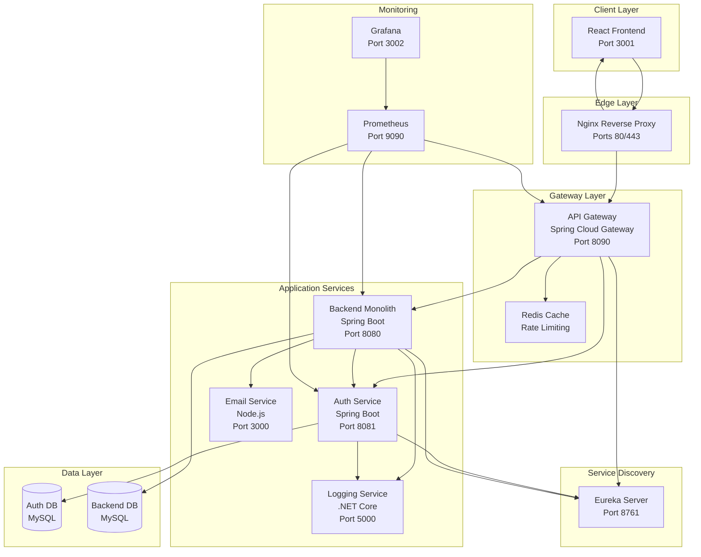
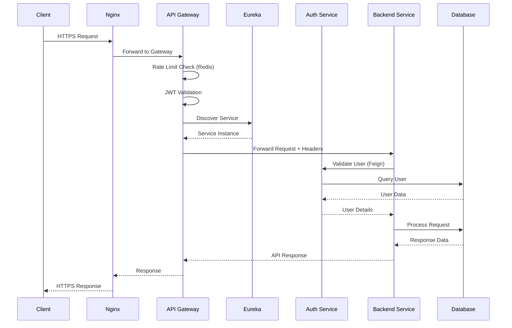
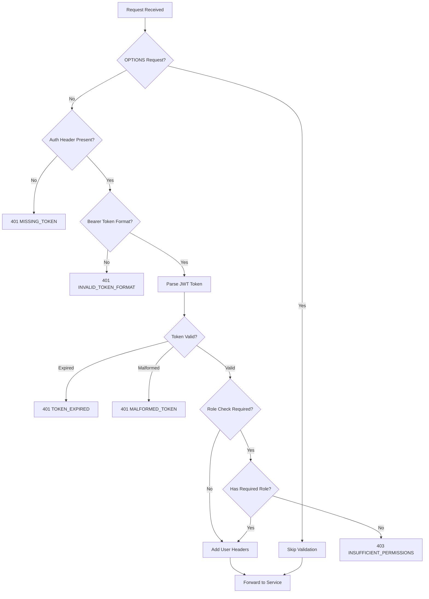
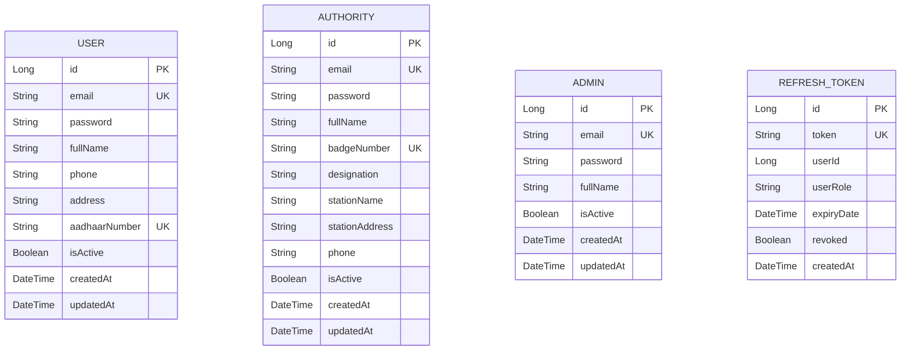
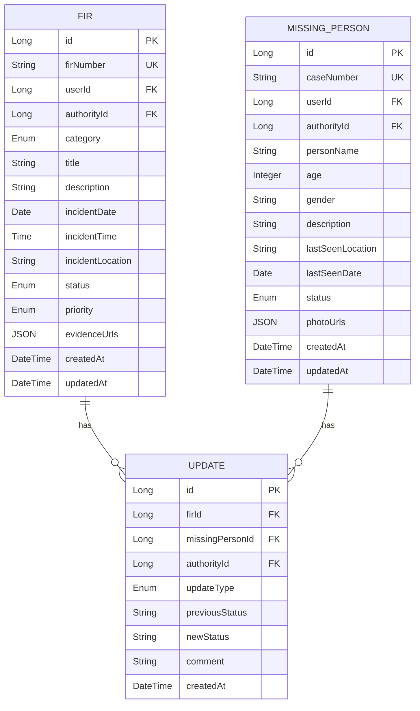
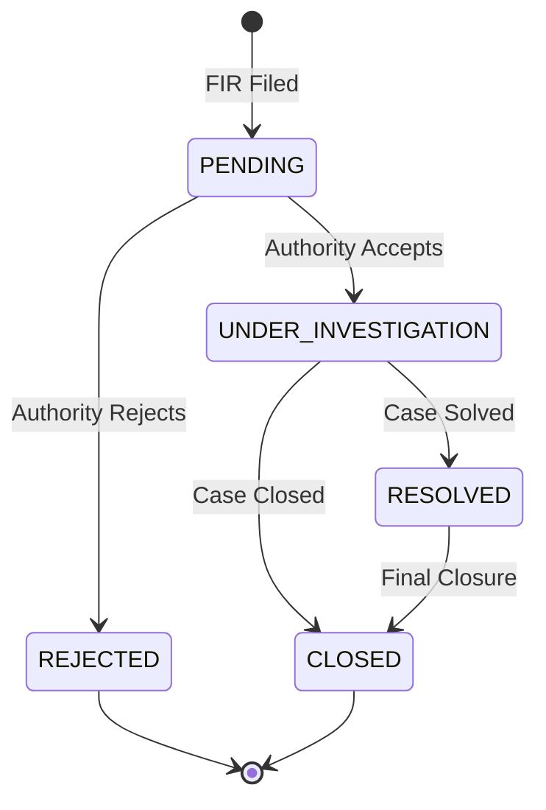
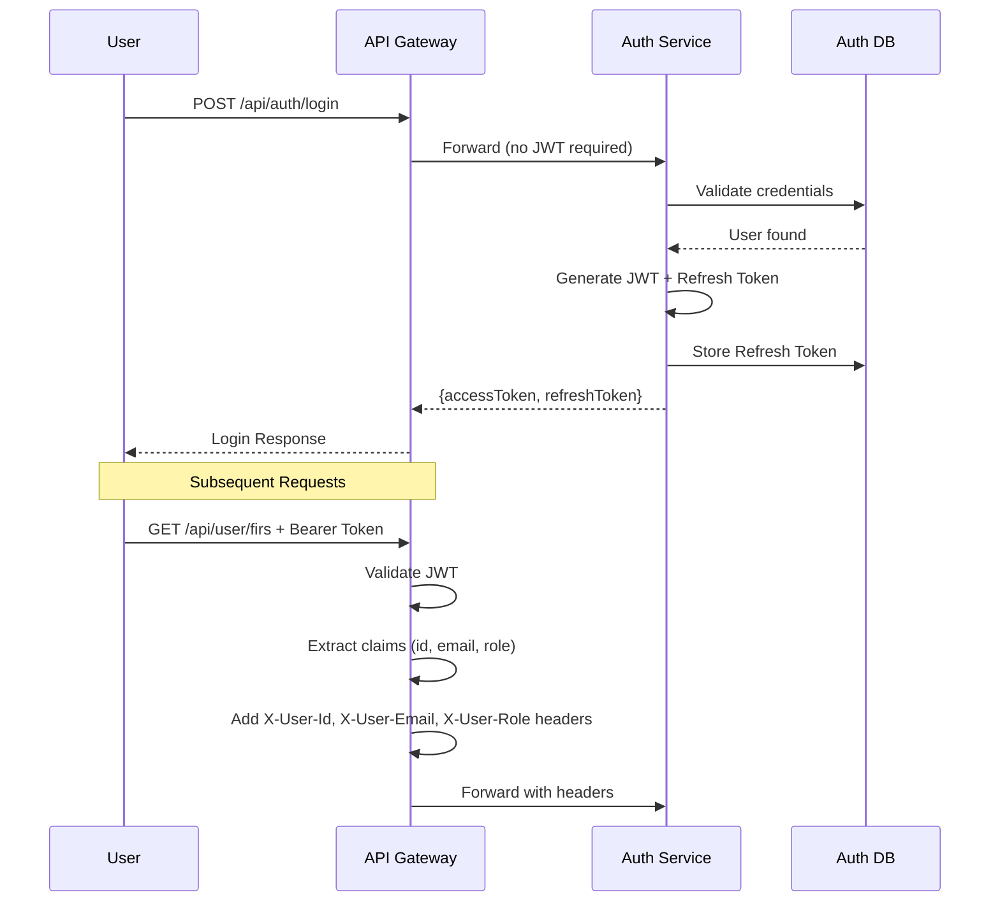

# OCRS - Online Crime Reporting System

## Comprehensive Production-Grade Documentation

> **Version**: 1.0.0  
> **Last Updated**: February 2026  
> **Author**: CDAC Project Team

---

## Table of Contents

1. [Executive Summary](#executive-summary)
2. [System Architecture Overview](#system-architecture-overview)
3. [Technology Stack](#technology-stack)
4. [Service Documentation](#service-documentation)
5. [Database Schema](#database-schema)
6. [API Reference](#api-reference)
7. [Security Architecture](#security-architecture)
8. [Deployment Guide](#deployment-guide)
9. [CI/CD Pipelines](#cicd-pipelines)
10. [Monitoring & Observability](#monitoring--observability)
11. [Troubleshooting Guide](#troubleshooting-guide)
12. [Interview Questions](#interview-questions)

---

## Executive Summary

The **Online Crime Reporting System (OCRS)** is a production-grade, microservices-based web application that enables citizens to file First Information Reports (FIRs) and Missing Person reports digitally. The system connects citizens with law enforcement authorities through a secure, scalable platform.

### Key Features

- **Digital FIR Filing**: Citizens can file FIRs with evidence uploads
- **Missing Person Reports**: Dedicated workflow for missing person cases  
- **Authority Dashboard**: Police officers manage assigned cases
- **Admin Panel**: System-wide administration and oversight
- **Real-time Notifications**: Email notifications for case updates
- **Audit Logging**: Complete audit trail of all actions
- **Role-Based Access Control**: USER, AUTHORITY, ADMIN roles

### Business Value

- Reduces paperwork and manual processes
- Improves transparency in case handling
- Enables faster response times
- Provides analytics for resource allocation

---

## System Architecture Overview

### High-Level Architecture Diagram



### Request Flow Diagram



---

## Technology Stack

### Backend Services

| Service | Technology | Version | Purpose |
|---------|------------|---------|---------|
| API Gateway | Spring Cloud Gateway | 3.x | Request routing, JWT validation, rate limiting |
| Auth Service | Spring Boot | 3.x | Authentication, authorization, user management |
| Backend Monolith | Spring Boot | 3.x | Core business logic, FIR/Missing Person management |
| Email Service | Node.js/Express | 18.x | Email notifications via Mailtrap |
| Logging Service | .NET Core | 8.x | Centralized audit logging |
| Eureka Server | Spring Cloud Netflix | 3.x | Service discovery and registry |

### Frontend

| Technology | Version | Purpose |
|------------|---------|---------|
| React | 18.x | UI framework |
| Vite | 5.x | Build tool |
| React Router | 6.x | Client-side routing |
| Axios | 1.x | HTTP client |

### Infrastructure

| Component | Technology | Purpose |
|-----------|------------|---------|
| Reverse Proxy | Nginx Alpine | SSL termination, load balancing |
| Containerization | Docker | Service isolation |
| Orchestration | Docker Compose | Multi-container management |
| SSL Certificates | Let's Encrypt/Certbot | HTTPS encryption |
| Rate Limiting | Redis 7 | Request throttling |

### Databases

| Database | Technology | Purpose |
|----------|------------|---------|
| Auth DB | MySQL 8.0 | User, Authority, Admin, RefreshToken data |
| Backend DB | MySQL 8.0 | FIR, MissingPerson, Update data |

### Monitoring

| Tool | Purpose |
|------|---------|
| Prometheus | Metrics collection |
| Grafana | Visualization and dashboards |
| Spring Actuator | Health checks, metrics exposure |

---

## Service Documentation

### 1. Eureka Server (Service Discovery)

**Purpose**: Central service registry enabling dynamic service discovery.

**Port**: 8761

**Key Configuration**:
```yaml
eureka:
  client:
    register-with-eureka: false
    fetch-registry: false
  server:
    enable-self-preservation: true
```

**Registered Services**:
- `auth-service`
- `backend-service`
- `api-gateway`

---

### 2. API Gateway

**Purpose**: Single entry point for all API requests with security and rate limiting.

**Port**: 8090

**Key Features**:
- JWT token validation
- Role-based route protection
- Redis-based rate limiting
- Request/response header manipulation
- Service discovery integration

**Route Configuration**:

| Route ID | Path | Target Service | Auth Required | Rate Limit |
|----------|------|----------------|---------------|------------|
| auth-service-public | /api/auth/** | auth-service | No | 10 req/s |
| backend-user | /api/user/** | backend-service | USER | 20 req/s |
| backend-authority | /api/authority/** | backend-service | AUTHORITY | 30 req/s |
| backend-admin | /api/admin/** | backend-service | ADMIN | 50 req/s |

**JWT Filter Flow**:



---

### 3. Auth Service

**Purpose**: Handles all authentication and user management.

**Port**: 8081

**Entities**:



**API Endpoints**:

| Method | Endpoint | Description | Auth |
|--------|----------|-------------|------|
| POST | /api/auth/register/user | Register new user | No |
| POST | /api/auth/register/authority | Register new authority | No |
| POST | /api/auth/login | Login (all roles) | No |
| POST | /api/auth/refresh | Refresh access token | No |
| POST | /api/auth/revoke | Revoke refresh token | No |
| POST | /api/auth/logout | Logout user | No |

---

### 4. Backend Monolith

**Purpose**: Core business logic for FIR and Missing Person management.

**Port**: 8080

**Entities**:



**FIR Categories & Priorities**:

| Category | Auto-Assigned Priority | Rationale |
|----------|----------------------|-----------|
| ASSAULT | URGENT | Physical violence requires immediate attention |
| HARASSMENT | HIGH | Personal safety concern |
| CYBERCRIME | HIGH | Time-sensitive, evidence can be deleted |
| FRAUD | MEDIUM | Financial crime, less immediate |
| THEFT | MEDIUM | Property crime |
| VANDALISM | LOW | Property damage, non-violent |
| OTHER | MEDIUM | Default for unclassified |

**FIR Status Flow**:



---

### 5. Email Service

**Purpose**: Sends transactional emails for FIR updates and notifications.

**Port**: 3000

**Technology**: Node.js with Express, Nodemailer, Mailtrap

**Endpoints**:

| Method | Endpoint | Description |
|--------|----------|-------------|
| POST | /api/send-email | Send generic email |
| POST | /api/fir-filed | FIR filing confirmation |
| POST | /api/fir-updated | FIR status update notification |
| GET | /health | Health check |

---

### 6. Logging Service

**Purpose**: Centralized audit logging for all services.

**Port**: 5000

**Technology**: .NET Core 8 with Serilog

**Log Categories**:

| Log File | Purpose |
|----------|---------|
| user/user_auth_logs.txt | User authentication events |
| authority/authority_logs.txt | Authority actions |
| admin/admin_logs.txt | Admin operations |
| fir/fir_logs.txt | FIR and Missing Person events |

---

## Security Architecture

### Authentication Flow



### JWT Token Structure

```json
{
  "header": {
    "alg": "HS256",
    "typ": "JWT"
  },
  "payload": {
    "id": 1,
    "sub": "user@example.com",
    "role": "USER",
    "iat": 1706000000,
    "exp": 1706003600
  }
}
```

### Security Layers

```mermaid
flowchart TB
    subgraph "Layer 1: Network"
        UFW[UFW Firewall<br/>Ports 22, 80, 443]
    end
    
    subgraph "Layer 2: Transport"
        SSL[TLS 1.2/1.3<br/>Let's Encrypt]
    end
    
    subgraph "Layer 3: Edge"
        NGINX[Nginx<br/>Rate Limiting<br/>Security Headers]
    end
    
    subgraph "Layer 4: Gateway"
        JWT[JWT Validation]
        RATE[Redis Rate Limiting]
        ROLE[Role-Based Access]
    end
    
    subgraph "Layer 5: Application"
        SPRING[@PreAuthorize]
        GATEWAY[Gateway Secret]
    end
    
    UFW --> SSL --> NGINX --> JWT --> RATE --> ROLE --> SPRING --> GATEWAY
```

### Rate Limiting Configuration

| Route | Replenish Rate | Burst Capacity | Key Resolver |
|-------|----------------|----------------|--------------|
| /api/auth/** | 10/sec | 20 | IP Address |
| /api/user/** | 20/sec | 40 | User ID |
| /api/authority/** | 30/sec | 60 | User ID |
| /api/admin/** | 50/sec | 100 | User ID |

---

## Database Schema

### Auth Database (ocrs_auth)

```sql
-- Users table
CREATE TABLE users (
    id BIGINT PRIMARY KEY AUTO_INCREMENT,
    full_name VARCHAR(255) NOT NULL,
    email VARCHAR(255) NOT NULL UNIQUE,
    password VARCHAR(255) NOT NULL,
    phone VARCHAR(20),
    address TEXT,
    aadhaar_number VARCHAR(12) UNIQUE,
    is_active BOOLEAN DEFAULT TRUE,
    created_at TIMESTAMP DEFAULT CURRENT_TIMESTAMP,
    updated_at TIMESTAMP DEFAULT CURRENT_TIMESTAMP ON UPDATE CURRENT_TIMESTAMP
);

-- Authorities table
CREATE TABLE authorities (
    id BIGINT PRIMARY KEY AUTO_INCREMENT,
    full_name VARCHAR(255) NOT NULL,
    email VARCHAR(255) NOT NULL UNIQUE,
    password VARCHAR(255) NOT NULL,
    badge_number VARCHAR(50) UNIQUE,
    designation VARCHAR(100),
    station_name VARCHAR(255),
    station_address TEXT,
    phone VARCHAR(20),
    is_active BOOLEAN DEFAULT TRUE,
    created_at TIMESTAMP DEFAULT CURRENT_TIMESTAMP,
    updated_at TIMESTAMP DEFAULT CURRENT_TIMESTAMP ON UPDATE CURRENT_TIMESTAMP
);

-- Admins table
CREATE TABLE admins (
    id BIGINT PRIMARY KEY AUTO_INCREMENT,
    full_name VARCHAR(255) NOT NULL,
    email VARCHAR(255) NOT NULL UNIQUE,
    password VARCHAR(255) NOT NULL,
    is_active BOOLEAN DEFAULT TRUE,
    created_at TIMESTAMP DEFAULT CURRENT_TIMESTAMP,
    updated_at TIMESTAMP DEFAULT CURRENT_TIMESTAMP ON UPDATE CURRENT_TIMESTAMP
);

-- Refresh tokens table
CREATE TABLE refresh_tokens (
    id BIGINT PRIMARY KEY AUTO_INCREMENT,
    token VARCHAR(255) NOT NULL UNIQUE,
    user_id BIGINT NOT NULL,
    user_role VARCHAR(20) NOT NULL,
    expiry_date TIMESTAMP NOT NULL,
    revoked BOOLEAN DEFAULT FALSE,
    created_at TIMESTAMP DEFAULT CURRENT_TIMESTAMP
);
```

### Backend Database (ocrs_backend)

```sql
-- FIRs table
CREATE TABLE firs (
    id BIGINT PRIMARY KEY AUTO_INCREMENT,
    fir_number VARCHAR(50) NOT NULL UNIQUE,
    user_id BIGINT NOT NULL,
    authority_id BIGINT,
    category ENUM('THEFT','ASSAULT','FRAUD','CYBERCRIME','HARASSMENT','VANDALISM','OTHER') NOT NULL,
    title VARCHAR(255) NOT NULL,
    description TEXT NOT NULL,
    incident_date DATE NOT NULL,
    incident_time TIME,
    incident_location TEXT NOT NULL,
    status ENUM('PENDING','UNDER_INVESTIGATION','RESOLVED','CLOSED','REJECTED') DEFAULT 'PENDING',
    priority ENUM('LOW','MEDIUM','HIGH','URGENT') DEFAULT 'MEDIUM',
    evidence_urls JSON,
    created_at TIMESTAMP DEFAULT CURRENT_TIMESTAMP,
    updated_at TIMESTAMP DEFAULT CURRENT_TIMESTAMP ON UPDATE CURRENT_TIMESTAMP
);

-- Missing persons table
CREATE TABLE missing_persons (
    id BIGINT PRIMARY KEY AUTO_INCREMENT,
    case_number VARCHAR(50) NOT NULL UNIQUE,
    user_id BIGINT NOT NULL,
    authority_id BIGINT,
    person_name VARCHAR(255) NOT NULL,
    age INT,
    gender VARCHAR(20),
    description TEXT,
    last_seen_location TEXT NOT NULL,
    last_seen_date DATE NOT NULL,
    status ENUM('REPORTED','SEARCHING','FOUND','CLOSED') DEFAULT 'REPORTED',
    photo_urls JSON,
    created_at TIMESTAMP DEFAULT CURRENT_TIMESTAMP,
    updated_at TIMESTAMP DEFAULT CURRENT_TIMESTAMP ON UPDATE CURRENT_TIMESTAMP
);

-- Updates table
CREATE TABLE updates (
    id BIGINT PRIMARY KEY AUTO_INCREMENT,
    fir_id BIGINT,
    missing_person_id BIGINT,
    authority_id BIGINT NOT NULL,
    update_type ENUM('STATUS_CHANGE','INVESTIGATION_UPDATE','EVIDENCE_ADDED','REASSIGNMENT','OTHER') NOT NULL,
    previous_status VARCHAR(50),
    new_status VARCHAR(50),
    comment TEXT,
    created_at TIMESTAMP DEFAULT CURRENT_TIMESTAMP,
    FOREIGN KEY (fir_id) REFERENCES firs(id),
    FOREIGN KEY (missing_person_id) REFERENCES missing_persons(id)
);
```

---

## Deployment Guide

### Prerequisites

- Ubuntu 22.04 LTS server (DigitalOcean Droplet recommended)
- Domain name configured with DNS
- Minimum 4GB RAM, 2 vCPUs

### Quick Start

```bash
# 1. Clone repository
git clone https://github.com/ghagevaibhav/ocrs-project.git
cd ocrs-project

# 2. Run initial setup
chmod +x deploy/*.sh
./deploy/setup.sh

# 3. Configure environment
cp .env.production.example .env.production
nano .env.production  # Edit with your values

# 4. Deploy application
./deploy/deploy.sh

# 5. Setup SSL
./deploy/ssl-setup.sh your-domain.com your-email@example.com

# 6. Verify deployment
./deploy/health-check.sh
```

### Environment Variables

```bash
# Database
MYSQL_ROOT_PASSWORD=secure_password_here

# JWT (generate with: openssl rand -base64 64)
JWT_SECRET=your_super_secure_jwt_secret

# Email Service
MAILTRAP_TOKEN=your_mailtrap_api_token

# Frontend
FRONTEND_API_URL=https://your-domain.com

# Monitoring
GRAFANA_USER=admin
GRAFANA_PASSWORD=secure_grafana_password

# Domain
DOMAIN=your-domain.com
```

---

## CI/CD Pipelines

### GitHub Actions Workflow

See [docs/ci-cd/github-actions.md](ci-cd/github-actions.md) for complete configuration.

### Jenkins Pipeline

See [docs/ci-cd/jenkins.md](ci-cd/jenkins.md) for complete configuration.

---

## Monitoring & Observability

### Prometheus Metrics

All Spring Boot services expose metrics at `/actuator/prometheus`:

- JVM metrics (memory, GC, threads)
- HTTP request metrics
- Custom application metrics

### Grafana Dashboards

Access Grafana at `https://your-domain.com/grafana` (port 3002).

Default credentials configured via environment variables.

### Health Check Endpoints

| Service | Health Endpoint |
|---------|-----------------|
| Eureka Server | http://localhost:8761/actuator/health |
| API Gateway | http://localhost:8090/actuator/health |
| Auth Service | http://localhost:8081/actuator/health |
| Backend Service | http://localhost:8080/actuator/health |
| Email Service | http://localhost:3000/health |
| Logging Service | http://localhost:5000/health |

---

## Troubleshooting Guide

### Common Issues

#### 1. Service Not Registering with Eureka

```bash
# Check Eureka dashboard
curl http://localhost:8761/actuator/health

# Check service logs
docker logs ocrs-auth 2>&1 | grep -i eureka

# Verify network connectivity
docker exec ocrs-auth ping eureka-server
```

#### 2. JWT Token Errors

| Error Code | Cause | Solution |
|------------|-------|----------|
| MISSING_TOKEN | No Authorization header | Add Bearer token to request |
| TOKEN_EXPIRED | Token has expired | Use refresh token to get new access token |
| INVALID_TOKEN | Token signature invalid | Check JWT_SECRET matches across services |
| INSUFFICIENT_PERMISSIONS | Wrong role | User doesn't have required role |

#### 3. Database Connection Issues

```bash
# Check database health
docker exec ocrs-auth-db mysqladmin ping -h localhost -u root -p

# View database logs
docker logs ocrs-auth-db

# Verify connection string
docker exec ocrs-auth env | grep SPRING_DATASOURCE
```

#### 4. Rate Limiting (429 Too Many Requests)

```bash
# Check Redis connection
docker exec ocrs-redis redis-cli ping

# Monitor rate limit keys
docker exec ocrs-redis redis-cli KEYS "*rate*"

# Clear rate limits (use carefully)
docker exec ocrs-redis redis-cli FLUSHDB
```

---

## Interview Questions

### Architecture & Design

**Q1: Why use microservices architecture for OCRS?**
> Microservices provide independent deployment, technology diversity (Java, Node.js, .NET), scalability per service, and fault isolation. Each service has a single responsibility.

**Q2: How does service discovery work?**
> Eureka Server acts as a registry. Services register on startup and query Eureka to find other services. The API Gateway uses `lb://service-name` for load-balanced routing.

**Q3: Why separate Auth and Backend databases?**
> Database per service pattern ensures loose coupling. Auth data is sensitive and can have different backup/retention policies. Each service owns its data.

### Security

**Q4: Explain the JWT authentication flow.**
> User logs in → Auth Service validates credentials → Generates JWT with claims (id, email, role) → Client stores token → Subsequent requests include Bearer token → API Gateway validates and extracts claims → Forwards to services with X-User-* headers.

**Q5: How is rate limiting implemented?**
> Redis-based rate limiter in API Gateway. Token bucket algorithm with configurable replenish rate and burst capacity. Different limits per route based on authentication level.

### DevOps

**Q6: How would you handle a service failure?**
> Docker restart policies (`unless-stopped`), health checks for automatic recovery, circuit breakers (Resilience4j), Eureka for automatic failover, monitoring alerts in Grafana.

**Q7: Describe the deployment process.**
> Git push → CI builds Docker images → Push to registry → CD deploys to server → Docker Compose pulls images → Health checks verify → Nginx routes traffic.

---

## Additional Documentation

- [CI/CD Pipeline Details](ci-cd/README.md)
- [API Reference](api/README.md)
- [Infrastructure as Code](infrastructure/README.md)
- [Operational Runbooks](runbooks/README.md)

---

*Documentation generated for OCRS Project - CDAC*
