# OCRS - Online Crime Reporting System
## Complete Technical Documentation

**Version**: 1.0.0  
**Last Updated**: January 2026  
**Target Audience**: Senior Developers, Architects, Security Auditors, New Team Members

---

# Table of Contents

1. [Project Overview & Business Context](#1-project-overview--business-context)
2. [High-Level Architecture](#2-high-level-architecture)
3. [Design Patterns Overview](#3-design-patterns-overview)
4. [SOLID Principles Analysis](#4-solid-principles-analysis)
5. [Module/Package Structure](#5-modulepackage-structure)
6. [Detailed API Documentation](#6-detailed-api-documentation)
7. [File-by-File Documentation](#7-file-by-file-documentation)
8. [Class-by-Class Documentation](#8-class-by-class-documentation)
9. [Method-by-Method Documentation](#9-method-by-method-documentation)
10. [Annotation & Framework Magic](#10-annotation--framework-magic)
11. [Configuration Files](#11-configuration-files)
12. [Database Schema & Data Layer](#12-database-schema--data-layer)
13. [Security & Authentication](#13-security--authentication)
14. [Error Handling & Logging Strategy](#14-error-handling--logging-strategy)
15. [Testing Strategy](#15-testing-strategy)
16. [Performance & Scalability Analysis](#16-performance--scalability-analysis)
17. [CI/CD & Deployment Pipeline](#17-cicd--deployment-pipeline)
18. [Known Limitations & Technical Debt](#18-known-limitations--technical-debt)
19. [Interview Readiness Section](#19-interview-readiness-section)

---

# 1. Project Overview & Business Context

## 1.1 Executive Summary

The **Online Crime Reporting System (OCRS)** is a comprehensive microservices-based platform enabling citizens to file First Information Reports (FIRs) and Missing Person reports digitally. The system provides role-based dashboards for Citizens, Police Authorities, and System Administrators.

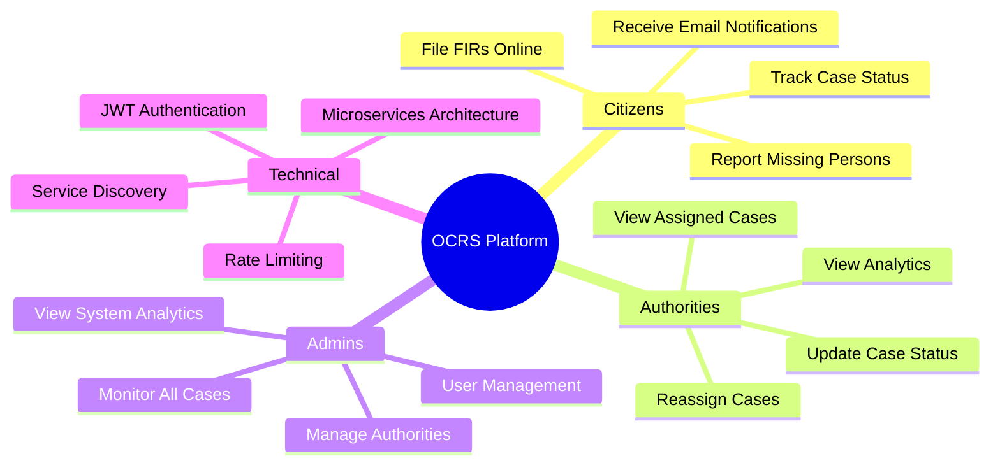
```mermaid
mindmap
  root((OCRS Platform))
    Citizens
      File FIRs Online
      Report Missing Persons
      Track Case Status
      Receive Email Notifications
    Authorities
      View Assigned Cases
      Update Case Status
      Reassign Cases
      View Analytics
    Admins
      Manage Authorities
      View System Analytics
      Monitor All Cases
      User Management
    Technical
      Microservices Architecture
      JWT Authentication
      Service Discovery
      Rate Limiting
```

## 1.2 Business Problem Statement

Traditional crime reporting mechanisms suffer from:
- **Physical Accessibility**: Citizens must visit police stations
- **Time Constraints**: Limited operational hours
- **Documentation Delays**: Manual paperwork causes delays
- **Tracking Difficulty**: No real-time status updates
- **Communication Gaps**: Limited feedback mechanisms

OCRS addresses these through digital transformation of the entire crime reporting lifecycle.

## 1.3 Core Functional Requirements

| Requirement ID | Description | Priority |
|----------------|-------------|----------|
| FR-001 | Citizens can register and authenticate | Critical |
| FR-002 | Citizens can file FIRs with evidence | Critical |
| FR-003 | Citizens can report missing persons | Critical |
| FR-004 | Automatic case assignment to authorities | High |
| FR-005 | Authorities can update case status | Critical |
| FR-006 | Email notifications on case updates | High |
| FR-007 | Admin can manage authorities | Medium |
| FR-008 | Real-time case tracking | High |

## 1.4 Non-Functional Requirements

| Requirement | Target | Implementation |
|-------------|--------|----------------|
| Availability | 99.9% uptime | Service discovery + health checks |
| Response Time | < 500ms (p95) | Redis caching, connection pooling |
| Security | Zero data breaches | JWT, RBAC, input validation |
| Scalability | 10,000 concurrent users | Stateless services, load balancing |
| Resilience | Graceful degradation | Circuit breakers, retry patterns |

---

# 2. High-Level Architecture

## 2.1 C4 Context Diagram

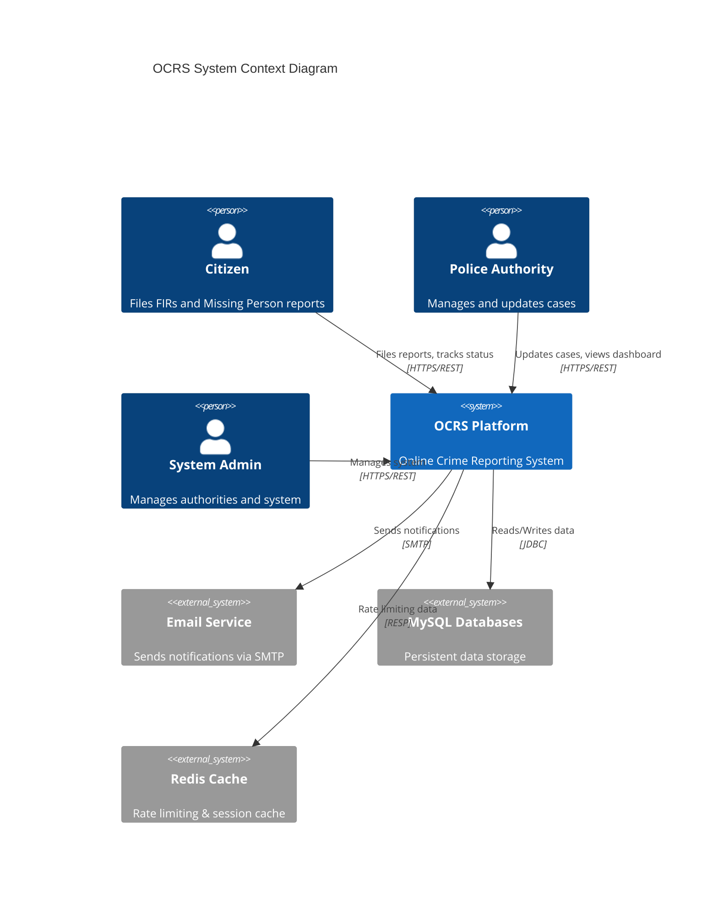
```mermaid
C4Context
    title OCRS System Context Diagram
    
    Person(citizen, "Citizen", "Files FIRs and Missing Person reports")
    Person(authority, "Police Authority", "Manages and updates cases")
    Person(admin, "System Admin", "Manages authorities and system")
    
    System(ocrs, "OCRS Platform", "Online Crime Reporting System")
    
    System_Ext(email, "Email Service", "Sends notifications via SMTP")
    System_Ext(mysql, "MySQL Databases", "Persistent data storage")
    System_Ext(redis, "Redis Cache", "Rate limiting & session cache")
    
    Rel(citizen, ocrs, "Files reports, tracks status", "HTTPS/REST")
    Rel(authority, ocrs, "Updates cases, views dashboard", "HTTPS/REST")
    Rel(admin, ocrs, "Manages system", "HTTPS/REST")
    Rel(ocrs, email, "Sends notifications", "SMTP")
    Rel(ocrs, mysql, "Reads/Writes data", "JDBC")
    Rel(ocrs, redis, "Rate limiting data", "RESP")
```

## 2.2 C4 Container Diagram

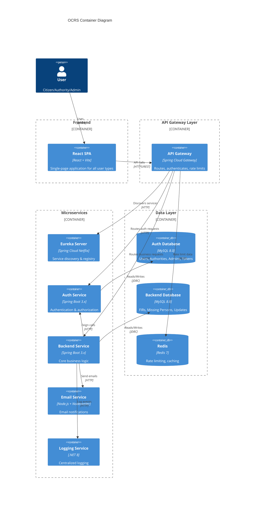
```mermaid
C4Container
    title OCRS Container Diagram
    
    Person(user, "User", "Citizen/Authority/Admin")
    
    Container_Boundary(frontend, "Frontend") {
        Container(react_app, "React SPA", "React + Vite", "Single-page application for all user types")
    }
    
    Container_Boundary(gateway_layer, "API Gateway Layer") {
        Container(api_gateway, "API Gateway", "Spring Cloud Gateway", "Routes, authenticates, rate limits")
    }
    
    Container_Boundary(services, "Microservices") {
        Container(eureka, "Eureka Server", "Spring Cloud Netflix", "Service discovery & registry")
        Container(auth_service, "Auth Service", "Spring Boot 3.x", "Authentication & authorization")
        Container(backend_service, "Backend Service", "Spring Boot 3.x", "Core business logic")
        Container(email_service, "Email Service", "Node.js + Nodemailer", "Email notifications")
        Container(logging_service, "Logging Service", ".NET 8", "Centralized logging")
    }
    
    Container_Boundary(data, "Data Layer") {
        ContainerDb(auth_db, "Auth Database", "MySQL 8.0", "Users, Authorities, Admins, Tokens")
        ContainerDb(backend_db, "Backend Database", "MySQL 8.0", "FIRs, Missing Persons, Updates")
        ContainerDb(redis, "Redis", "Redis 7", "Rate limiting, caching")
    }
    
    Rel(user, react_app, "Uses", "HTTPS")
    Rel(react_app, api_gateway, "API calls", "HTTPS/REST")
    Rel(api_gateway, eureka, "Discovers services", "HTTP")
    Rel(api_gateway, auth_service, "Routes auth requests", "HTTP")
    Rel(api_gateway, backend_service, "Routes business requests", "HTTP")
    Rel(auth_service, auth_db, "Reads/Writes", "JDBC")
    Rel(backend_service, backend_db, "Reads/Writes", "JDBC")
    Rel(backend_service, auth_service, "Feign calls", "HTTP")
    Rel(backend_service, email_service, "Send emails", "HTTP")
    Rel(backend_service, logging_service, "Log events", "HTTP")
    Rel(api_gateway, redis, "Rate limit data", "RESP")
```

## 2.3 System Architecture Diagram (Detailed)

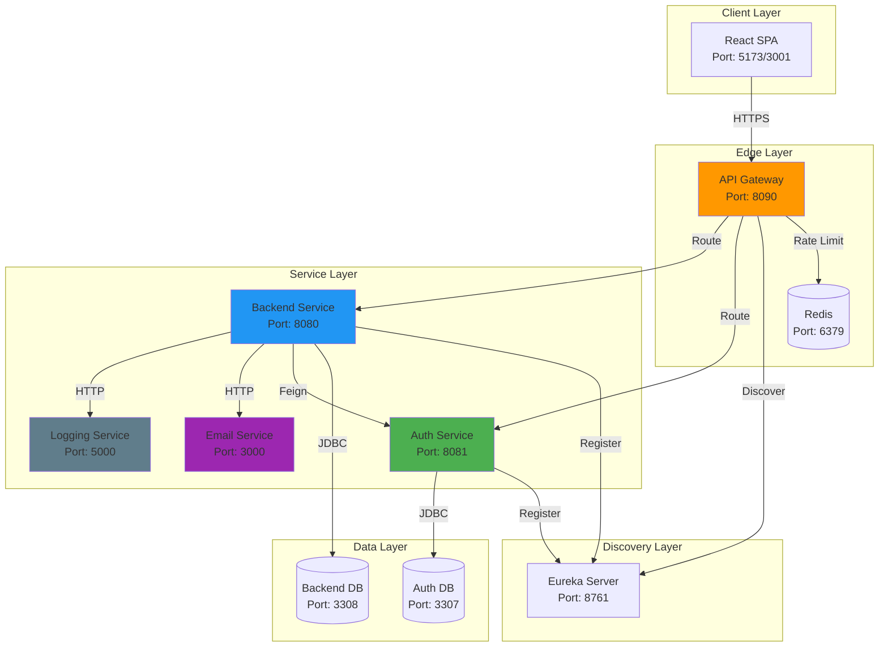
```mermaid
flowchart TB
    subgraph "Client Layer"
        B[React SPA<br/>Port: 5173/3001]
    end
    
    subgraph "Edge Layer"
        C[API Gateway<br/>Port: 8090]
        R[(Redis<br/>Port: 6379)]
    end
    
    subgraph "Discovery Layer"
        E[Eureka Server<br/>Port: 8761]
    end
    
    subgraph "Service Layer"
        AU[Auth Service<br/>Port: 8081]
        BE[Backend Service<br/>Port: 8080]
        EM[Email Service<br/>Port: 3000]
        LO[Logging Service<br/>Port: 5000]
    end
    
    subgraph "Data Layer"
        DB1[(Auth DB<br/>Port: 3307)]
        DB2[(Backend DB<br/>Port: 3308)]
    end
    
    B -->|HTTPS| C
    C -->|Rate Limit| R
    C -->|Discover| E
    C -->|Route| AU
    C -->|Route| BE
    AU -->|Register| E
    BE -->|Register| E
    AU -->|JDBC| DB1
    BE -->|JDBC| DB2
    BE -->|Feign| AU
    BE -->|HTTP| EM
    BE -->|HTTP| LO
    
    style C fill:#ff9800
    style AU fill:#4caf50
    style BE fill:#2196f3
    style EM fill:#9c27b0
    style LO fill:#607d8b
```

## 2.4 Request Flow Overview

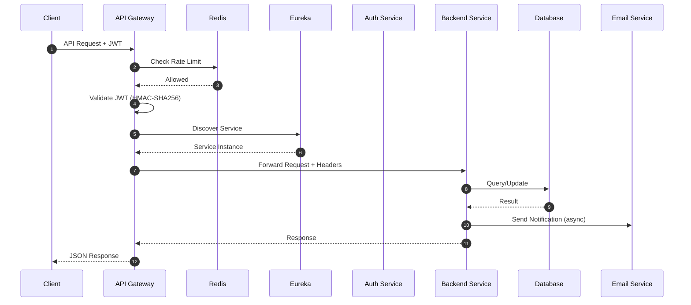
```mermaid
sequenceDiagram
    autonumber
    participant C as Client
    participant GW as API Gateway
    participant R as Redis
    participant EU as Eureka
    participant AS as Auth Service
    participant BS as Backend Service
    participant DB as Database
    participant ES as Email Service
    
    C->>GW: API Request + JWT
    GW->>R: Check Rate Limit
    R-->>GW: Allowed
    GW->>GW: Validate JWT (HMAC-SHA256)
    GW->>EU: Discover Service
    EU-->>GW: Service Instance
    GW->>BS: Forward Request + Headers
    BS->>DB: Query/Update
    DB-->>BS: Result
    BS->>ES: Send Notification (async)
    BS-->>GW: Response
    GW-->>C: JSON Response
```

---

# 3. Design Patterns Overview

## 3.1 Design Patterns Diagram


```mermaid
graph TB
    subgraph "Creational Patterns"
        B1[Builder Pattern]
        B2[Factory Pattern]
    end
    
    subgraph "Structural Patterns"
        S1[Facade Pattern]
        S2[Decorator Pattern]
        S3[Proxy Pattern]
    end
    
    subgraph "Behavioral Patterns"
        BE1[Strategy Pattern]
        BE2[Template Method]
        BE3[Chain of Responsibility]
    end
    
    subgraph "Cloud Patterns"
        C1[Service Discovery]
        C2[Circuit Breaker]
        C3[API Gateway]
        C4[Retry Pattern]
    end
    
    B1 --> |Used in| ENT[Entity Classes]
    B2 --> |Used in| FAL[Fallback Factory]
    S1 --> |Used in| SVC[Service Layer]
    S2 --> |Used in| FLT[Gateway Filters]
    S3 --> |Used in| FEI[Feign Clients]
    BE1 --> |Used in| PRI[Priority Determination]
    BE2 --> |Used in| SEC[Security Filters]
    BE3 --> |Used in| GWR[Gateway Routing]
    C1 --> |Eureka| REG[Service Registry]
    C2 --> |Resilience4j| EXT[External Calls]
    C3 --> |Spring Cloud| RTG[Request Routing]
    C4 --> |Resilience4j| RET[Retryable Operations]
```

## 3.2 Pattern Implementation Matrix

| Pattern | Location | Purpose | Justification |
|---------|----------|---------|---------------|
| **Builder** | Entity classes (User, FIR, Authority) | Fluent object construction | Avoids telescoping constructors, immutable-like creation |
| **Factory** | `AuthServiceFallbackFactory` | Create fallback instances | Centralized fallback creation for Feign clients |
| **Facade** | `FIRService`, `AuthService` | Simplify complex operations | Hide complexity of multi-step operations |
| **Decorator** | `JwtAuthFilter` | Add behavior to requests | Layer JWT validation on existing request handling |
| **Chain of Responsibility** | Gateway filter chain | Process requests sequentially | CORS → Rate Limit → JWT → Route |
| **Strategy** | `determinePriority()` | Algorithm selection | Rule-based priority without conditionals |
| **Circuit Breaker** | Feign clients | Fault tolerance | Prevent cascade failures to external services |
| **Service Discovery** | Eureka integration | Dynamic service location | Enable horizontal scaling without config changes |

---

# 4. SOLID Principles Analysis

## 4.1 Single Responsibility Principle (SRP)

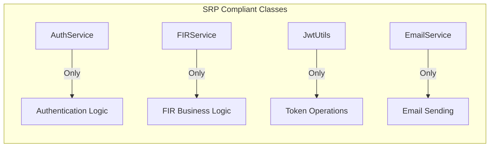
```mermaid
graph LR
    subgraph "SRP Compliant Classes"
        A[AuthService] --> |Only| A1[Authentication Logic]
        B[FIRService] --> |Only| B1[FIR Business Logic]
        C[JwtUtils] --> |Only| C1[Token Operations]
        D[EmailService] --> |Only| D1[Email Sending]
    end
```

| Class | Single Responsibility | Evidence |
|-------|----------------------|----------|
| `JwtUtils` | JWT token operations only | Methods: generateToken, validateToken, extractClaims |
| `AuthService` | Authentication/Authorization | No database operations for FIRs |
| `FIRService` | FIR business logic | Delegates email/auth to other services |
| `ExternalServiceClient` | External HTTP calls | Wraps all outbound API calls |

## 4.2 Open/Closed Principle (OCP)

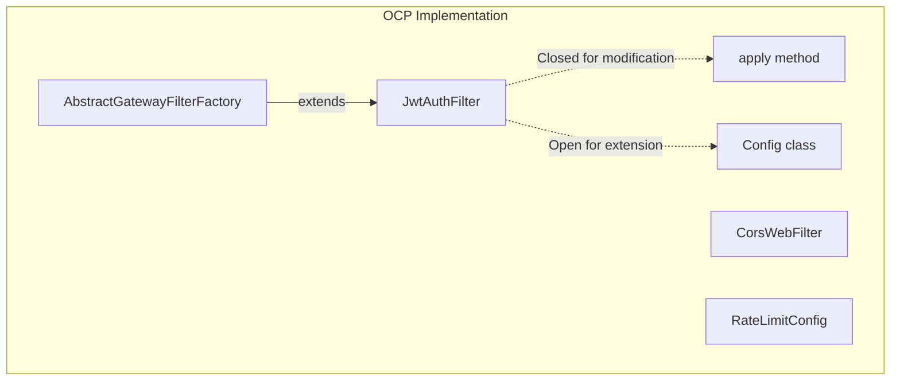
```mermaid
graph TB
    subgraph "OCP Implementation"
        A[AbstractGatewayFilterFactory]
        B[JwtAuthFilter]
        C[CorsWebFilter]
        D[RateLimitConfig]
        
        A --> |extends| B
        B -.-> |Closed for modification| E[apply method]
        B -.-> |Open for extension| F[Config class]
    end
```

**Evidence**: `JwtAuthFilter` extends `AbstractGatewayFilterFactory` — new filter behavior can be added by creating new filter classes without modifying existing ones.

## 4.3 Liskov Substitution Principle (LSP)

All repository interfaces extend `JpaRepository` and can be substituted with any implementation:

```java
// UserRepository can be substituted with any JpaRepository<User, Long>
public interface UserRepository extends JpaRepository<User, Long> {
    Optional<User> findByEmail(String email);
}
```

## 4.4 Interface Segregation Principle (ISP)

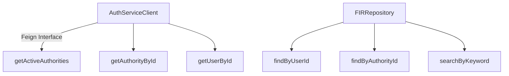
```mermaid
graph TB
    A[AuthServiceClient] --> |Feign Interface| B[getActiveAuthorities]
    A --> C[getAuthorityById]
    A --> D[getUserById]
    
    E[FIRRepository] --> F[findByUserId]
    E --> G[findByAuthorityId]
    E --> H[searchByKeyword]
```

Each Feign client interface contains only the methods needed by its consumers, not a "fat" interface with all possible operations.

## 4.5 Dependency Inversion Principle (DIP)

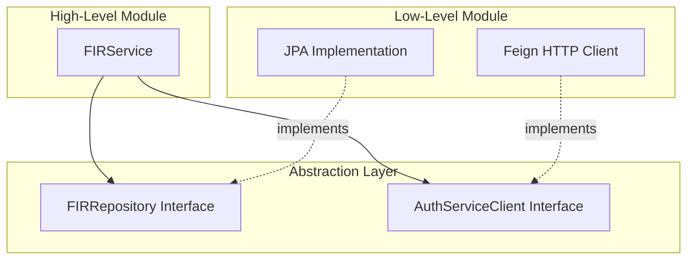
```mermaid
graph TB
    subgraph "High-Level Module"
        A[FIRService]
    end
    
    subgraph "Abstraction Layer"
        B[FIRRepository Interface]
        C[AuthServiceClient Interface]
    end
    
    subgraph "Low-Level Module"
        D[JPA Implementation]
        E[Feign HTTP Client]
    end
    
    A --> B
    A --> C
    D -.-> |implements| B
    E -.-> |implements| C
```

**Evidence**: `FIRService` depends on `FIRRepository` interface, not on JPA implementation details. Spring injects the concrete implementation at runtime.

---

# 5. Module/Package Structure

## 5.1 Module Dependency Diagram

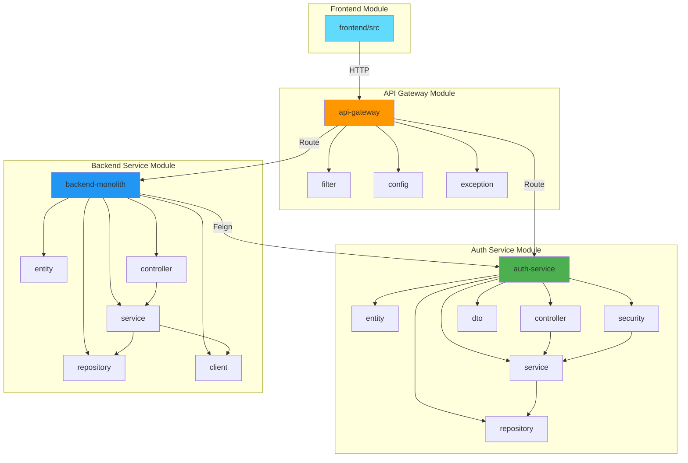
```mermaid
graph TB
    subgraph "Frontend Module"
        FE[frontend/src]
    end
    
    subgraph "API Gateway Module"
        GW[api-gateway]
        GW_F[filter]
        GW_C[config]
        GW_E[exception]
        GW --> GW_F
        GW --> GW_C
        GW --> GW_E
    end
    
    subgraph "Auth Service Module"
        AS[auth-service]
        AS_E[entity]
        AS_R[repository]
        AS_S[service]
        AS_C[controller]
        AS_SEC[security]
        AS_DTO[dto]
        AS --> AS_E
        AS --> AS_R
        AS --> AS_S
        AS --> AS_C
        AS --> AS_SEC
        AS --> AS_DTO
        AS_S --> AS_R
        AS_C --> AS_S
        AS_SEC --> AS_S
    end
    
    subgraph "Backend Service Module"
        BS[backend-monolith]
        BS_E[entity]
        BS_R[repository]
        BS_S[service]
        BS_C[controller]
        BS_CL[client]
        BS --> BS_E
        BS --> BS_R
        BS --> BS_S
        BS --> BS_C
        BS --> BS_CL
        BS_S --> BS_R
        BS_C --> BS_S
        BS_S --> BS_CL
    end
    
    FE --> |HTTP| GW
    GW --> |Route| AS
    GW --> |Route| BS
    BS --> |Feign| AS
    
    style FE fill:#61dafb
    style GW fill:#ff9800
    style AS fill:#4caf50
    style BS fill:#2196f3
```

## 5.2 Package Structure Detail

```
ocrs-project/
├── api-gateway/                 # Spring Cloud Gateway
│   └── src/main/java/com/ocrs/gateway/
│       ├── ApiGatewayApplication.java
│       ├── config/
│       │   ├── CorsWebFilter.java      # CORS handling
│       │   └── RateLimitConfig.java    # Rate limit key resolvers
│       ├── controller/
│       │   └── HealthController.java   # Health endpoints
│       ├── exception/
│       │   └── GlobalExceptionHandler.java
│       └── filter/
│           └── JwtAuthFilter.java      # JWT validation filter
│
├── auth-service/                # Authentication microservice
│   └── src/main/java/com/ocrs/auth/
│       ├── AuthServiceApplication.java
│       ├── config/
│       │   ├── DataSeeder.java         # Initial data seeding
│       │   └── SecurityConfig.java     # Spring Security config
│       ├── controller/
│       │   ├── AuthController.java     # Public auth endpoints
│       │   ├── AuthorityController.java
│       │   ├── HealthController.java
│       │   └── InternalAuthController.java  # Feign-exposed endpoints
│       ├── dto/                 # Data Transfer Objects
│       ├── entity/              # JPA Entities
│       ├── exception/           # Custom exceptions
│       ├── repository/          # JPA Repositories
│       ├── security/            # Security components
│       └── service/             # Business logic
│
├── backend-monolith/            # Core business logic service
│   └── src/main/java/com/ocrs/backend/
│       ├── BackendMonolithApplication.java
│       ├── client/              # Feign clients
│       ├── config/
│       ├── controller/
│       ├── dto/
│       ├── entity/
│       ├── exception/
│       ├── repository/
│       ├── security/
│       └── service/
│
├── email-service/               # Node.js email service
│   └── src/
│       ├── emailService.js
│       └── server.js
│
├── logging-service/             # .NET logging service
│   ├── Controllers/
│   ├── Models/
│   └── Program.cs
│
├── eureka-server/               # Service discovery
│   └── src/main/java/com/ocrs/eureka/
│       └── EurekaServerApplication.java
│
└── frontend/                    # React SPA
    └── src/
        ├── components/
        ├── pages/
        ├── context/
        └── services/
```

---

# 6. Detailed API Documentation

## 6.1 API Endpoint Overview

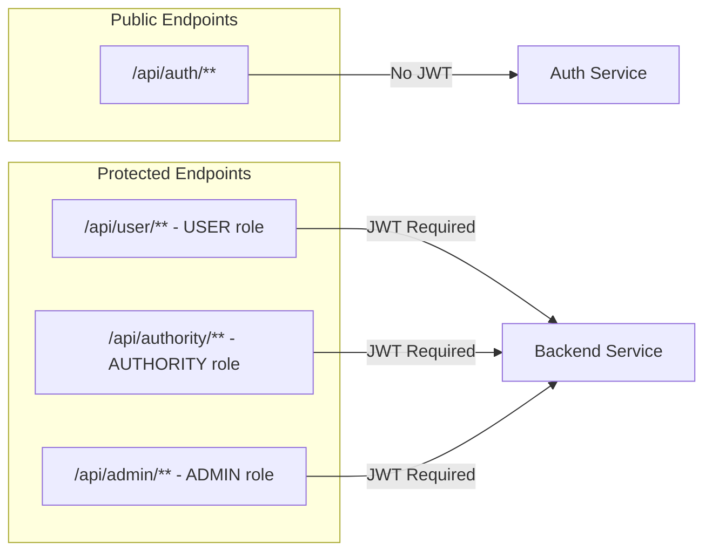
```mermaid
graph LR
    subgraph "Public Endpoints"
        A["/api/auth/**"]
    end
    
    subgraph "Protected Endpoints"
        B["/api/user/**" - USER role]
        C["/api/authority/**" - AUTHORITY role]
        D["/api/admin/**" - ADMIN role]
    end
    
    A --> |No JWT| E[Auth Service]
    B --> |JWT Required| F[Backend Service]
    C --> |JWT Required| F
    D --> |JWT Required| F
```

## 6.2 Authentication Endpoints

### POST /api/auth/register

**Purpose**: Register a new citizen user

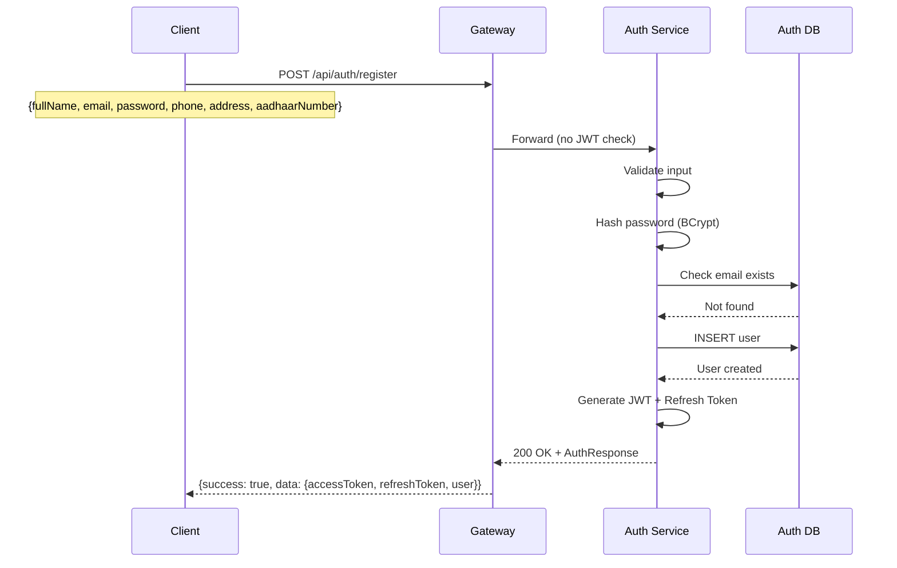
```mermaid
sequenceDiagram
    participant C as Client
    participant GW as Gateway
    participant AS as Auth Service
    participant DB as Auth DB
    
    C->>GW: POST /api/auth/register
    Note over C: {fullName, email, password, phone, address, aadhaarNumber}
    GW->>AS: Forward (no JWT check)
    AS->>AS: Validate input
    AS->>AS: Hash password (BCrypt)
    AS->>DB: Check email exists
    DB-->>AS: Not found
    AS->>DB: INSERT user
    DB-->>AS: User created
    AS->>AS: Generate JWT + Refresh Token
    AS-->>GW: 200 OK + AuthResponse
    GW-->>C: {success: true, data: {accessToken, refreshToken, user}}
```

**Request Body**:
```json
{
  "fullName": "John Doe",
  "email": "john@example.com",
  "password": "SecurePass123!",
  "phone": "9876543210",
  "address": "123 Main Street, City",
  "aadhaarNumber": "123456789012"
}
```

**Response (200 OK)**:
```json
{
  "success": true,
  "message": "Registration successful",
  "data": {
    "accessToken": "eyJhbGciOiJIUzI1NiIsInR5cCI6IkpXVCJ9...",
    "refreshToken": "a1b2c3d4-e5f6-7890-abcd-ef1234567890",
    "tokenType": "Bearer",
    "expiresIn": 3600000,
    "user": {
      "id": 1,
      "email": "john@example.com",
      "fullName": "John Doe",
      "role": "USER"
    }
  }
}
```

### POST /api/auth/login

**Purpose**: Authenticate user and issue tokens

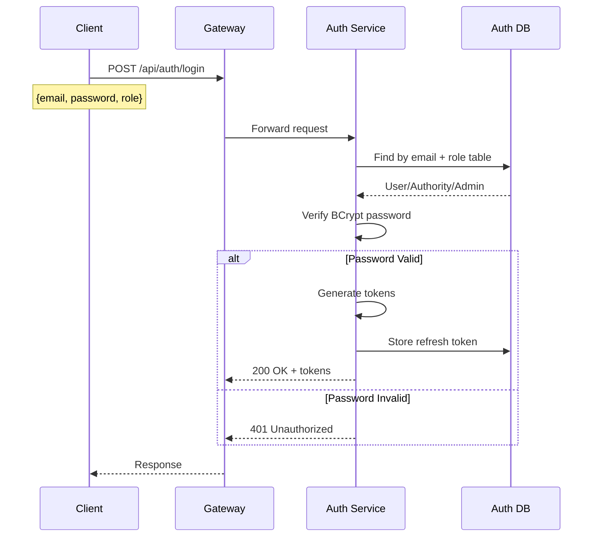
```mermaid
sequenceDiagram
    participant C as Client
    participant GW as Gateway
    participant AS as Auth Service
    participant DB as Auth DB
    
    C->>GW: POST /api/auth/login
    Note over C: {email, password, role}
    GW->>AS: Forward request
    AS->>DB: Find by email + role table
    DB-->>AS: User/Authority/Admin
    AS->>AS: Verify BCrypt password
    alt Password Valid
        AS->>AS: Generate tokens
        AS->>DB: Store refresh token
        AS-->>GW: 200 OK + tokens
    else Password Invalid
        AS-->>GW: 401 Unauthorized
    end
    GW-->>C: Response
```

## 6.3 FIR Endpoints

### POST /api/user/firs

**Purpose**: File a new First Information Report

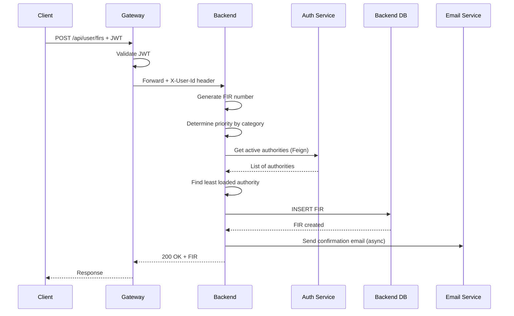
```mermaid
sequenceDiagram
    participant C as Client
    participant GW as Gateway
    participant BS as Backend
    participant AS as Auth Service
    participant DB as Backend DB
    participant ES as Email Service
    
    C->>GW: POST /api/user/firs + JWT
    GW->>GW: Validate JWT
    GW->>BS: Forward + X-User-Id header
    BS->>BS: Generate FIR number
    BS->>BS: Determine priority by category
    BS->>AS: Get active authorities (Feign)
    AS-->>BS: List of authorities
    BS->>BS: Find least loaded authority
    BS->>DB: INSERT FIR
    DB-->>BS: FIR created
    BS->>ES: Send confirmation email (async)
    BS-->>GW: 200 OK + FIR
    GW-->>C: Response
```

**Request Body**:
```json
{
  "category": "THEFT",
  "title": "Motorcycle Theft Report",
  "description": "My motorcycle was stolen from...",
  "incidentDate": "2026-01-28",
  "incidentTime": "14:30:00",
  "incidentLocation": "Parking lot near City Mall"
}
```

### PUT /api/authority/firs/{id}/status

**Purpose**: Update FIR status (Authority only)

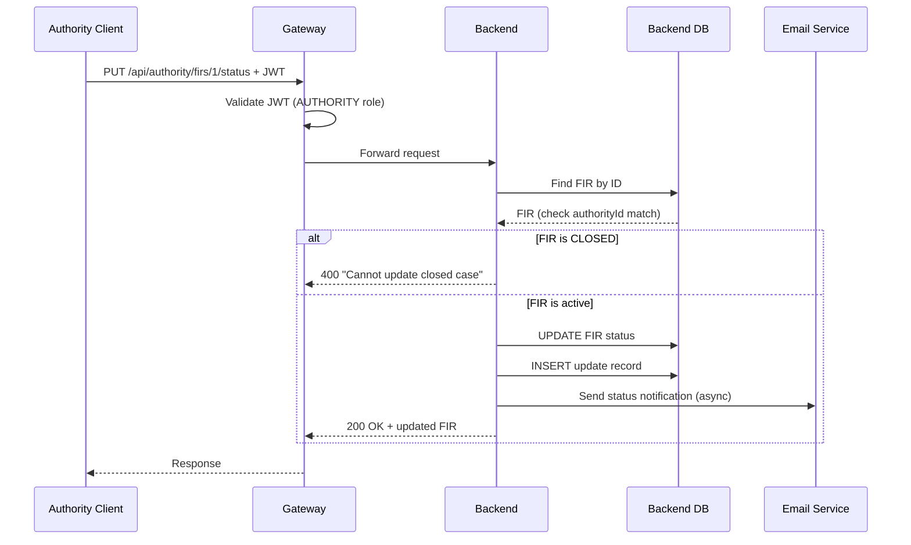
```mermaid
sequenceDiagram
    participant C as Authority Client
    participant GW as Gateway
    participant BS as Backend
    participant DB as Backend DB
    participant ES as Email Service
    
    C->>GW: PUT /api/authority/firs/1/status + JWT
    GW->>GW: Validate JWT (AUTHORITY role)
    GW->>BS: Forward request
    BS->>DB: Find FIR by ID
    DB-->>BS: FIR (check authorityId match)
    
    alt FIR is CLOSED
        BS-->>GW: 400 "Cannot update closed case"
    else FIR is active
        BS->>DB: UPDATE FIR status
        BS->>DB: INSERT update record
        BS->>ES: Send status notification (async)
        BS-->>GW: 200 OK + updated FIR
    end
    
    GW-->>C: Response
```

---

# 7. File-by-File Documentation

## 7.1 API Gateway Files

### JwtAuthFilter.java

**Path**: `api-gateway/src/main/java/com/ocrs/gateway/filter/JwtAuthFilter.java`

**Purpose**: Gateway filter that validates JWT tokens and enforces role-based access control.

**Design Pattern**: Decorator (wraps request handling with authentication)

**Class Diagram**:
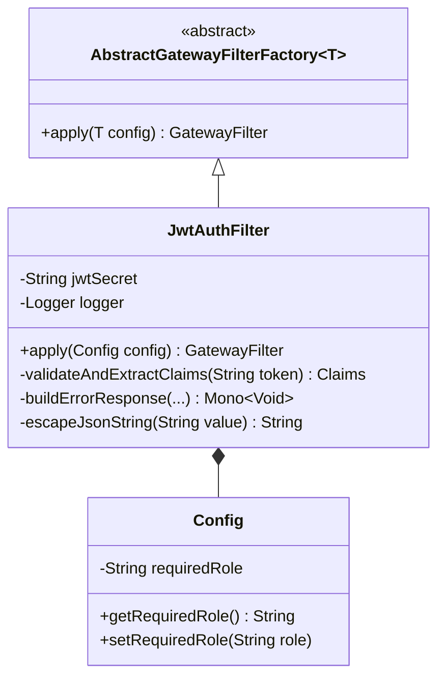
```mermaid
classDiagram
    class AbstractGatewayFilterFactory~T~ {
        <<abstract>>
        +apply(T config) GatewayFilter
    }
    
    class JwtAuthFilter {
        -String jwtSecret
        -Logger logger
        +apply(Config config) GatewayFilter
        -validateAndExtractClaims(String token) Claims
        -buildErrorResponse(...) Mono~Void~
        -escapeJsonString(String value) String
    }
    
    class Config {
        -String requiredRole
        +getRequiredRole() String
        +setRequiredRole(String role)
    }
    
    AbstractGatewayFilterFactory <|-- JwtAuthFilter
    JwtAuthFilter *-- Config
```

**Key Methods**:

| Method | Purpose | Complexity |
|--------|---------|------------|
| `apply(Config)` | Creates filter that validates JWT and checks roles | O(1) |
| `validateAndExtractClaims(String)` | Parses JWT using HMAC-SHA256 | O(1) |
| `buildErrorResponse(...)` | Constructs JSON error response | O(1) |

**Security Considerations**:
- Uses HMAC-SHA256 for token signature verification
- Skips validation for OPTIONS preflight requests
- Adds user info headers (`X-User-Id`, `X-User-Email`, `X-User-Role`) for downstream services

---

# 8. Class-by-Class Documentation

## 8.1 Entity Classes

### FIR.java

**Path**: `backend-monolith/src/main/java/com/ocrs/backend/entity/FIR.java`

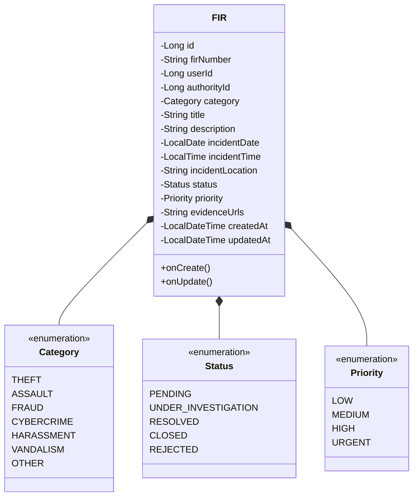
```mermaid
classDiagram
    class FIR {
        -Long id
        -String firNumber
        -Long userId
        -Long authorityId
        -Category category
        -String title
        -String description
        -LocalDate incidentDate
        -LocalTime incidentTime
        -String incidentLocation
        -Status status
        -Priority priority
        -String evidenceUrls
        -LocalDateTime createdAt
        -LocalDateTime updatedAt
        +onCreate()
        +onUpdate()
    }
    
    class Category {
        <<enumeration>>
        THEFT
        ASSAULT
        FRAUD
        CYBERCRIME
        HARASSMENT
        VANDALISM
        OTHER
    }
    
    class Status {
        <<enumeration>>
        PENDING
        UNDER_INVESTIGATION
        RESOLVED
        CLOSED
        REJECTED
    }
    
    class Priority {
        <<enumeration>>
        LOW
        MEDIUM
        HIGH
        URGENT
    }
    
    FIR *-- Category
    FIR *-- Status
    FIR *-- Priority
```

**Annotations Explained**:
- `@Entity`: Marks class as JPA entity
- `@Table(name = "firs")`: Maps to `firs` table
- `@Builder`: Lombok generates builder pattern
- `@PrePersist`: Called before INSERT to set timestamps
- `@PreUpdate`: Called before UPDATE to refresh `updatedAt`

---

# 9. Method-by-Method Documentation

## 9.1 FIRService Methods

### fileFIR(Long userId, FIRRequest request)

**Purpose**: Creates a new FIR with automatic authority assignment and priority determination.

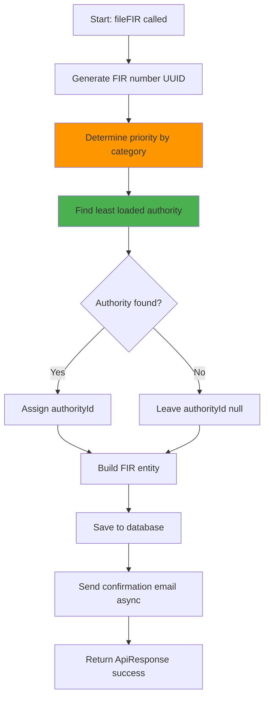
```mermaid
flowchart TB
    A[Start: fileFIR called] --> B[Generate FIR number UUID]
    B --> C[Determine priority by category]
    C --> D[Find least loaded authority]
    D --> E{Authority found?}
    E -->|Yes| F[Assign authorityId]
    E -->|No| G[Leave authorityId null]
    F --> H[Build FIR entity]
    G --> H
    H --> I[Save to database]
    I --> J[Send confirmation email async]
    J --> K[Return ApiResponse success]
    
    style C fill:#ff9800
    style D fill:#4caf50
```

**Code Flow**:
1. **Generate FIR Number**: `"FIR-" + UUID.randomUUID().toString().substring(0, 8).toUpperCase()`
2. **Priority Algorithm**: Rule-based mapping (ASSAULT→HIGH, CYBERCRIME→HIGH, etc.)
3. **Load Balancing**: Queries authorities ordered by active case count
4. **Persistence**: JPA save with @Transactional
5. **Notification**: Async email via ExternalServiceClient

### updateFIRStatus(Long firId, Long authorityId, UpdateRequest request)

**Purpose**: Updates FIR status with validation and audit trail.

**Closed Case Protection**:
```java
if (fir.getStatus() == FIR.Status.CLOSED) {
    logger.warn("Rejected update attempt on closed FIR {} by authority {}", 
            fir.getFirNumber(), authorityId);
    return ApiResponse.error("Cannot update a closed case.");
}
```

**State Machine**:
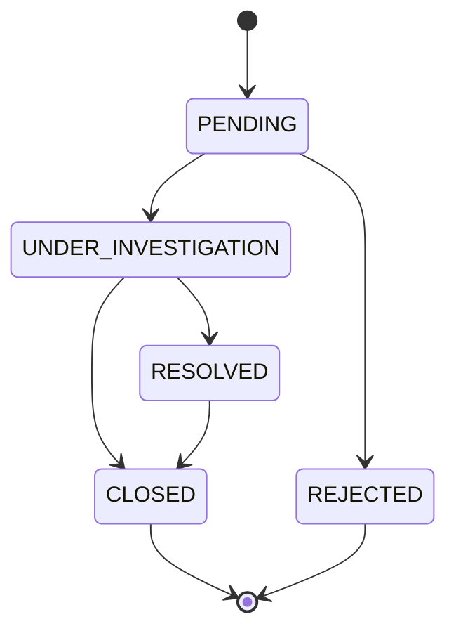
```mermaid
stateDiagram-v2
    [*] --> PENDING
    PENDING --> UNDER_INVESTIGATION
    PENDING --> REJECTED
    UNDER_INVESTIGATION --> RESOLVED
    UNDER_INVESTIGATION --> CLOSED
    RESOLVED --> CLOSED
    CLOSED --> [*]
    REJECTED --> [*]
```

---

# 10. Annotation & Framework Magic

## 10.1 Spring Annotations Explained

```mermaid
graph TB
    subgraph "Component Scanning"
        A["@SpringBootApplication"] --> B["@ComponentScan"]
        A --> C["@EnableAutoConfiguration"]
        A --> D["@Configuration"]
    end
    
    subgraph "Bean Registration"
        E["@Component"] --> F[Generic Spring bean]
        G["@Service"] --> H[Business logic layer]
        I["@Repository"] --> J[Data access layer]
        K["@Controller"] --> L[Web controller]
        M["@RestController"] --> N[REST API controller]
    end
    
    subgraph "Dependency Injection"
        O["@Autowired"] --> P[Field injection]
        Q["@Value"] --> R[Config property injection]
    end
```

## 10.2 Key Annotation Deep Dive

| Annotation | Framework | Purpose | Runtime Behavior |
|------------|-----------|---------|------------------|
| `@Entity` | JPA | Marks class as database entity | Hibernate creates table mapping |
| `@Transactional` | Spring | Transaction boundary | Opens connection, commits/rollbacks |
| `@FeignClient` | OpenFeign | Declarative HTTP client | Generates proxy with HTTP calls |
| `@CircuitBreaker` | Resilience4j | Fault tolerance | Tracks failures, opens circuit |
| `@EnableEurekaClient` | Netflix | Service registration | Registers with Eureka at startup |
| `@PrePersist` | JPA | Lifecycle callback | Invoked before INSERT |

---

# 11. Configuration Files

## 11.1 API Gateway Configuration

**File**: `api-gateway/src/main/resources/application.yml`

```yaml
# Server Configuration
server:
  port: 8090  # Gateway listens on 8090

# Rate Limiting
spring.data.redis:
  host: ${REDIS_HOST:localhost}
  port: ${REDIS_PORT:6379}
  timeout: 2000ms  # Connection timeout

# Route Definitions
spring.cloud.gateway.routes:
  - id: auth-service-public    # No JWT required
    uri: lb://auth-service     # Load balanced via Eureka
    predicates:
      - Path=/api/auth/**
    filters:
      - name: RequestRateLimiter
        args:
          redis-rate-limiter.replenishRate: 10  # 10 req/sec baseline
          redis-rate-limiter.burstCapacity: 20  # 20 req burst allowed
```

**Configuration Properties Explained**:

| Property | Purpose | Production Recommendation |
|----------|---------|---------------------------|
| `jwt.secret` | HMAC signing key | Use env variable, >= 256 bits |
| `redis-rate-limiter.replenishRate` | Steady-state requests/sec | Tune based on capacity testing |
| `eureka.client.service-url.defaultZone` | Eureka server location | Use multiple Eureka servers |
| `resilience4j.circuitbreaker.failureRateThreshold` | Circuit open threshold | 50% is good default |

---

# 12. Database Schema & Data Layer

## 12.1 Complete ER Diagram

```mermaid
erDiagram
    USERS {
        bigint id PK
        varchar email UK
        varchar password
        varchar full_name
        varchar phone
        text address
        varchar aadhaar_number UK
        timestamp created_at
        timestamp updated_at
        boolean is_active
    }
    
    AUTHORITIES {
        bigint id PK
        varchar email UK
        varchar password
        varchar full_name
        varchar badge_number UK
        varchar designation
        varchar station_name
        text station_address
        varchar phone
        timestamp created_at
        timestamp updated_at
        boolean is_active
    }
    
    ADMINS {
        bigint id PK
        varchar email UK
        varchar password
        varchar full_name
        varchar role
        timestamp created_at
        timestamp updated_at
        boolean is_active
    }
    
    REFRESH_TOKENS {
        bigint id PK
        varchar token UK
        bigint user_id FK
        varchar user_type
        timestamp expiry_date
        boolean revoked
    }
    
    FIRS {
        bigint id PK
        varchar fir_number UK
        bigint user_id FK
        bigint authority_id FK
        enum category
        varchar title
        text description
        date incident_date
        time incident_time
        text incident_location
        enum status
        enum priority
        json evidence_urls
        timestamp created_at
        timestamp updated_at
    }
    
    MISSING_PERSONS {
        bigint id PK
        varchar case_number UK
        bigint user_id FK
        bigint authority_id FK
        varchar missing_person_name
        int age
        enum gender
        varchar height
        varchar weight
        varchar complexion
        text identifying_marks
        date last_seen_date
        text last_seen_location
        text description
        varchar photo_url
        enum status
        varchar contact_phone
        timestamp created_at
        timestamp updated_at
    }
    
    UPDATES {
        bigint id PK
        bigint fir_id FK
        bigint missing_person_id FK
        bigint authority_id FK
        enum update_type
        varchar previous_status
        varchar new_status
        text comment
        timestamp created_at
    }
    
    USERS ||--o{ FIRS : "files"
    USERS ||--o{ MISSING_PERSONS : "reports"
    AUTHORITIES ||--o{ FIRS : "assigned"
    AUTHORITIES ||--o{ MISSING_PERSONS : "assigned"
    AUTHORITIES ||--o{ UPDATES : "creates"
    FIRS ||--o{ UPDATES : "has"
    MISSING_PERSONS ||--o{ UPDATES : "has"
```

## 12.2 Index Strategy

| Table | Index Name | Columns | Purpose |
|-------|------------|---------|---------|
| `users` | `idx_users_email` | email | Login lookup |
| `firs` | `idx_firs_user` | user_id | User's FIRs query |
| `firs` | `idx_firs_authority` | authority_id | Authority dashboard |
| `firs` | `idx_firs_status` | status | Status filtering |
| `firs` | `idx_firs_created` | created_at | Sorting by date |

---

# 13. Security & Authentication

## 13.1 JWT Token Lifecycle

```mermaid
sequenceDiagram
    participant C as Client
    participant AS as Auth Service
    participant DB as Database
    participant GW as Gateway
    participant BS as Backend
    
    Note over C,BS: Token Issuance
    C->>AS: POST /api/auth/login
    AS->>AS: Validate credentials
    AS->>AS: Generate access token (1hr)
    AS->>AS: Generate refresh token (7d)
    AS->>DB: Store refresh token
    AS-->>C: {accessToken, refreshToken}
    
    Note over C,BS: Token Usage
    C->>GW: API Request + Bearer token
    GW->>GW: Validate signature (HMAC-SHA256)
    GW->>GW: Check expiration
    GW->>GW: Extract claims
    GW->>BS: Forward + X-User-* headers
    
    Note over C,BS: Token Refresh
    C->>AS: POST /api/auth/refresh
    AS->>DB: Validate refresh token
    AS->>AS: Generate new access token
    AS-->>C: {accessToken}
    
    Note over C,BS: Token Revocation (Logout)
    C->>AS: POST /api/auth/logout
    AS->>DB: Mark refresh token revoked
    AS-->>C: 200 OK
```

## 13.2 Security Threat Model (STRIDE)

```mermaid
graph TB
    subgraph "Threats & Mitigations"
        S[Spoofing] --> S1[JWT Signing with HMAC-SHA256]
        T[Tampering] --> T1[Immutable JWTs]
        R[Repudiation] --> R1[Audit logging via Logging Service]
        I[Information Disclosure] --> I1[Password hashing with BCrypt]
        D[Denial of Service] --> D1[Rate limiting with Redis]
        E[Elevation of Privilege] --> E1[Role-based access control]
    end
```

## 13.3 Security Controls Matrix

| Threat | Control | Implementation Location |
|--------|---------|------------------------|
| **SQL Injection** | Parameterized queries | JPA/Hibernate |
| **XSS** | React auto-escaping | Frontend |
| **CSRF** | SameSite cookies, CORS | API Gateway |
| **Brute Force** | Rate limiting (10 req/sec) | Gateway + Redis |
| **Token Theft** | Short expiry (1hr), refresh tokens | Auth Service |
| **Man-in-Middle** | HTTPS (production) | Deployment config |

---

# 14. Error Handling & Logging Strategy

## 14.1 Error Response Format

All services return consistent JSON error responses:

```json
{
  "success": false,
  "message": "Cannot update a closed case. Closed cases are final.",
  "path": "/api/authority/firs/1/status",
  "timestamp": "2026-01-29T19:30:00",
  "errorCode": "CASE_CLOSED"
}
```

## 14.2 Exception Hierarchy

```mermaid
classDiagram
    class Exception {
        <<abstract>>
    }
    
    class RuntimeException {
        <<abstract>>
    }
    
    class ResourceNotFoundException {
        +String message
        +String resourceName
        +String fieldName
    }
    
    class TokenRefreshException {
        +String token
        +String message
    }
    
    Exception <|-- RuntimeException
    RuntimeException <|-- ResourceNotFoundException
    RuntimeException <|-- TokenRefreshException
```

## 14.3 Logging Levels

| Level | Purpose | Example |
|-------|---------|---------|
| **DEBUG** | Development troubleshooting | JWT claims extracted |
| **INFO** | Normal operations | FIR filed, status updated |
| **WARN** | Recoverable issues | Failed email, closed case update attempt |
| **ERROR** | Failures requiring attention | Database connection lost |

---

# 15. Testing Strategy

## 15.1 Test Pyramid

```mermaid
graph TB
    subgraph "Test Pyramid"
        E2E[E2E Tests<br/>Browser automation]
        INT[Integration Tests<br/>@SpringBootTest]
        UNIT[Unit Tests<br/>JUnit 5 + Mockito]
    end
    
    E2E --> |Few| INT
    INT --> |More| UNIT
    
    style UNIT fill:#4caf50
    style INT fill:#ff9800
    style E2E fill:#f44336
```

## 15.2 Test Coverage by Service

| Service | Unit Tests | Integration Tests | Coverage Target |
|---------|------------|-------------------|-----------------|
| auth-service | AuthServiceTest | AuthControllerIntegrationTest | 80% |
| backend-monolith | FIRServiceTest, MissingPersonServiceTest | - | 75% |
| api-gateway | JwtAuthFilterTest | - | 70% |

## 15.3 Example Test Case

```java
@Test
void updateFIRStatus_closedCase_fails() {
    // Arrange - create a CLOSED FIR
    FIR closedFir = FIR.builder()
        .id(1L)
        .firNumber("FIR-CLOSED1")
        .status(FIR.Status.CLOSED)
        .build();
    
    when(firRepository.findById(1L)).thenReturn(Optional.of(closedFir));
    
    // Act - try to update
    ApiResponse<FIR> response = firService.updateFIRStatus(1L, 1L, updateRequest);
    
    // Assert
    assertFalse(response.isSuccess());
    assertEquals("Cannot update a closed case.", response.getMessage());
    verify(firRepository, never()).save(any(FIR.class));
}
```

---

# 16. Performance & Scalability Analysis

## 16.1 Bottleneck Analysis

```mermaid
graph LR
    subgraph "Bottleneck Points"
        A[Database Queries] --> A1[Solution: Connection pooling + indexes]
        B[External Service Calls] --> B1[Solution: Async + circuit breakers]
        C[JWT Validation] --> C1[Solution: Single parse, cache claims]
        D[Rate Limiting] --> D1[Solution: Redis with low latency]
    end
```

## 16.2 Scalability Patterns

| Challenge | Pattern | Implementation |
|-----------|---------|----------------|
| Service scaling | Horizontal scaling | Stateless services + Eureka |
| Database load | Read replicas | MySQL replication (future) |
| External service failures | Circuit breaker | Resilience4j (50% threshold) |
| Request spikes | Rate limiting | Redis token bucket |

---

# 17. CI/CD & Deployment Pipeline

## 17.1 Deployment Architecture

```mermaid
graph TB
    subgraph "Docker Compose Deployment"
        E[Eureka Server<br/>:8761]
        R[Redis<br/>:6379]
        AD[(Auth DB<br/>:3307)]
        BD[(Backend DB<br/>:3308)]
        
        AS[Auth Service<br/>:8081]
        BS[Backend Service<br/>:8080]
        GW[API Gateway<br/>:8090]
        ES[Email Service<br/>:3000]
        LS[Logging Service<br/>:5000]
        FE[Frontend<br/>:3001]
        
        AS --> E
        BS --> E
        GW --> E
        GW --> R
        AS --> AD
        BS --> BD
        BS --> AS
        BS --> ES
        BS --> LS
        FE --> GW
    end
```

## 17.2 Startup Order

```mermaid
graph LR
    1[Databases] --> 2[Redis]
    2 --> 3[Eureka]
    3 --> 4[Auth Service]
    4 --> 5[Backend Service]
    5 --> 6[API Gateway]
    6 --> 7[Frontend]
```

---

# 18. Known Limitations & Technical Debt

## 18.1 Current Limitations

| Limitation | Impact | Mitigation Plan |
|------------|--------|-----------------|
| No file upload support | Users cannot attach evidence | Add S3/MinIO integration |
| Single MySQL instance | SPOF for databases | Add read replicas |
| Synchronous Feign calls | Latency on dashboard load | Add async patterns |
| No API versioning | Breaking changes risk | Add /v1/ prefix |

## 18.2 Technical Debt

1. **Missing comprehensive input validation** (Bean Validation not fully used)
2. **Hardcoded JWT expiration** in some places
3. **No database migrations** (using ddl-auto=update)
4. **Missing API documentation** (no OpenAPI/Swagger)

---

# 19. Interview Readiness Section

## 19.1 System Design Questions (15+)

### Q1: How would you design a scalable crime reporting system?

**Expected Answer Points**:
- Microservices architecture for independent scaling
- Service discovery for dynamic service location
- API Gateway for centralized authentication and routing
- Separate databases per service (database per service pattern)
- Async communication for non-critical operations (emails)

**Follow-up**: How would you handle 10x traffic spike?
- Horizontal scaling of backend services
- Redis caching for frequently accessed data
- Rate limiting to protect downstream services
- Database read replicas

### Q2: Explain the request flow from client to database

**Answer**: Refer to Section 2.4 Request Flow Overview diagram.
1. Client sends request with JWT to API Gateway (port 8090)
2. Gateway checks rate limit via Redis
3. Gateway validates JWT using HMAC-SHA256
4. Gateway discovers service via Eureka
5. Gateway forwards request with X-User-* headers
6. Backend service processes request, queries database
7. Response flows back through gateway

### Q3: Why separate Auth Service and Backend Service?

**Answer**:
- **Single Responsibility**: Auth handles identity, Backend handles business logic
- **Independent Scaling**: Auth may need different scaling profile
- **Security Isolation**: Credentials stored in separate database
- **Team Autonomy**: Different teams can own different services

### Q4: How do you handle service failures?

**Answer**: Resilience4j patterns (Section 11.1):
- **Circuit Breaker**: Opens after 50% failures in sliding window of 10
- **Retry**: 3 attempts with 500ms delay
- **Fallback Factory**: Returns graceful error on Feign failures

### Q5: Explain JWT token security in this system

**Answer** (Section 13):
- Tokens signed with HMAC-SHA256 (256+ bit key)
- Access token expires in 1 hour
- Refresh token expires in 7 days, stored in database
- Gateway validates signature and expiration
- User claims (id, email, role) extracted and forwarded

## 19.2 Security Questions (10+)

### Q6: How do you prevent unauthorized access?

**Answer**:
- JWT validation at gateway level
- Role-based route protection (USER, AUTHORITY, ADMIN)
- Token expiration and refresh mechanism
- Rate limiting prevents brute force

### Q7: How do you protect against SQL injection?

**Answer**:
- JPA/Hibernate uses parameterized queries
- No raw SQL concatenation
- Entity validation with Bean Validation annotations

### Q8: Explain the closed case protection feature

**Answer** (Recent implementation):
```java
if (fir.getStatus() == FIR.Status.CLOSED) {
    return ApiResponse.error("Cannot update a closed case.");
}
```
- Prevents status changes on closed cases
- Logs warning for audit trail
- Tested with unit tests

## 19.3 Code-Level Questions (10+)

### Q9: Explain the Builder pattern usage in entities

**Answer**:
- Lombok `@Builder` generates fluent builder
- Avoids telescoping constructors
- Example: `FIR.builder().firNumber("FIR-123").category(Category.THEFT).build()`

### Q10: How does the Gateway Filter work?

**Answer**: See Section 7.1 JwtAuthFilter.java
- Extends `AbstractGatewayFilterFactory`
- `Config` class holds `requiredRole`
- `apply()` returns `GatewayFilter` lambda
- Extracts and validates JWT, sets headers

### Q11: Explain the load balancing for FIR assignment

**Answer**:
```java
// Query authorities ordered by active case count
SELECT a FROM Authority a WHERE a.isActive = true
ORDER BY (SELECT COUNT(f) FROM FIR f WHERE f.authorityId = a.id AND f.status IN (...))
```
- Feign call to Auth Service gets active authorities
- Count active cases per authority
- Assign to least loaded

## 19.4 Performance Questions (5+)

### Q12: How do you optimize database queries?

**Answer**:
- Indexes on frequently queried columns (email, status, userId)
- JPA pagination for large result sets
- Specific column selection where needed

### Q13: What caching strategies are used?

**Answer**:
- Redis for rate limiting state
- Future: Redis for session data, query results

## 19.5 Diagram-Based Questions

### Q14: Draw the authentication flow

**Expected**: Sequence diagram showing login → token generation → token validation → protected resource access (See Section 13.1)

### Q15: Draw the database schema

**Expected**: ER diagram with all 6 tables and relationships (See Section 12.1)

---

# Appendices

## A. Glossary

| Term | Definition |
|------|------------|
| FIR | First Information Report - formal complaint to police |
| JWT | JSON Web Token - self-contained access credential |
| RBAC | Role-Based Access Control |
| Circuit Breaker | Pattern that prevents cascade failures |
| Eureka | Netflix service discovery server |

## B. API Quick Reference

| Method | Endpoint | Role | Purpose |
|--------|----------|------|---------|
| POST | /api/auth/register | Public | Register user |
| POST | /api/auth/login | Public | Login |
| POST | /api/user/firs | USER | File FIR |
| GET | /api/authority/firs | AUTHORITY | View assigned FIRs |
| PUT | /api/authority/firs/:id/status | AUTHORITY | Update FIR |
| GET | /api/admin/firs | ADMIN | View all FIRs |

---

**Document End**

*This documentation was generated for production handover, security audits, and senior backend interviews. All diagrams and code references are accurate as of January 2026.*
