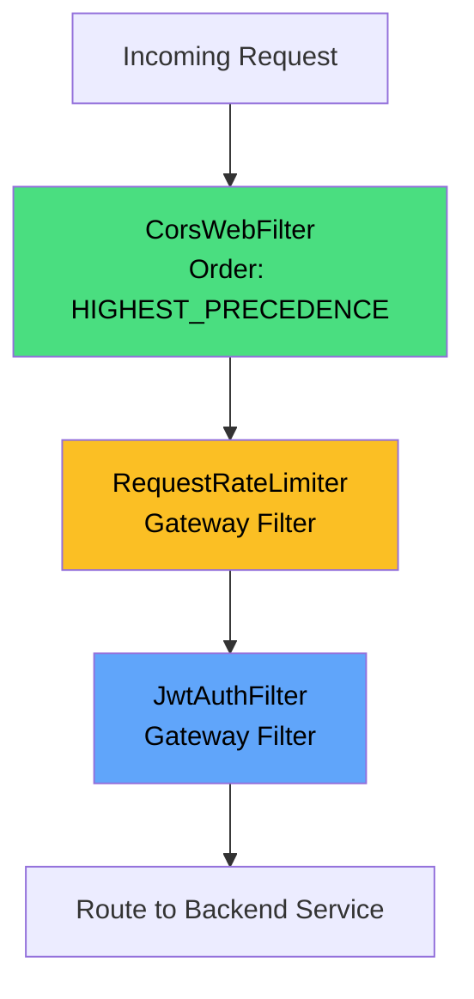
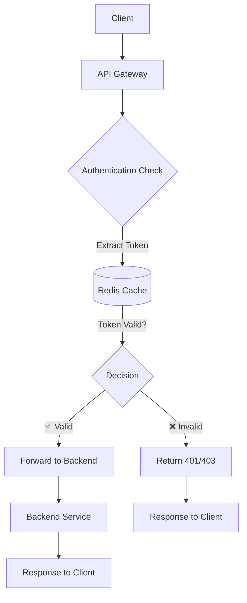
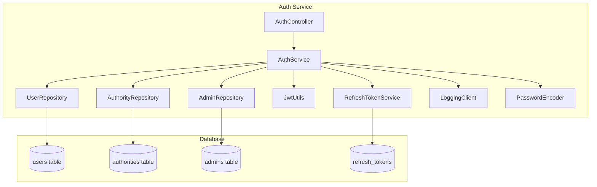
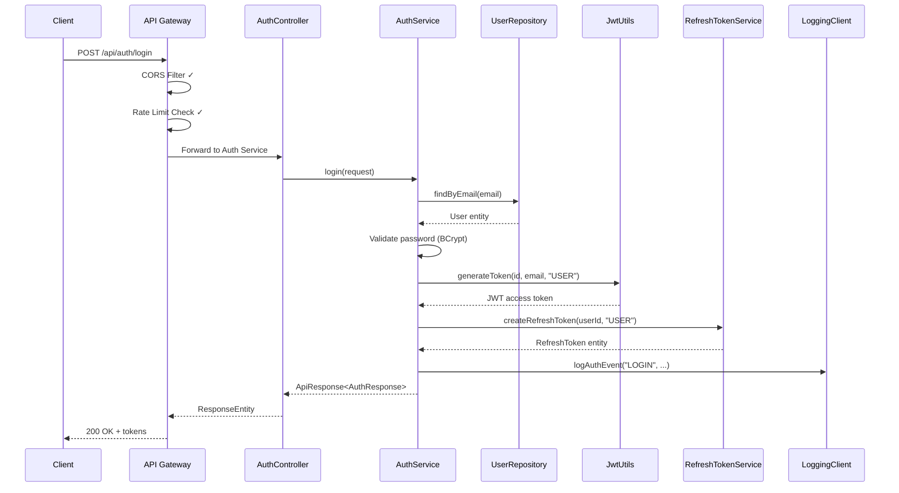
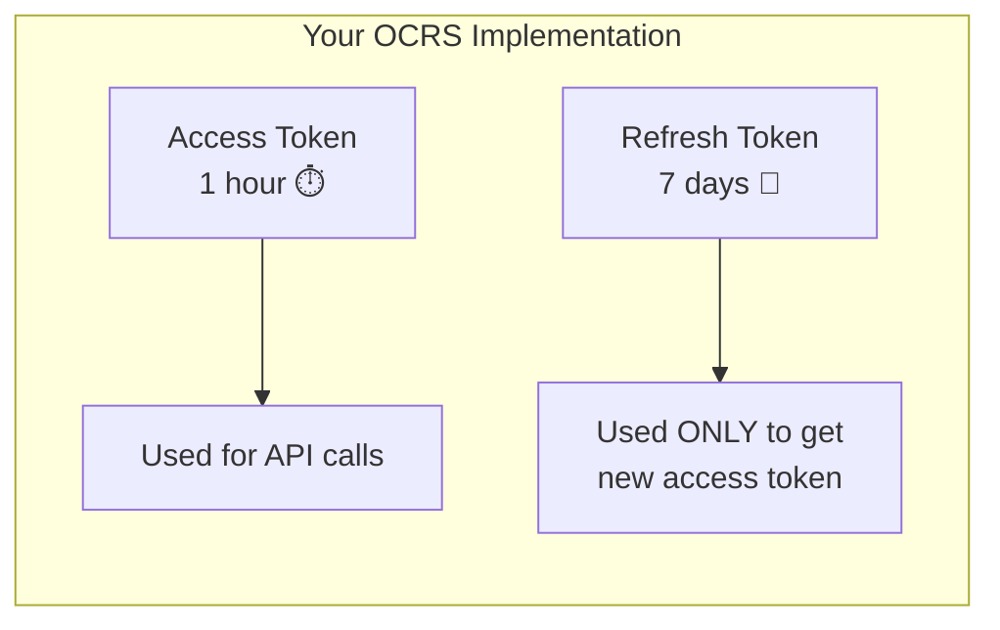
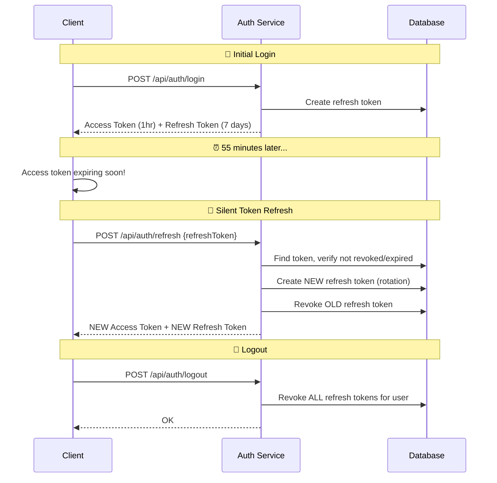

- Filter Execution Order

```mermaid 
flowchart TD
    A[Incoming Request] --> B[CorsWebFilter<br/>Order: HIGHEST_PRECEDENCE]
    B --> C[RequestRateLimiter<br/>Gateway Filter]
    C --> D[JwtAuthFilter<br/>Gateway Filter]
    D --> E[Route to Backend Service]
    
    style B fill:#4ade80,color:#000
    style C fill:#fbbf24,color:#000
    style D fill:#60a5fa,color:#000
```

 
 

- Rate limiting Diagram

```mermaid
flowchart TD
    A[Client] --> B[API Gateway]
    
    B --> C{Authentication Check}
    C -->|Extract Token| D[(Redis Cache)]
    
    D -->|Token Valid?| E{Decision}
    E -->|✅ Valid| F[Forward to Backend]
    E -->|❌ Invalid| G[Return 401/403]
    
    F --> H[Backend Service]
    G --> I[Response to Client]
    H --> J[Response to Client]
```
 
 

-  Auth Service Architecture

```mermaid
flowchart TB
    subgraph "Auth Service"
        A[AuthController] --> B[AuthService]
        B --> C[UserRepository]
        B --> D[AuthorityRepository]
        B --> E[AdminRepository]
        B --> F[JwtUtils]
        B --> G[RefreshTokenService]
        B --> H[LoggingClient]
        B --> I[PasswordEncoder]
    end
    
    subgraph "Database"
        C --> J[(users table)]
        D --> K[(authorities table)]
        E --> L[(admins table)]
        G --> M[(refresh_tokens)]
    end
```

 
 
 

- Complete requires flow diagram

```mermaid
sequenceDiagram
    participant C as Client
    participant G as API Gateway
    participant A as AuthController
    participant S as AuthService
    participant R as UserRepository
    participant J as JwtUtils
    participant RT as RefreshTokenService
    participant L as LoggingClient
    
    C->>G: POST /api/auth/login
    G->>G: CORS Filter ✓
    G->>G: Rate Limit Check ✓
    G->>A: Forward to Auth Service
    A->>S: login(request)
    S->>R: findByEmail(email)
    R-->>S: User entity
    S->>S: Validate password (BCrypt)
    S->>J: generateToken(id, email, "USER")
    J-->>S: JWT access token
    S->>RT: createRefreshToken(userId, "USER")
    RT-->>S: RefreshToken entity
    S->>L: logAuthEvent("LOGIN", ...)
    S-->>A: ApiResponse<AuthResponse>
    A-->>G: ResponseEntity
    G-->>C: 200 OK + tokens
```

 
 

```mermaid
    flowchart LR
    subgraph "Your OCRS Implementation"
        A[Access Token<br/>1 hour ⏱️] --> B[Used for API calls]
        C[Refresh Token<br/>7 days 📅] --> D[Used ONLY to get<br/>new access token]
    end
```

 
 

- Complete Refresh Token Flow

```mermaid
sequenceDiagram
    participant C as Client
    participant A as Auth Service
    participant DB as Database
    
    Note over C,DB: 🔐 Initial Login
    C->>A: POST /api/auth/login
    A->>DB: Create refresh token
    A-->>C: Access Token (1hr) + Refresh Token (7 days)
    
    Note over C,DB: ⏰ 55 minutes later...
    C->>C: Access token expiring soon!
    
    Note over C,DB: 🔄 Silent Token Refresh
    C->>A: POST /api/auth/refresh {refreshToken}
    A->>DB: Find token, verify not revoked/expired
    A->>DB: Create NEW refresh token (rotation)
    A->>DB: Revoke OLD refresh token
    A-->>C: NEW Access Token + NEW Refresh Token
    
    Note over C,DB: 👋 Logout
    C->>A: POST /api/auth/logout
    A->>DB: Revoke ALL refresh tokens for user
    A-->>C: OK
```