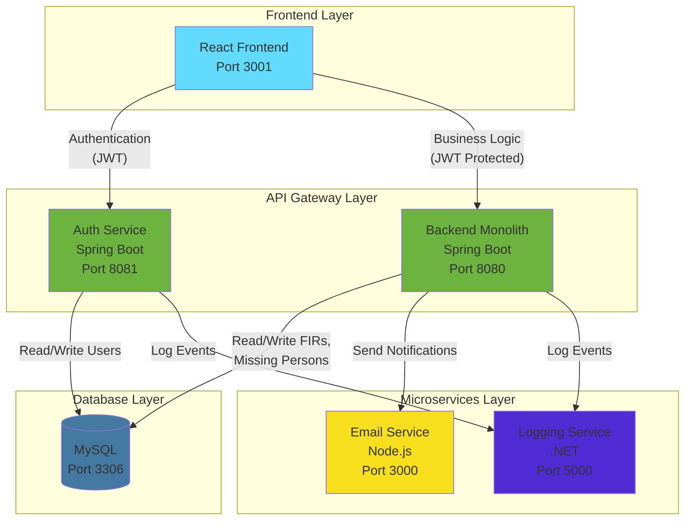
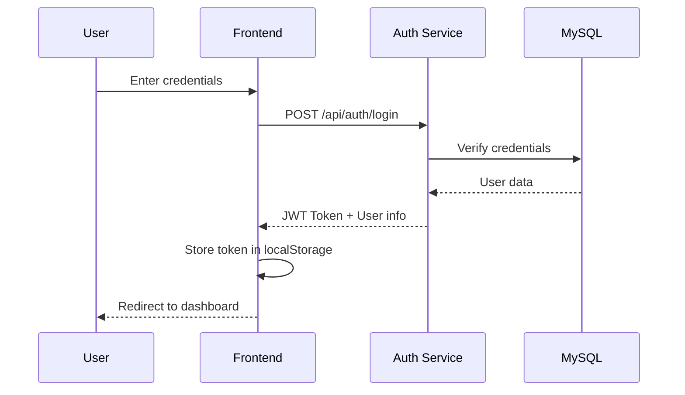
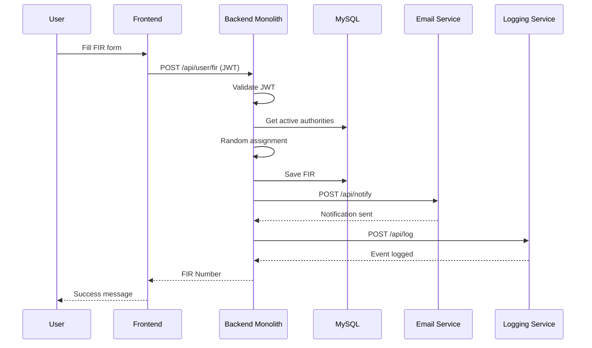
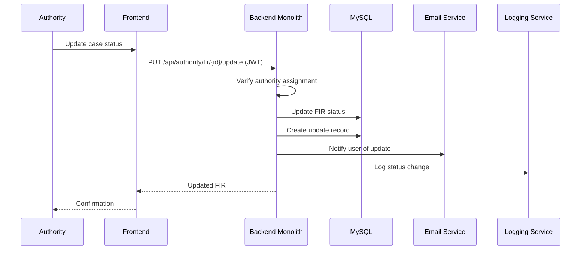

# OCRS Service Architecture & Communication Flow

## Service Overview

---

## Authentication Flow

---

## FIR Filing Flow

---

## Authority Status Update Flow

---

## Inter-Service Communication Protocol

| From | To | Protocol | Method | Endpoint | Purpose |
|------|-----|----------|--------|----------|---------|
| Frontend | Auth Service | HTTP | POST | `/api/auth/login` | User authentication |
| Frontend | Auth Service | HTTP | POST | `/api/auth/register/user` | User registration |
| Frontend | Backend | HTTP | POST/GET | `/api/user/*` | User operations |
| Frontend | Backend | HTTP | POST/GET | `/api/authority/*` | Authority operations |
| Frontend | Backend | HTTP | GET | `/api/admin/*` | Admin operations |
| Backend | Email Service | HTTP | POST | `/api/notify` | Send notifications |
| Backend | Logging Service | HTTP | POST | `/api/log` | Log events |
| Backend | MySQL | JDBC | - | - | Data persistence |
| Auth Service | MySQL | JDBC | - | - | User data |

---

## Service Ports Summary

| Service | Port | Technology | Responsibility |
|---------|------|------------|----------------|
| Frontend | 5173 | React + Vite | User interface |
| Auth Service | 8081 | Spring Boot | JWT authentication |
| Backend Monolith | 8080 | Spring Boot | Business logic |
| Email Service | 3000 | Node.js/Express | Email notifications |
| Logging Service | 5000 | .NET 10 | Centralized logging |
| MySQL | 3306 | MySQL 8 | Data persistence |
